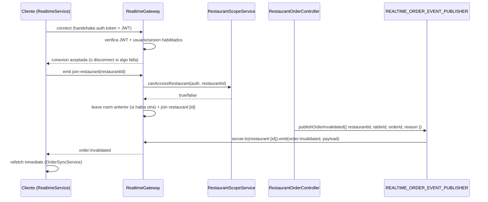

# Realtime de pedidos

## Resumen

El modulo `realtime` empuja invalidaciones de pedido por WebSocket (Socket.IO) para que el POS no dependa solo del polling de 30s del frontend. Se activa con la variable de entorno `REALTIME_ENABLED` (`false` por defecto):

- `REALTIME_ENABLED=false`: `RealtimeModule.register({ enabled: false })` no registra ningun gateway ni servidor de sockets; el puerto `REALTIME_ORDER_EVENT_PUBLISHER` se liga a `NoopRealtimeOrderEventPublisher`.
- `REALTIME_ENABLED=true`: se registra `RealtimeGateway` y `SocketRealtimeOrderEventPublisher`.

El frontend nunca depende exclusivamente de los sockets: `OrderSyncService` sigue con su polling de 30s como red de seguridad, y solo usa los eventos de invalidacion para disparar un refetch inmediato. Si el flag esta desactivado, el socket falla al conectar, o la sesion se revoca, el polling sigue funcionando igual.

## Flujo

## Autenticacion y revalidacion de sesion

`RealtimeGateway.handleConnection` verifica el JWT con `AuthTokenService.verifyAccessToken` y ademas carga usuario (`USER_REPOSITORY`) y sesion (`AUTH_SESSION_REPOSITORY`) para comprobar que ambos siguen habilitados y que la sesion pertenece al usuario del token — el mismo criterio que ya aplica `AuthGuard` en REST, reutilizando `AuthSession.isUsable()`.

Mientras el socket sigue conectado, una revalidacion periodica (`SESSION_REVALIDATION_INTERVAL_MS`, 60s) repite el mismo chequeo y desconecta el socket si la sesion se revoca a mitad de conexion. Esto acota la ventana de exposicion de una sesion revocada a como maximo ese intervalo, en vez de depender solo de la expiracion del JWT (`JWT_ACCESS_TTL_SECONDS`, 900s por defecto). `handleDisconnect` limpia tanto el timer de expiracion del JWT como este intervalo.

No se replica aqui el chequeo de cuenta demo (`BlockDemoAccountGuard`/`canUseInteractiveAuth`): ese guard protege mutaciones de identidad, y este canal es de solo lectura (invalidacion), no de escritura.

## Scope y anti-fuga multi-tenant

`handleJoinRestaurant` solo une la room `restaurant:{id}` si `RestaurantScopeService.canAccessRestaurant` lo permite — un scope vacio nunca da acceso, igual que en REST. Ademas, el gateway recuerda la ultima room unida por socket (`client.data.joinedRestaurantId`); si el cliente pide unirse a un restaurante distinto, primero abandona la room anterior (`client.leave`) antes de unirse a la nueva, para que un usuario con acceso a varios restaurantes no siga recibiendo eventos del restaurante que ya no esta viendo.

## Catalogo de eventos

Evento `order:invalidated`, payload `{ restaurantId, tableId, orderId, reason, occurredAt }` — nunca el pedido completo, el cliente reutiliza el mismo pipeline REST para pedir el snapshot fresco. `reason` es una de:

`order.opened`, `order.line.created`, `order.line.updated`, `order.line.deleted`, `order.line.cancelled`, `order.line.status-updated`, `order.payment.recorded`, `order.service-point.sent-to-kitchen`, `order.service-point.marked-served`, `order.service-point.charged`, `order.service-point.freed`.

## Arquitectura y aislamiento de la libreria

- Backend: `restaurants` solo conoce el puerto `REALTIME_ORDER_EVENT_PUBLISHER` (`backend/src/restaurants/application/ports/realtime-order-event-publisher.port.ts`); `RestaurantOrderController` nunca importa Socket.IO directamente.
- Frontend: `RealtimeService` solo conoce la interfaz `RealtimeTransport` (`frontend/src/app/core/realtime/realtime-transport.ts`); `SocketIoRealtimeTransport` es el unico archivo que importa `socket.io-client`.

Esto permite cambiar de libreria (p. ej. a un proveedor gestionado como Ably/Pusher) sustituyendo solo el adaptador de cada lado, sin tocar los consumidores.

## Logging de conexion (frontend)

`RealtimeService` reenvia `connect_error` (nivel `warn`, evento `frontend.realtime.connect_error`) y `reconnect` (nivel `info`, evento `frontend.realtime.reconnected`) al `ClientLogsService` existente, para poder diagnosticar problemas de conectividad en produccion (p. ej. el cold start de un host gratuito) sin instrumentacion nueva.

## Variables de entorno

- `REALTIME_ENABLED` (backend, `.env`): activa/desactiva el gateway completo.
- El equivalente en frontend es el provider `REALTIME_ENABLED`/`REALTIME_URL` en `frontend/src/app/core/realtime/realtime.config.ts` — no hay archivo `environment.ts` en este proyecto, se sobreescribe el valor por defecto via provider en `app.config.ts` para el build que lo necesite.
