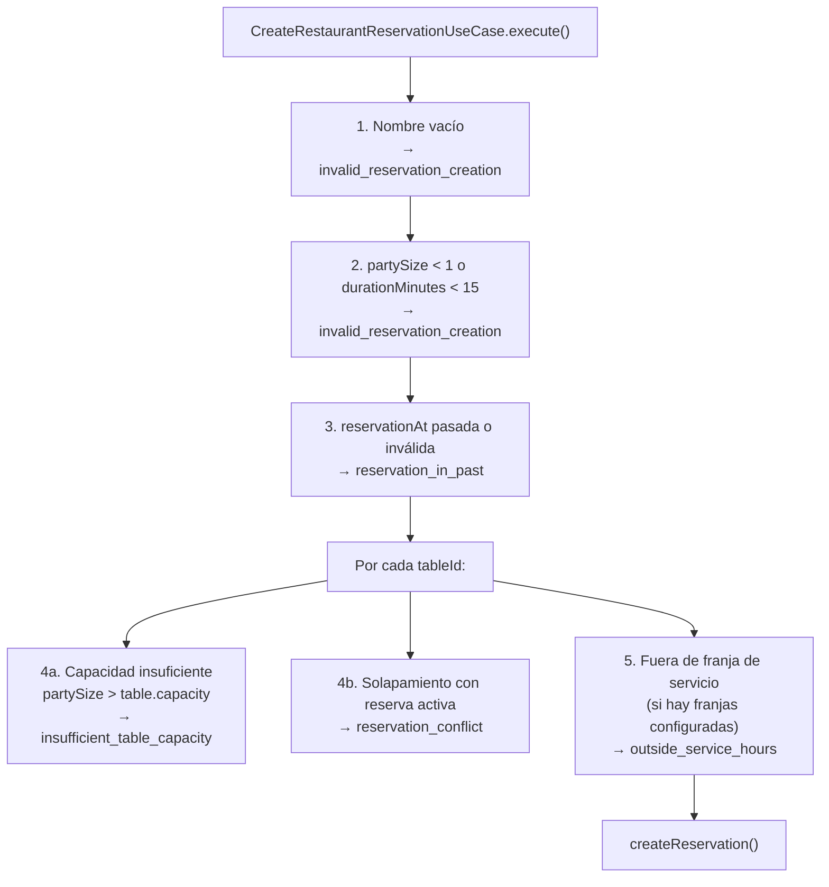
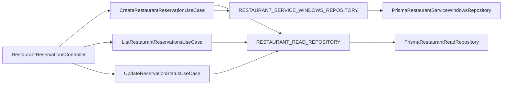

# Reservations API

## Overview

Los endpoints de reservas permiten leer la agenda del día, crear reservas nuevas y ejecutar
transiciones de estado (confirmar, sentar, no-show, cancelar). La creación aplica cuatro
validaciones de negocio antes de persistir.

## Endpoints

| Verbo | Ruta | Descripción |
|---|---|---|
| GET | `/api/v1/restaurants/:id/reservations` | Lista reservas del restaurante (filtro `?date=YYYY-MM-DD`) |
| POST | `/api/v1/restaurants/:id/reservations` | Crea una reserva con validaciones |
| PATCH | `/api/v1/restaurants/:id/reservations/:reservationId/confirm` | Cambia estado a `confirmed` |
| PATCH | `/api/v1/restaurants/:id/reservations/:reservationId/seat` | Cambia estado a `seated` |
| PATCH | `/api/v1/restaurants/:id/reservations/:reservationId/no-show` | Cambia estado a `no_show` |
| PATCH | `/api/v1/restaurants/:id/reservations/:reservationId/cancel` | Cambia estado a `cancelled` |

Todos los endpoints requieren `AuthGuard` y `RestaurantAccessGuard`.

---

## POST /api/v1/restaurants/:id/reservations

### Request body

```json
{
  "customerNameSnapshot": "Ana López",
  "customerPhoneSnapshot": "+34 600 000 000",
  "partySize": 4,
  "reservationAt": "2026-07-15T20:00:00.000Z",
  "durationMinutes": 90,
  "notes": "Celebración de cumpleaños",
  "tableIds": ["table-3", "table-4"]
}
```

| Campo | Tipo | Reglas |
|---|---|---|
| `customerNameSnapshot` | string | No puede estar vacío ni ser solo espacios |
| `customerPhoneSnapshot` | string \| null | Opcional |
| `partySize` | number | ≥ 1 |
| `reservationAt` | string ISO-8601 | Debe ser en el futuro |
| `durationMinutes` | number | ≥ 15 |
| `notes` | string \| null | Opcional |
| `tableIds` | string[] | Puede ser vacío (sin mesa asignada) |

### Validaciones de negocio

El caso de uso aplica las siguientes reglas en orden antes de llamar al repositorio:



#### Regla 3: fecha en el pasado

`startTime <= new Date()` devuelve `reservation_in_past` (422).

#### Regla 4a: capacidad de mesa

Si `table.capacity` existe y `partySize > capacity`, devuelve `insufficient_table_capacity` (422).
La comprobación se salta si la mesa no tiene capacidad registrada.

#### Regla 4b: solapamiento

Busca reservas activas (estado distinto de `cancelled` / `no_show`) sobre la misma mesa cuyo
rango horario se solape con `[startTime, endTime)`. Si existe alguna, devuelve
`reservation_conflict` (409).

```
solapamiento = existingStart < endTime AND existingEnd > startTime
```

#### Regla 5: franjas de servicio

Si el restaurante tiene franjas configuradas (`ServiceWindow[]` no vacío), la reserva debe
caber dentro de al menos una franja:

```
startHHMM >= window.startTime AND endHHMM <= window.endTime
```

Si no hay franjas configuradas, la validación se omite (el restaurante no ha definido horarios
de servicio). Si hay franjas pero la reserva no encaja en ninguna, devuelve
`outside_service_hours` (422).

La comparación usa `HH:MM` en hora local del servidor. Para producción se recomienda alinear
la zona horaria del servidor con la del restaurante o convertir `startTime` / `endTime` a UTC
antes de comparar.

### Errors

| Código | HTTP | Descripción |
|---|---|---|
| `invalid_reservation_creation` | 400 | Nombre vacío, partySize < 1 o duración < 15 |
| `reservation_in_past` | 422 | `reservationAt` ya ha pasado |
| `insufficient_table_capacity` | 422 | La mesa no tiene capacidad para el grupo |
| `reservation_conflict` | 409 | Solapamiento con otra reserva activa en la misma mesa |
| `outside_service_hours` | 422 | La reserva no encaja en ninguna franja de servicio |
| `restaurant_not_found` | 404 | El restaurante no existe |

---

## Arquitectura



`CreateRestaurantReservationUseCase` inyecta dos puertos:
- `RESTAURANT_READ_REPOSITORY` para validar capacidad, detectar solapamientos y persistir.
- `RESTAURANT_SERVICE_WINDOWS_REPOSITORY` para leer las franjas de servicio del restaurante.

### Adaptadores por entorno

| Puerto | Runtime | Tests de caso de uso |
|---|---|---|
| `RESTAURANT_READ_REPOSITORY` | `PrismaRestaurantReadRepository` | `InMemoryReservationReadRepository` (clase inline en spec) |
| `RESTAURANT_SERVICE_WINDOWS_REPOSITORY` | `PrismaRestaurantServiceWindowsRepository` | `InMemoryServiceWindowsRepository` (clase inline en spec) |

### Métodos del puerto de lectura usados por la creación

| Método | Propósito |
|---|---|
| `findTableCapacity(restaurantId, tableId)` | Devuelve capacidad de la mesa o `null` si no existe |
| `findConflictingReservations(restaurantId, tableId, startTime, endTime)` | Devuelve IDs de reservas activas que se solapan |
| `createReservation(restaurantId, input)` | Persiste la reserva; devuelve `null` si el restaurante no existe |

---

## Tests

Los tests del caso de uso usan adaptadores in-memory con `seed()` para configurar el estado
inicial sin levantar base de datos:

```
src/restaurants/application/use-cases/create-restaurant-reservation.use-case.spec.ts
```

| Escenario | Error esperado |
|---|---|
| Nombre vacío | `invalid_reservation_creation` |
| Fecha en el pasado | `reservation_in_past` |
| partySize > capacidad de mesa | `insufficient_table_capacity` |
| Solapamiento con reserva existente | `reservation_conflict` |
| Fuera de franja de servicio | `outside_service_hours` |
| Sin franjas configuradas (array vacío) | sin error (validación omitida) |
| Restaurante no encontrado (repo devuelve null) | `restaurant_not_found` |
| Happy path — todas las validaciones pasan | reserva creada |
