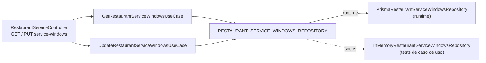
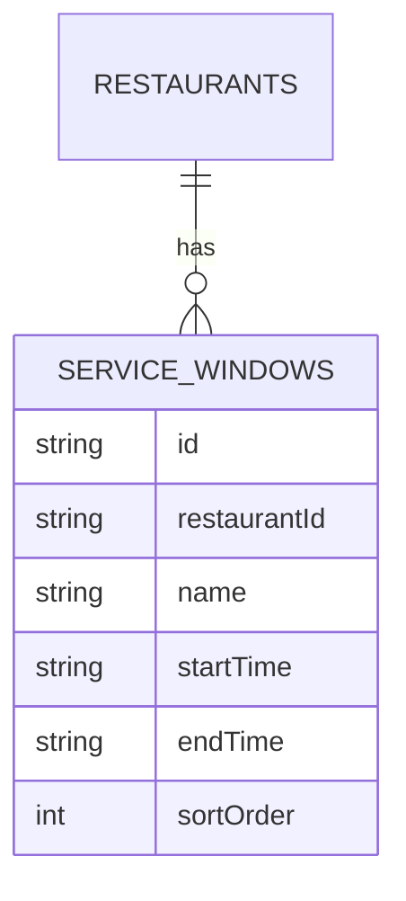
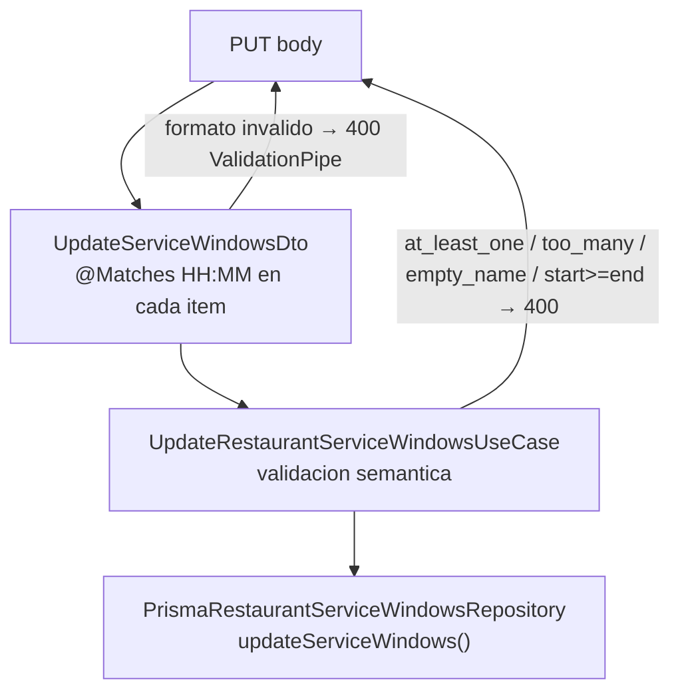
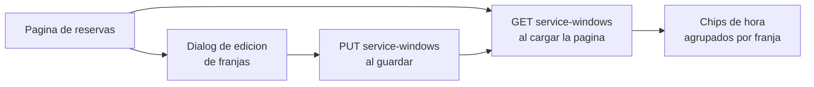

# Service Windows API

## Overview

Las franjas de servicio (`ServiceWindow`) definen los rangos horarios configurables por restaurante —
por ejemplo, "Comidas 12:00–16:30" y "Cenas 20:00–23:30". La API permite leer las franjas activas
(publico) y actualizarlas (autenticado). El frontend las usa para mostrar selectores de hora
agrupados en lugar de un `<input type="time">` libre.

## Scope

- `GET /api/v1/restaurants/:id/service-windows` — lectura publica
- `PUT /api/v1/restaurants/:id/service-windows` — actualizacion autenticada (reemplaza el conjunto completo)

## Arquitectura



El puerto `RESTAURANT_SERVICE_WINDOWS_REPOSITORY` es independiente de `RESTAURANT_READ_REPOSITORY`
para no romper los mocks de los specs existentes que implementan la interfaz de lectura.

Cada puerto tiene dos adaptadores alineados:

| Adaptador | Uso | Archivo |
|---|---|---|
| `PrismaRestaurantServiceWindowsRepository` | Runtime y tests de integración | `infrastructure/persistence/prisma-restaurant-service-windows.repository.ts` |
| `InMemoryRestaurantServiceWindowsRepository` | Specs de casos de uso (sin BD) | `infrastructure/in-memory-restaurant-service-windows.repository.ts` |

### Modelo Prisma

```prisma
model RestaurantServiceWindow {
  id           String     @id @default(cuid())
  restaurantId String
  restaurant   Restaurant @relation(fields: [restaurantId], references: [id], onDelete: Cascade)
  name         String
  startTime    String
  endTime      String
  sortOrder    Int        @default(0)
  isActive     Boolean    @default(true)
  createdAt    DateTime   @default(now())
  updatedAt    DateTime   @updatedAt

  @@index([restaurantId])
  @@map("restaurant_service_windows")
}
```

`updateServiceWindows` borra y recrea todas las franjas del restaurante en una transacción
(`$transaction`) para garantizar atomicidad y evitar franjas huérfanas.

## Domain Model



`startTime` y `endTime` son strings `"HH:MM"` en hora local del restaurante. `sortOrder` determina
el orden de presentacion; el adaptador lo asigna automaticamente (1-based) al actualizar.

## Endpoints

### GET /api/v1/restaurants/:id/service-windows

Devuelve las franjas de servicio configuradas para el restaurante. No requiere autenticacion.

**Path params**

- `id`: identificador del restaurante

**Response 200**

```json
[
  {
    "id": "sw-lunch",
    "restaurantId": "restaurant-mesaflow-centro",
    "name": "Comidas",
    "startTime": "12:00",
    "endTime": "16:30",
    "sortOrder": 1
  },
  {
    "id": "sw-dinner",
    "restaurantId": "restaurant-mesaflow-centro",
    "name": "Cenas",
    "startTime": "20:00",
    "endTime": "23:30",
    "sortOrder": 2
  }
]
```

**Errors**

- `404` restaurante no encontrado

---

### PUT /api/v1/restaurants/:id/service-windows

Reemplaza el conjunto completo de franjas del restaurante. Requiere autenticacion.
Minimo 1 franja, maximo 5.

**Path params**

- `id`: identificador del restaurante

**Request body**

```json
{
  "windows": [
    { "name": "Almuerzo", "startTime": "13:00", "endTime": "17:00" },
    { "name": "Noche",    "startTime": "21:00", "endTime": "23:00" }
  ]
}
```

| campo | tipo | reglas |
|---|---|---|
| `name` | string | no puede estar vacio ni ser solo espacios |
| `startTime` | string `HH:MM` | formato 00:00–23:59; validado en DTO y en caso de uso |
| `endTime` | string `HH:MM` | formato 00:00–23:59; debe ser estrictamente posterior a `startTime` |

**Response 200**

Devuelve el array actualizado con el mismo schema que el GET.

**Errors**

- `400` array vacio (`at_least_one_window_required`)
- `400` mas de 5 franjas (`too_many_windows`)
- `400` nombre vacio (`empty_name`)
- `400` formato `HH:MM` invalido (`invalid_time_format`) — detectado en DTO por `@Matches`
- `400` `startTime >= endTime` (`start_must_be_before_end`)
- `401` sin autenticacion
- `404` restaurante no encontrado

---

## Validacion en capas



La validacion de formato `HH:MM` se hace dos veces por diseno:

- En el DTO con `@Matches` para dar un error de validacion consistente con el resto de la API.
- En el caso de uso con la misma regex `TIME_RE` para que el use case sea autocontenido
  (testable sin depender de que el DTO haya validado primero).

## Datos demo

El seed `mesaflow-service-windows.seed.ts` inserta las franjas iniciales si el restaurante demo
no tiene ninguna (idempotente):

| name | startTime | endTime | sortOrder |
|---|---|---|---|
| Comidas | 12:00 | 16:30 | 0 |
| Cenas | 20:00 | 23:30 | 1 |

Los tests e2e que necesiten un estado limpio deben re-ejecutar el seed antes del test o usar
`InMemoryRestaurantServiceWindowsRepository` con `seed()` para aislar el estado.

## Tests

| nivel | archivo | casos |
|---|---|---|
| uso get | `get-restaurant-service-windows.use-case.spec.ts` | happy path, restaurante no encontrado |
| uso update | `update-restaurant-service-windows.use-case.spec.ts` | happy path, not found, array vacio, >5, nombre vacio, start>=end, start==end, formato invalido |
| e2e | `test/app.e2e-spec.ts` | GET default, GET 404, PUT autenticado + GET de verificacion, PUT 401, PUT 400 |

## Frontend Consumption



El frontend espera el siguiente contrato para generar los chips de hora:

- Por cada `ServiceWindow`, genera slots cada 30 minutos desde `startTime` hasta `endTime` inclusive.
- Ejemplo: franja `12:00–16:30` genera `12:00, 12:30, 13:00, …, 16:30` (10 slots).
- La franja activa se selecciona con un `SegmentedControl` usando `name` como etiqueta.
- El slot seleccionado se escribe en el campo `time` del formulario de creacion de reserva.
