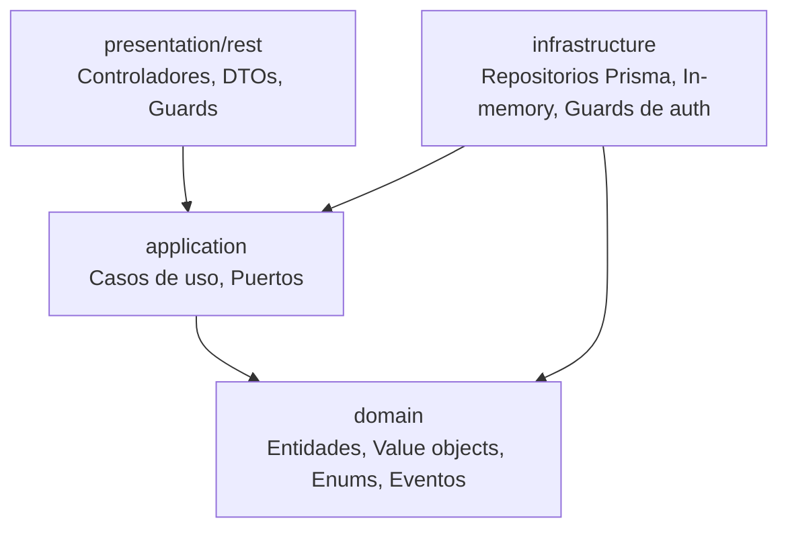
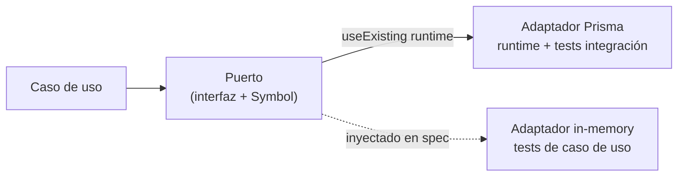
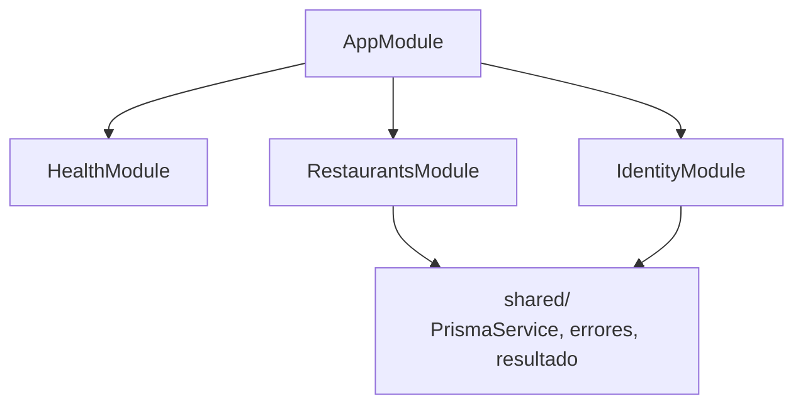
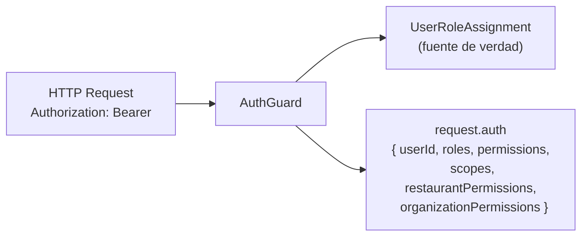
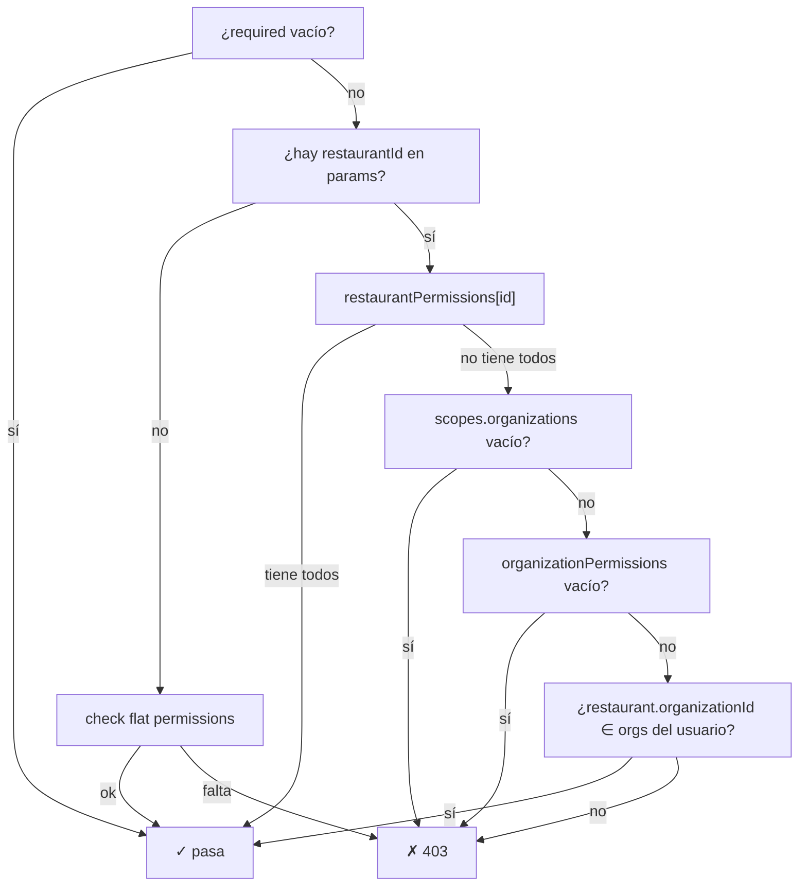
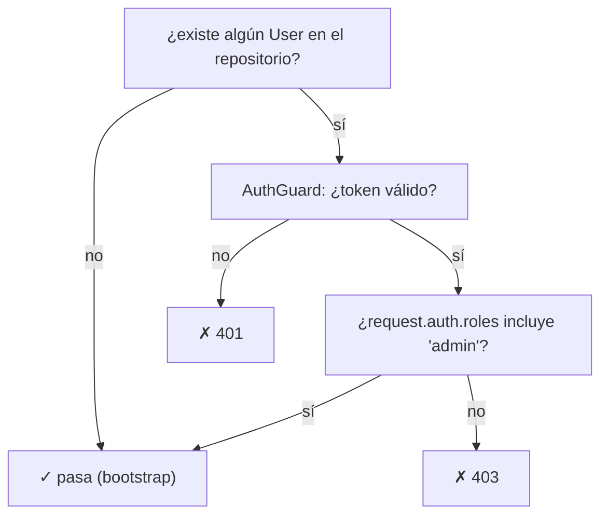
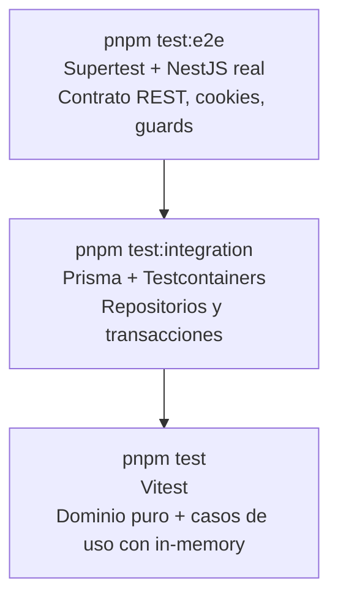

# Arquitectura Backend

## Estructura de capas

El backend sigue arquitectura limpia con cuatro capas por módulo:



| Capa | Responsabilidad | Puede importar |
|---|---|---|
| `domain/` | Entidades, enums, tipos de dominio | Nada externo |
| `application/` | Casos de uso, interfaces de puerto | `domain/` |
| `infrastructure/` | Repositorios Prisma, adaptadores in-memory | `application/`, `domain/` |
| `presentation/rest/` | Controladores NestJS, DTOs, Guards | `application/` |

```txt
src/<feature>/
  domain/
  application/
    ports/
    use-cases/
  infrastructure/
    persistence/       # adaptadores Prisma
    in-memory-*.ts     # adaptadores in-memory
  presentation/rest/
    <feature>.controller.ts
    <sub>.controller.ts
    guards/
    dto/
  <feature>.module.ts
```

---

## Patrón puerto-adaptador

Cada repositorio se expresa como un **puerto** (interfaz + token de inyección) con **dos adaptadores** que deben mantenerse alineados:



### Regla: adaptadores alineados

Cada vez que se añade o modifica un repositorio Prisma, su equivalente in-memory debe
actualizarse en el mismo commit. Los métodos nuevos del puerto deben implementarse en ambos.

| Archivo | Propósito |
|---|---|
| `application/ports/*.port.ts` | Interfaz TypeScript + token `Symbol` |
| `infrastructure/persistence/prisma-*.repository.ts` | Adaptador runtime |
| `infrastructure/in-memory-*.repository.ts` | Adaptador para specs de caso de uso |

Los specs de caso de uso **no deben importar adaptadores Prisma**. Usan siempre el adaptador
in-memory o clases inline dentro del propio spec.

---

## Módulos actuales



| Módulo | Descripción |
|---|---|
| `health` | Endpoint `GET /api/v1/health` sin auth |
| `identity` | Registro, login, roles, `UserRoleAssignment`, `/auth/me` |
| `restaurants` | Menú, suelo, pedidos, reservas, productos, clientes, service windows |

---

## Auth y scopes

La autenticación usa JWT Bearer. `AuthGuard` valida el token, carga el usuario y construye
`request.auth` con toda la información de roles, permisos y scopes:



### Fuente de verdad de roles

`UserRoleAssignment` es la única fuente para roles de negocio (`manager`, `waiter`, `kitchen`).
Cada assignment tiene un `scopeType` (`organization` | `restaurant`) que indica el alcance del rol:

| `scopeType` | Campos poblados | Ejemplo |
|---|---|---|
| `organization` | `organizationId` | Admin con acceso a todos los restaurantes de la org |
| `restaurant` | `organizationId` + `restaurantId` | Camarero asignado a un restaurante concreto |

### Estructura de `request.auth`

```ts
type AuthPayload = {
  userId: string;
  roles: string[];
  permissions: string[];           // unión plana (compatibilidad)
  scopes: {
    organizations: string[];
    restaurants: string[];
  };
  restaurantPermissions: Record<string, string[]>;    // permisos por restaurantId
  organizationPermissions: Record<string, string[]>;  // permisos por organizationId
};
```

`scopes.restaurants` contiene los IDs de restaurante presentes en algún assignment del usuario.
`listRestaurants` filtra por este conjunto para que cada usuario solo vea sus restaurantes.

`restaurantPermissions` y `organizationPermissions` son los mapas de permisos calculados por scope
a partir de cada `UserRoleAssignment` individual, evitando la unión plana incorrecta cuando un
usuario tiene roles distintos en restaurantes distintos.

### Guards en endpoints de restaurante

Los endpoints que requieren permiso de operación encadenan tres guards:

```
@UseGuards(AuthGuard, PermissionsGuard, RestaurantAccessGuard)
```

**`PermissionsGuard`** — resolución de permisos por scope:



El caso `developer` (org scope sin permisos) se cortocircuita antes de la consulta a Prisma porque
`organizationPermissions` queda vacío aunque tenga org en `scopes.organizations`.

**`RestaurantAccessGuard`** — comprueba que el usuario pueda acceder al restaurante:
- Acceso directo si `restaurantId ∈ scopes.restaurants`
- Acceso por org si el restaurante pertenece a una organización del usuario (consulta Prisma)

**Limitación conocida:** `RestaurantAccessGuard` con scope de organización permite acceso a cualquier
restaurante sin verificar que el restaurante pertenezca a esa organización.

### `BootstrapOrAdminGuard`

Protege el bootstrap de identidad: `POST/GET /users`, `PATCH /users/:id/roles`, `POST/GET /roles`.
Estos endpoints estuvieron sin ningún guard durante un tiempo (bypass total de autenticación:
cualquiera podía listar usuarios, crear cuentas o auto-asignarse el rol `admin`). El motivo original
era permitir crear el primer admin sin token en una instalación nueva.

```
@UseGuards(BootstrapOrAdminGuard)
```

Lógica:



En producción el primer admin normal se siembra con `pnpm prisma:seed` (escribe directo a la base,
no pasa por este guard). El bootstrap vía API solo importa para entornos efímeros (tests e2e, demos
locales sin seed) donde no hay ningún usuario todavía. En cuanto existe un usuario, el guard exige
sesión válida + rol `admin` para siempre — no hay forma de reabrir el bootstrap sin vaciar la tabla
`users`.

---

## Controladores de restaurante

El módulo `restaurants` divide la presentación en controladores especializados para mantener
cada archivo bajo 150 líneas:

| Controlador | Prefijo | Responsabilidad |
|---|---|---|
| `RestaurantsController` | `restaurants` | `GET /restaurants` (lista) |
| `RestaurantMenuController` | `restaurants/:id` | Menú, secciones, ítems, disponibilidad |
| `RestaurantOrderController` | `restaurants/:id` | Pedidos y líneas de pedido |
| `RestaurantFloorController` | `restaurants/:id` | Suelo, service floor, service points |
| `RestaurantReservationsController` | `restaurants/:id` | Agenda de reservas |
| `RestaurantProductsController` | `restaurants/:id` | Catálogo de productos |
| `RestaurantModifierGroupsController` | `restaurants/:id` | CRUD de grupos de modificadores |
| `RestaurantCustomersController` | `restaurants/:id` | Búsqueda y alta de clientes |
| `RestaurantServiceController` | `restaurants/:id` | Service windows |

---

## Errores de aplicación

Los errores de dominio se expresan como `ApplicationError` (código + detalles) y se mapean a
HTTP en `application-error.mapper.ts`:

| Código | HTTP | Descripción |
|---|---|---|
| `restaurant_not_found` | 404 | Restaurante no encontrado |
| `invalid_reservation_creation` | 400 | Datos de reserva inválidos |
| `reservation_in_past` | 422 | Fecha en el pasado |
| `insufficient_table_capacity` | 422 | Mesa sin capacidad suficiente |
| `reservation_conflict` | 409 | Solapamiento de reservas |
| `outside_service_hours` | 422 | Fuera de franjas de servicio |
| `invalid_order_state` | 422 | Transición de pedido no permitida |
| `product_not_found` | 404 | Producto no encontrado |
| `modifier_group_not_found` | 404 | Grupo de modificadores no encontrado |
| `modifier_group_name_taken` | 409 | Ya existe un grupo con ese nombre en la organización |
| `modifier_group_in_use` | 409 | El grupo está asignado a al menos un producto |

Los casos de uso devuelven `Result<T, ApplicationError>` usando el tipo `Result` de
`shared/result/result.ts`. El adaptador HTTP convierte `err(applicationError)` en la excepción
NestJS correspondiente.

---

## Estrategia de tests



| Nivel | Cuándo añadir |
|---|---|
| Spec de caso de uso (Vitest) | Lógica nueva en un use case, reglas de negocio |
| Spec de repositorio (Testcontainers) | Query Prisma nueva, transacción, relación |
| Spec e2e (Supertest) | Contrato REST, cookie de auth, guard, flujo completo |

---

## Observabilidad

El backend incluye un módulo `observability` dedicado a:

- persistir logs técnicos y auditoría en `app_logs`
- registrar request/response con interceptor global
- registrar excepciones con filtro global
- almacenar eventos ligeros del frontend
- exponer agregados y listados para el dashboard developer
- limpiar datos expirados según retención configurable

Campos de auditoría estructurada:

- `actorRoles`
- `result`
- `entityType`
- `entityId`
- `entityLabel`
- `changedFields`

Consulta la documentación operativa en [observability.md](/C:/Users/Thor_/Documents/Proyecto/backend/docs/observability.md).
