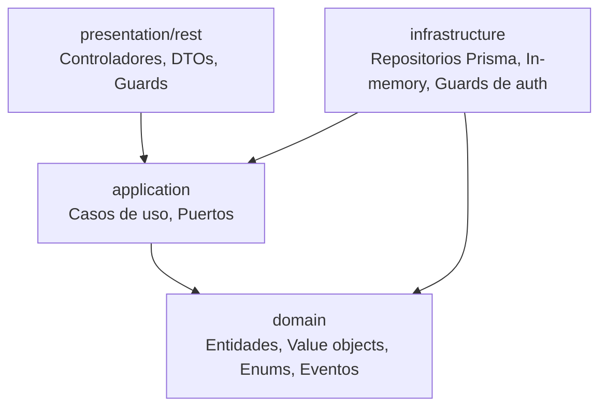
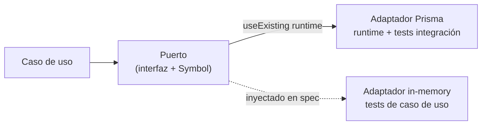
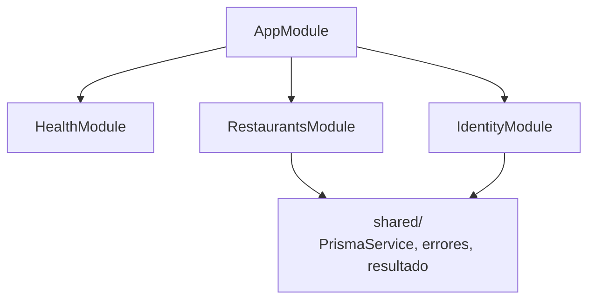
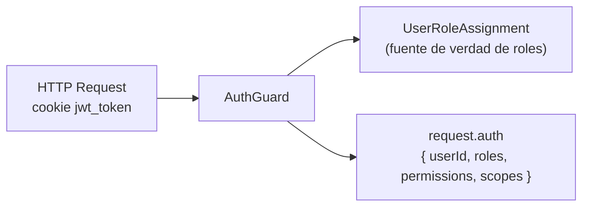
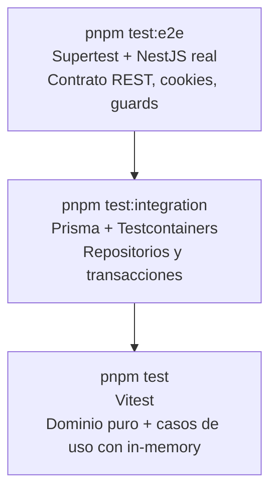

# Arquitectura Backend

## Estructura de capas

El backend sigue arquitectura limpia con cuatro capas por módulo:



| Capa | Responsabilidad | Puede importar |
|---|---|---|
| `domain/` | Entidades, enums, tipos de dominio | Nada externo |
| `application/` | Casos de uso, interfaces de puerto | `domain/` |
| `infrastructure/` | Repositorios Prisma, adaptadores in-memory | `application/`, `domain/` |
| `presentation/rest/` | Controladores NestJS, DTOs, Guards | `application/` |

```txt
src/<feature>/
  domain/
  application/
    ports/
    use-cases/
  infrastructure/
    persistence/       # adaptadores Prisma
    in-memory-*.ts     # adaptadores in-memory
  presentation/rest/
    <feature>.controller.ts
    <sub>.controller.ts
    guards/
    dto/
  <feature>.module.ts
```

---

## Patrón puerto-adaptador

Cada repositorio se expresa como un **puerto** (interfaz + token de inyección) con **dos adaptadores** que deben mantenerse alineados:



### Regla: adaptadores alineados

Cada vez que se añade o modifica un repositorio Prisma, su equivalente in-memory debe
actualizarse en el mismo commit. Los métodos nuevos del puerto deben implementarse en ambos.

| Archivo | Propósito |
|---|---|
| `application/ports/*.port.ts` | Interfaz TypeScript + token `Symbol` |
| `infrastructure/persistence/prisma-*.repository.ts` | Adaptador runtime |
| `infrastructure/in-memory-*.repository.ts` | Adaptador para specs de caso de uso |

Los specs de caso de uso **no deben importar adaptadores Prisma**. Usan siempre el adaptador
in-memory o clases inline dentro del propio spec.

---

## Módulos actuales



| Módulo | Descripción |
|---|---|
| `health` | Endpoint `GET /api/v1/health` sin auth |
| `identity` | Registro, login, roles, `UserRoleAssignment`, `/auth/me` |
| `restaurants` | Menú, suelo, pedidos, reservas, productos, clientes, service windows |

---

## Auth y scopes

La autenticación usa JWT en cookie. `AuthGuard` valida el token, carga el usuario y construye
`request.auth`:



### Fuente de verdad de roles

`UserRoleAssignment` es la única fuente para roles de negocio (`manager`, `waiter`, `kitchen`).
La tabla `UserRole` (many-to-many legacy) no se usa para construir `roles` ni `scopes` en el guard.

### Estructura de `request.auth`

```ts
type AuthPayload = {
  userId: string;
  roles: string[];
  permissions: string[];
  scopes: {
    organizations: string[];
    restaurants: string[];
  };
};
```

`scopes.restaurants` contiene los IDs de restaurante a los que el usuario tiene acceso según
sus `UserRoleAssignment`. `listRestaurants` filtra por este conjunto, por lo que cada usuario
solo ve los restaurantes propios.

### Guards en endpoints de restaurante

Los endpoints de lectura y escritura de un restaurante específico llevan tres guards:

```
@UseGuards(AuthGuard, PermissionsGuard, RestaurantAccessGuard)
```

`RestaurantAccessGuard` verifica que `params.restaurantId` esté en `request.auth.scopes.restaurants`.

---

## Controladores de restaurante

El módulo `restaurants` divide la presentación en controladores especializados para mantener
cada archivo bajo 150 líneas:

| Controlador | Prefijo | Responsabilidad |
|---|---|---|
| `RestaurantsController` | `restaurants` | `GET /restaurants` (lista) |
| `RestaurantMenuController` | `restaurants/:id` | Menú, secciones, ítems, disponibilidad |
| `RestaurantOrderController` | `restaurants/:id` | Pedidos y líneas de pedido |
| `RestaurantFloorController` | `restaurants/:id` | Suelo, service floor, service points |
| `RestaurantReservationsController` | `restaurants/:id` | Agenda de reservas |
| `RestaurantProductsController` | `restaurants/:id` | Catálogo de productos |
| `RestaurantCustomersController` | `restaurants/:id` | Búsqueda y alta de clientes |
| `RestaurantServiceController` | `restaurants/:id` | Service windows |

---

## Errores de aplicación

Los errores de dominio se expresan como `ApplicationError` (código + detalles) y se mapean a
HTTP en `application-error.mapper.ts`:

| Código | HTTP | Descripción |
|---|---|---|
| `restaurant_not_found` | 404 | Restaurante no encontrado |
| `invalid_reservation_creation` | 400 | Datos de reserva inválidos |
| `reservation_in_past` | 422 | Fecha en el pasado |
| `insufficient_table_capacity` | 422 | Mesa sin capacidad suficiente |
| `reservation_conflict` | 409 | Solapamiento de reservas |
| `outside_service_hours` | 422 | Fuera de franjas de servicio |
| `invalid_order_state` | 422 | Transición de pedido no permitida |
| `product_not_found` | 404 | Producto no encontrado |

Los casos de uso devuelven `Result<T, ApplicationError>` usando el tipo `Result` de
`shared/result/result.ts`. El adaptador HTTP convierte `err(applicationError)` en la excepción
NestJS correspondiente.

---

## Estrategia de tests



| Nivel | Cuándo añadir |
|---|---|
| Spec de caso de uso (Vitest) | Lógica nueva en un use case, reglas de negocio |
| Spec de repositorio (Testcontainers) | Query Prisma nueva, transacción, relación |
| Spec e2e (Supertest) | Contrato REST, cookie de auth, guard, flujo completo |
