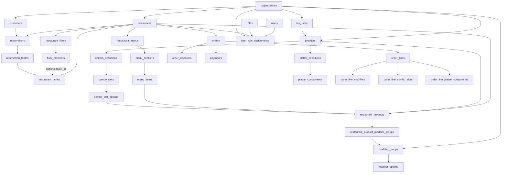

# MesaFlow API Draft

Read-first API draft for the MesaFlow backend. These endpoints are versioned under `/api/v1` and
currently expose demo-backed read models so frontend and backend can align on contracts before
write workflows are expanded.

## Data Model

Notas rápidas:
- `restaurant_tables` representa la mesa operativa; `floor_elements` representa su posición visual.
- `order_lines` guarda snapshots para no depender del catálogo vivo.
- `reservations` snapshot-ea nombre y teléfono del cliente aunque exista `customerId`.

## Restaurants

- `GET /api/v1/restaurants`
  Returns available restaurant scopes for the current environment.

- `GET /api/v1/restaurants/:id/menu`
  Returns the active menu projection for a restaurant, grouped by sections and ready for POS-style
  browsing.

- `GET /api/v1/restaurants/:id/floors`
  Returns persisted layout data with separate business tables and visual floor elements.

- `POST /api/v1/restaurants/:id/floors/:floorId/elements`
  Creates a new visual element inside the floor matrix. Intended for the matrix editor when the
  user drops a new table marker, bar area, blocked zone, entrance, kitchen, bathroom or stool.

- `PATCH /api/v1/restaurants/:id/floors/:floorId`
  Updates floor metadata such as `name`, `rows`, and `columns`.

- `PUT /api/v1/restaurants/:id/floors/:floorId/elements/reorder`
  Reorders and repositions existing floor elements inside the floor matrix. This is the first write
  endpoint for layout editing and keeps `restaurant_tables` separate from `floor_elements`.

- `GET /api/v1/restaurants/:id/reservations`
  Returns reservation projections with customer snapshots and linked table ids.

## Follow-up write endpoints

The next write endpoints expected on top of the current data model are:

- `DELETE /api/v1/restaurants/:id/floors/:floorId/elements/:elementId`
- `POST /api/v1/restaurants/:restaurantId/orders`
- `POST /api/v1/orders/:id/lines`
- `POST /api/v1/orders/:id/payments`
- `POST /api/v1/restaurants/:restaurantId/reservations`

These are intentionally not implemented yet so the read contracts can stabilize first.
