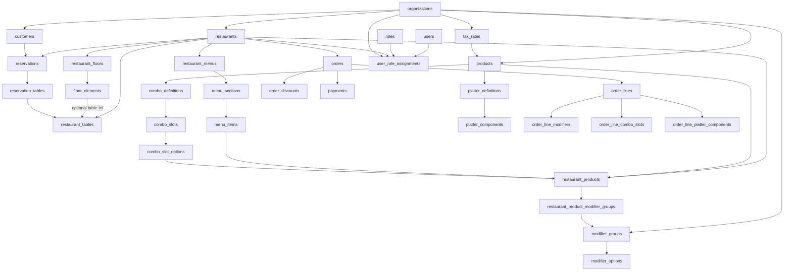
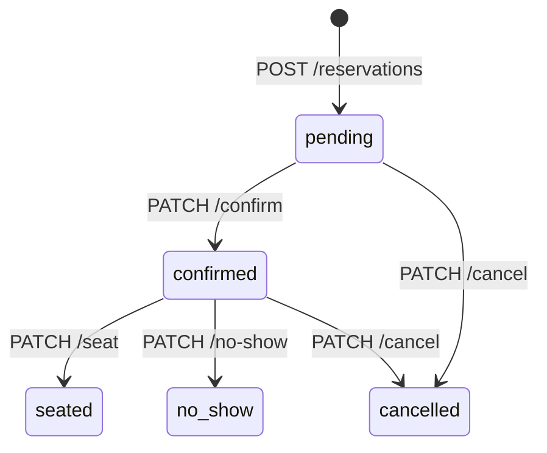
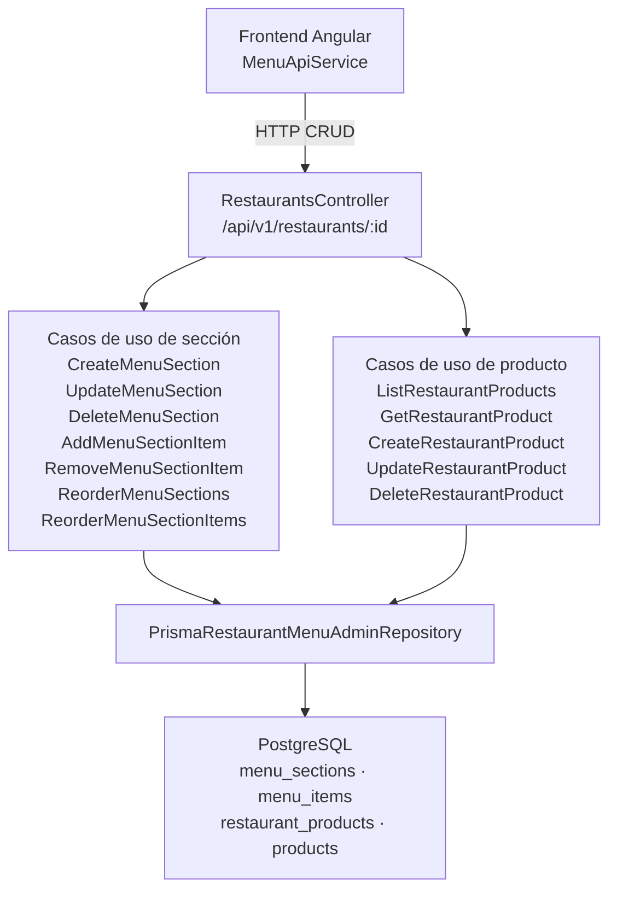

# MesaFlow API Draft

Read-first API draft for the MesaFlow backend. These endpoints are versioned under `/api/v1` and
currently expose demo-backed read models so frontend and backend can align on contracts before
write workflows are expanded.

## Data Model



Notas rápidas:
- `restaurant_tables` representa la mesa operativa; `floor_elements` representa su posición visual.
- `order_lines` guarda snapshots para no depender del catálogo vivo.
- `reservations` snapshot-ea nombre y teléfono del cliente aunque exista `customerId`.

## Restaurants

- `GET /api/v1/restaurants`
  Returns available restaurant scopes for the current environment.

- `GET /api/v1/restaurants/:id/menu`
  Returns the active menu projection for a restaurant, grouped by sections and ready for POS-style
  browsing.

- `GET /api/v1/restaurants/:id/floors`
  Returns persisted layout data with separate business tables and visual floor elements.

- `POST /api/v1/restaurants/:id/floors/:floorId/elements`
  Creates a new visual element inside the floor matrix. Intended for the matrix editor when the
  user drops a new table marker, bar area, blocked zone, entrance, kitchen, bathroom or stool.

- `PATCH /api/v1/restaurants/:id/floors/:floorId`
  Updates floor metadata such as `name`, `rows`, and `columns`.

- `PUT /api/v1/restaurants/:id/floors/:floorId/elements/reorder`
  Reorders and repositions existing floor elements inside the floor matrix. This is the first write
  endpoint for layout editing and keeps `restaurant_tables` separate from `floor_elements`.

- `GET /api/v1/restaurants/:id/reservations`
  Returns reservation projections with customer snapshots, linked table ids and enriched table
  data ready for the front-of-house agenda.

- `POST /api/v1/restaurants/:restaurantId/reservations`
  Creates one reservation with customer snapshots, party size, date/time, optional notes and
  optional table ids.

- `PATCH /api/v1/restaurants/:restaurantId/reservations/:reservationId/confirm`
  Moves one reservation from `pending` to `confirmed`.

- `PATCH /api/v1/restaurants/:restaurantId/reservations/:reservationId/seat`
  Moves one reservation from `confirmed` to `seated`.

- `PATCH /api/v1/restaurants/:restaurantId/reservations/:reservationId/no-show`
  Moves one reservation from `confirmed` to `no_show`.

- `PATCH /api/v1/restaurants/:restaurantId/reservations/:reservationId/cancel`
  Moves one reservation from `pending` or `confirmed` to `cancelled`.

### Reservation creation contract

`POST /api/v1/restaurants/:restaurantId/reservations` creates a reservation. The request body:

| Field | Type | Required | Description |
|---|---|---|---|
| `customerNameSnapshot` | `string` | yes | Customer name at booking time. Must not be blank. |
| `customerPhoneSnapshot` | `string \| null` | no | Phone snapshot, stored even if a `customerId` exists. |
| `partySize` | `integer` | yes | Number of people. Must be ≥ 1. |
| `reservationAt` | `ISO-8601` | yes | Date and time of the reservation. Must be in the future. |
| `durationMinutes` | `integer` | no | Expected duration in minutes. Must be ≥ 15. Defaults to 90. |
| `notes` | `string \| null` | no | Operational notes visible to front-of-house staff. |
| `tableIds` | `string[]` | no | Optional list of pre-assigned restaurant table IDs. |

Validation errors are returned as `400` with code `invalid_reservation_creation` and a `reason`
detail field:

| Reason | Condition |
|---|---|
| `missing_customer_name` | `customerNameSnapshot` is blank after trimming |
| `invalid_party_size` | `partySize` is less than 1 |
| `invalid_duration` | `durationMinutes` is less than 15 |
| `invalid_reservation_at` | `reservationAt` is not a parseable date |
| `reservation_in_past` | `reservationAt` is not in the future |

### Reservation agenda contract

`GET /api/v1/restaurants/:id/reservations` keeps `tableIds: string[]` for compatibility and adds a
frontend-friendly `tables` collection so the POS can render labels such as `Mesa 1` or `Terraza 4`
without extra joins.

Response shape:

```json
{
  "id": "reservation-demo-lunch",
  "customerId": null,
  "customerNameSnapshot": "Laura Gomez",
  "customerPhoneSnapshot": "+34 600 111 222",
  "partySize": 2,
  "reservationAt": "2026-06-27T13:30:00.000Z",
  "durationMinutes": 90,
  "status": "confirmed",
  "notes": "Mesa tranquila.",
  "tableIds": ["table_1"],
  "tables": [{ "id": "table_1", "tableNumber": 1, "name": "Mesa 1" }]
}
```

### Reservation status transitions



Transitions from `seated`, `cancelled` and `no_show` are terminal and will be rejected.

### Reservation errors

| Code | HTTP | Meaning |
|---|---|---|
| `restaurant_not_found` | 404 | The restaurant scope does not exist |
| `reservation_not_found` | 404 | The reservation does not exist in that restaurant |
| `invalid_reservation_creation` | 400 | A field failed creation validation (see `reason` detail) |
| `invalid_reservation_state` | 400 | The requested status transition is not allowed |

## Menu Admin

Endpoints de administración de secciones e ítems del menú. Requieren que exista un menú activo para el restaurante.

### Secciones

- `POST /api/v1/restaurants/:id/menus/:menuId/sections`
  Crea una nueva sección en el menú. El campo `name` debe ser único dentro del menú.

- `PATCH /api/v1/restaurants/:id/menus/:menuId/sections/:sectionId`
  Actualiza `name` o `isVisible` de una sección. Retorna el estado actualizado.

- `DELETE /api/v1/restaurants/:id/menus/:menuId/sections/:sectionId`
  Elimina la sección y sus ítems asociados.

- `PUT /api/v1/restaurants/:id/menus/:menuId/sections/reorder`
  Reordena las secciones del menú. Recibe un array `items: [{ id, sortOrder }]`.

### Ítems de sección

- `POST /api/v1/restaurants/:id/menus/:menuId/sections/:sectionId/items`
  Añade un ítem a la sección. El campo `restaurantProductId` referencia un producto del restaurante.

- `PATCH /api/v1/restaurants/:id/menus/:menuId/sections/:sectionId/items/:itemId`
  Actualiza `sortOrder` u otros metadatos del ítem.

- `DELETE /api/v1/restaurants/:id/menus/:menuId/sections/:sectionId/items/:itemId`
  Elimina el ítem de la sección.

- `PUT /api/v1/restaurants/:id/menus/:menuId/sections/:sectionId/items/reorder`
  Reordena los ítems dentro de una sección. Recibe `items: [{ id, sortOrder }]`.

### Productos del restaurante

- `GET /api/v1/restaurants/:id/products`
  Devuelve el resumen de todos los productos del restaurante (`RestaurantProductSummaryDto`: `id`,
  `name`, `displayName`, `productType`, `course`, `preparationRoute`, `priceCents`, `isAvailable`,
  `isVisible`). Incluye productos sin asignar a ninguna sección.

- `GET /api/v1/restaurants/:id/products/:productId`
  Devuelve el detalle completo de un producto (`RestaurantProductDetailDto`) con nombre, descripción,
  precio, curso, ruta de preparación y disponibilidad.

- `POST /api/v1/restaurants/:id/products`
  Crea un nuevo producto en el catálogo del restaurante. Requiere autenticación. Devuelve
  `RestaurantProductDetailDto`. Lanza `409` si ya existe un producto con el mismo nombre.

- `PATCH /api/v1/restaurants/:id/products/:productId`
  Actualiza campos del producto (`name`, `description`, `course`, `preparationRoute`, `priceCents`,
  `isAvailable`). Requiere autenticación. Lanza `404` si el producto no existe.

- `DELETE /api/v1/restaurants/:id/products/:productId`
  Elimina el producto del catálogo. Requiere autenticación.



### Errores

Los endpoints de admin de menú y producto lanzan errores alineados con `application-error.mapper.ts`:

| Código | HTTP | Descripción |
|---|---|---|
| `menu_not_found` | 404 | El menú no existe en el restaurante |
| `menu_section_not_found` | 404 | La sección no existe en el menú |
| `menu_section_name_taken` | 409 | Ya existe una sección con ese nombre |
| `menu_item_not_found` | 404 | El ítem no existe en la sección |
| `menu_item_already_in_section` | 409 | El producto ya está en la sección |
| `restaurant_product_not_found` | 404 | El producto no existe en el restaurante |
| `product_name_taken` | 409 | Ya existe un producto con ese nombre en la organización |

## Follow-up write endpoints

The next write endpoints expected on top of the current data model are:

- `DELETE /api/v1/restaurants/:id/floors/:floorId/elements/:elementId`
- `POST /api/v1/restaurants/:restaurantId/orders`
- `POST /api/v1/orders/:id/lines`
- `POST /api/v1/orders/:id/payments`

These are intentionally not implemented yet so the read contracts can stabilize first.
