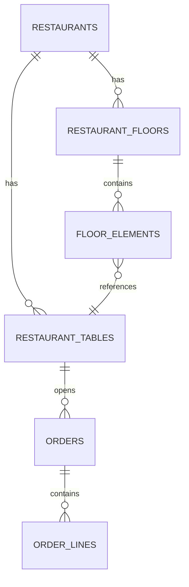
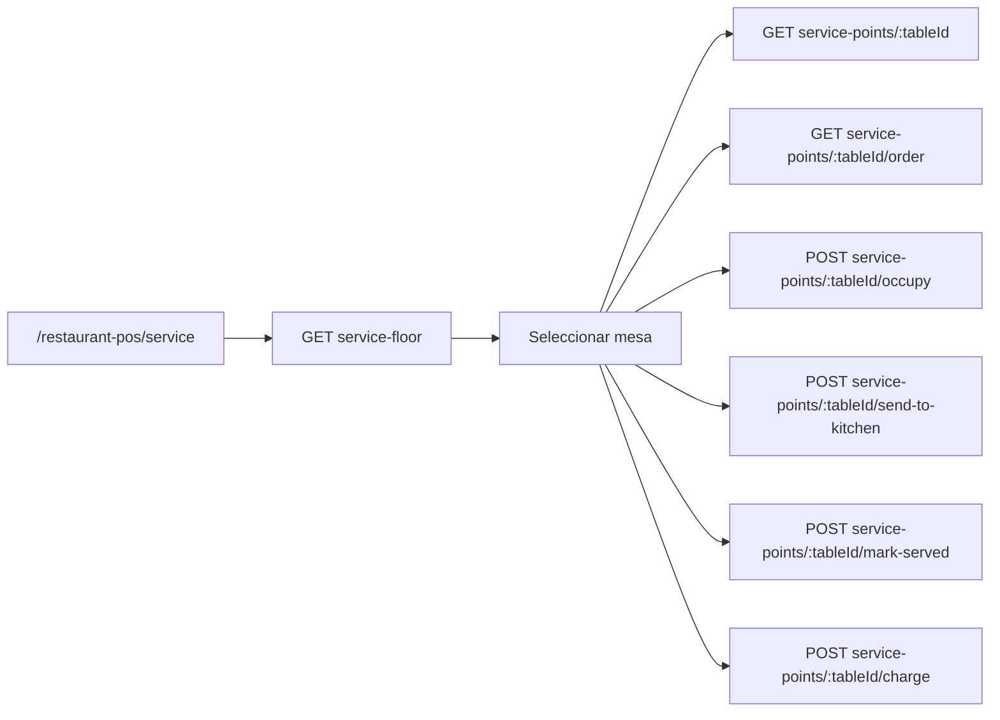
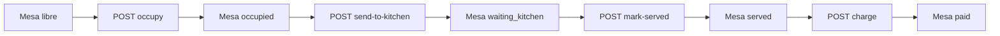

# Service Floor API

## Overview

Esta API da soporte a la ruta operativa de `service` en MesaFlow. Su objetivo es cargar el plano del
restaurante, los puntos de servicio visibles y el estado operativo minimo de cada mesa o taburete
sin depender de mocks en frontend.

Este primer corte cubre lectura operativa y cuatro acciones base del flujo de sala:

- iniciar servicio (`occupy`)
- enviar pedido a cocina (`send-to-kitchen`)
- marcar pedido como servido (`mark-served`)
- marcar la mesa como cobrada (`charge`)

No incluye todavia creacion de pedidos, edicion persistente de lineas, registros de pago ni cierre de
mesa. `charge` solo completa la transicion operativa del pedido y la mesa a `paid`.

## Scope

Incluido en esta fase:

- `GET /api/v1/restaurants/:id/service-floor`
- `GET /api/v1/restaurants/:id/service-points/:tableId`
- `GET /api/v1/restaurants/:id/service-points/:tableId/order`
- `POST /api/v1/restaurants/:id/service-points/:tableId/occupy`
- `POST /api/v1/restaurants/:id/service-points/:tableId/send-to-kitchen`
- `POST /api/v1/restaurants/:id/service-points/:tableId/mark-served`
- `POST /api/v1/restaurants/:id/service-points/:tableId/charge`

Fuera de alcance por ahora:

- crear pedido
- anadir productos
- editar lineas
- modifiers detallados en escritura
- registros de pago y conciliacion
- cierre de servicio

## Domain Model



## Endpoints

### GET /api/v1/restaurants/:id/service-floor

Carga el plano operativo de servicio para el restaurante activo.

**Path params**

- `id`: identificador del restaurante

**Response 200**

```json
{
  "restaurantId": "restaurant-mesaflow-centro",
  "floor": {
    "id": "floor-main",
    "name": "Sala principal",
    "rows": 12,
    "columns": 16
  },
  "elements": [
    {
      "id": "floor-element-1",
      "type": "table",
      "label": "M1",
      "x": 1,
      "y": 1,
      "width": 2,
      "height": 2,
      "shape": "round",
      "tableId": "table-1"
    }
  ],
  "servicePoints": [
    {
      "table": {
        "id": "table-1",
        "tableNumber": 1,
        "name": "Mesa 1",
        "capacity": 2,
        "status": "occupied",
        "serviceStartedAt": "2026-06-21T12:00:00.000Z"
      },
      "summary": {
        "lineCount": 3,
        "guestCount": 2,
        "totalCents": 4250,
        "currency": "EUR",
        "servicePhase": {
          "course": "mains",
          "status": "pending"
        }
      }
    }
  ],
  "totals": {
    "servicePointCount": 14,
    "occupiedCount": 6,
    "openOrderCount": 5
  }
}
```

**Errors**

- `404` restaurante no encontrado

### GET /api/v1/restaurants/:id/service-points/:tableId

Carga el detalle operativo de una mesa o taburete.

**Path params**

- `id`: identificador del restaurante
- `tableId`: identificador de la mesa

**Response 200**

```json
{
  "table": {
    "id": "table-1",
    "tableNumber": 1,
    "name": "Mesa 1",
    "capacity": 2,
    "status": "occupied",
    "occupiedAt": "2026-06-21T12:00:00.000Z",
    "serviceStartedAt": "2026-06-21T12:00:00.000Z"
  },
  "floorElement": {
    "id": "floor-element-1",
    "label": "M1",
    "type": "table",
    "x": 1,
    "y": 1,
    "width": 2,
    "height": 2,
    "shape": "round"
  },
  "serviceInfo": {
    "guestCount": 2,
    "lineCount": 3,
    "totalCents": 4250,
    "currency": "EUR",
    "servicePhase": {
      "course": "mains",
      "status": "pending"
    },
    "durationMinutes": 34
  }
}
```

**Errors**

- `404` restaurante no encontrado
- `404` mesa no encontrada en el restaurante

### GET /api/v1/restaurants/:id/service-points/:tableId/order

Carga el pedido activo de una mesa.

**Path params**

- `id`: identificador del restaurante
- `tableId`: identificador de la mesa

**Response 200 con pedido abierto**

```json
{
  "order": {
    "id": "order-1",
    "tableId": "table-1",
    "status": "open",
    "openedAt": "2026-06-21T12:00:00.000Z",
    "updatedAt": "2026-06-21T12:25:00.000Z",
    "subtotalCents": 3512,
    "taxCents": 738,
    "totalCents": 4250,
    "currency": "EUR"
  },
  "lines": [
    {
      "id": "line-1",
      "productName": "Hamburguesa completa",
      "quantity": 2,
      "unitPriceCents": 1250,
      "subtotalCents": 2500,
      "status": "pending",
      "course": "mains",
      "kitchenNote": "Sin cebolla"
    }
  ]
}
```

**Response 200 sin pedido abierto**

```json
{
  "order": null,
  "lines": []
}
```

**Errors**

- `404` restaurante no encontrado
- `404` mesa no encontrada en el restaurante

### POST /api/v1/restaurants/:id/service-points/:tableId/occupy

Marca una mesa o taburete como servicio iniciado y devuelve su detalle actualizado.

**Path params**

- `id`: identificador del restaurante
- `tableId`: identificador de la mesa

**Response 201**

```json
{
  "table": {
    "id": "stool-1",
    "tableNumber": 5,
    "name": "Taburete 1",
    "capacity": 1,
    "status": "occupied",
    "occupiedAt": "2026-06-22T10:15:00.000Z",
    "serviceStartedAt": "2026-06-22T10:15:00.000Z"
  },
  "floorElement": {
    "id": "floor-element-8",
    "label": "Stool 1",
    "type": "stool",
    "x": 1,
    "y": 5,
    "width": 1,
    "height": 1,
    "shape": null
  },
  "serviceInfo": {
    "guestCount": 1,
    "lineCount": 0,
    "totalCents": 0,
    "currency": "EUR",
    "servicePhase": {
      "course": "none",
      "status": "no_order"
    },
    "durationMinutes": 0
  }
}
```

**Errors**

- `404` restaurante no encontrado
- `404` mesa no encontrada en el restaurante

### POST /api/v1/restaurants/:id/service-points/:tableId/send-to-kitchen

Marca las lineas pendientes del pedido activo como enviadas a cocina y actualiza la mesa a
`waiting_kitchen`.

**Path params**

- `id`: identificador del restaurante
- `tableId`: identificador de la mesa

**Response 201**

```json
{
  "table": {
    "id": "table-3",
    "tableNumber": 3,
    "name": "Mesa 3",
    "capacity": 6,
    "status": "waiting_kitchen",
    "occupiedAt": "2026-06-22T10:15:00.000Z",
    "serviceStartedAt": "2026-06-22T10:15:00.000Z"
  },
  "floorElement": {
    "id": "floor-element-3",
    "label": "M3",
    "type": "table",
    "x": 9,
    "y": 1,
    "width": 2,
    "height": 2,
    "shape": "rectangle"
  },
  "serviceInfo": {
    "guestCount": 6,
    "lineCount": 2,
    "totalCents": 2940,
    "currency": "EUR",
    "servicePhase": {
      "course": "mixed",
      "status": "pending"
    },
    "durationMinutes": 21
  }
}
```

**Errors**

- `400` la mesa no tiene lineas pendientes para enviar
- `404` restaurante no encontrado
- `404` mesa no encontrada en el restaurante

### POST /api/v1/restaurants/:id/service-points/:tableId/mark-served

Marca las lineas activas del pedido como servidas y actualiza la mesa a `served`.

**Path params**

- `id`: identificador del restaurante
- `tableId`: identificador de la mesa

**Response 201**

```json
{
  "table": {
    "id": "table-3",
    "tableNumber": 3,
    "name": "Mesa 3",
    "capacity": 6,
    "status": "served",
    "occupiedAt": "2026-06-22T10:15:00.000Z",
    "serviceStartedAt": "2026-06-22T10:15:00.000Z"
  },
  "floorElement": {
    "id": "floor-element-3",
    "label": "M3",
    "type": "table",
    "x": 9,
    "y": 1,
    "width": 2,
    "height": 2,
    "shape": "rectangle"
  },
  "serviceInfo": {
    "guestCount": 6,
    "lineCount": 2,
    "totalCents": 2940,
    "currency": "EUR",
    "servicePhase": {
      "course": "none",
      "status": "served"
    },
    "durationMinutes": 24
  }
}
```

**Errors**

- `400` la mesa no tiene lineas activas para marcar como servidas
- `404` restaurante no encontrado
- `404` mesa no encontrada en el restaurante

### POST /api/v1/restaurants/:id/service-points/:tableId/charge

Marca el pedido activo y la mesa como `paid`. La mesa debe tener un importe mayor que cero y no
puede estar libre, reservada, ya pagada o en limpieza.

Este endpoint representa la confirmacion operativa del cobro. La persistencia del metodo de pago,
transacciones y conciliacion se incorporara con los endpoints de payments.

**Path params**

- `id`: identificador del restaurante
- `tableId`: identificador de la mesa

**Response 201**

```json
{
  "table": {
    "id": "table-2",
    "tableNumber": 2,
    "name": "Mesa 2",
    "capacity": 4,
    "status": "paid",
    "occupiedAt": "2026-06-22T10:15:00.000Z",
    "serviceStartedAt": "2026-06-22T10:15:00.000Z"
  },
  "floorElement": {
    "id": "floor-element-2",
    "label": "M2",
    "type": "table",
    "x": 5,
    "y": 1,
    "width": 2,
    "height": 2,
    "shape": "rectangle"
  },
  "serviceInfo": {
    "guestCount": 4,
    "lineCount": 0,
    "totalCents": 0,
    "currency": "EUR",
    "servicePhase": {
      "course": "none",
      "status": "no_order"
    },
    "durationMinutes": 28
  }
}
```

Despues del cobro, `GET .../order` devuelve `order: null` porque ya no existe un pedido activo.

**Errors**

- `400` la mesa no tiene importe cobrable o su estado no permite cobrar
- `404` restaurante no encontrado
- `404` mesa no encontrada en el restaurante

## Enums

### table.status

- `free`
- `occupied`
- `waiting_kitchen`
- `served`
- `payment_pending`
- `paid`
- `cleaning`
- `reserved`

### order.status

- `open`
- `sent_to_kitchen`
- `served`
- `payment_pending`
- `paid`

### line.status

- `pending`
- `sent_to_kitchen`
- `preparing`
- `ready`
- `picked_up`
- `served`
- `cancelled`

### servicePhase.course

- `drinks`
- `starters`
- `mains`
- `desserts`
- `mixed`
- `none`

### servicePhase.status

- `no_order`
- `pending`
- `in_progress`
- `ready`
- `served`

## Derived Rules

`servicePhase` es derivado en backend y no se persiste.

### servicePhase.status

- si no hay lineas activas: `no_order`
- si todas las lineas activas estan `served`: `served`
- si alguna linea esta `ready` y ninguna esta `preparing`: `ready`
- si alguna linea esta `preparing`: `in_progress`
- si hay lineas `pending` y ninguna esta `preparing` ni `ready`: `pending`

### servicePhase.course

- si todas las lineas activas son del mismo curso: devolver ese curso
- si mezclan varios cursos: `mixed`
- si no hay lineas activas: `none`

### durationMinutes

- calcular desde `occupiedAt`
- si `occupiedAt` es null, usar `serviceStartedAt`
- si ambos son null, devolver `0`

### Active lines

Para este primer corte, una linea activa es cualquier linea cuyo estado no sea:

- `served`
- `cancelled`

## Frontend Consumption



Flujo esperado:

1. La ruta `service` carga `service-floor`.
2. El plano se pinta con `floor`, `elements` y `servicePoints`.
3. Al seleccionar una mesa, frontend pide:
   - `service-points/:tableId`
   - `service-points/:tableId/order`
4. Si `order` es `null`, frontend muestra mesa seleccionada sin pedido abierto.
5. Al pulsar `ocupar`, frontend llama a `service-points/:tableId/occupy` y refresca el panel.
6. Al pulsar `cocina`, frontend llama a `service-points/:tableId/send-to-kitchen` y vuelve a cargar `order`.
7. Al pulsar `servido`, frontend llama a `service-points/:tableId/mark-served` y mantiene las lineas locales sincronizadas con el cambio de estado de mesa.
8. Al confirmar el cobro, frontend llama a `service-points/:tableId/charge` y conserva localmente el metodo de pago y el resumen visible.

## Current Status



Lo que ya esta operativo hoy:

- lectura de planta de servicio
- lectura de detalle de mesa
- lectura de pedido activo
- iniciar servicio
- enviar a cocina
- marcar servido
- marcar como cobrado

Lo que sigue fuera de alcance:

- persistir notas de linea
- anadir o quitar productos en backend
- modifiers en escritura
- registrar transacciones y metodos de pago en backend
- cierre de mesa

## Error Model

Convencion para esta fase:

- `404` cuando el restaurante no existe
- `404` cuando la mesa no existe dentro del restaurante
- `400` cuando una accion no es valida para el estado o importe actual
- `200` con `order: null` cuando la mesa existe pero todavia no tiene pedido abierto

## Future Extensions

Siguientes endpoints previstos fuera de esta fase:

- `POST /api/v1/restaurants/:id/service-points/:tableId/orders`
- `POST /api/v1/restaurants/:id/orders/:orderId/lines`
- `PATCH /api/v1/restaurants/:id/orders/:orderId/lines/:lineId`
- `POST /api/v1/restaurants/:id/orders/:orderId/payments`
