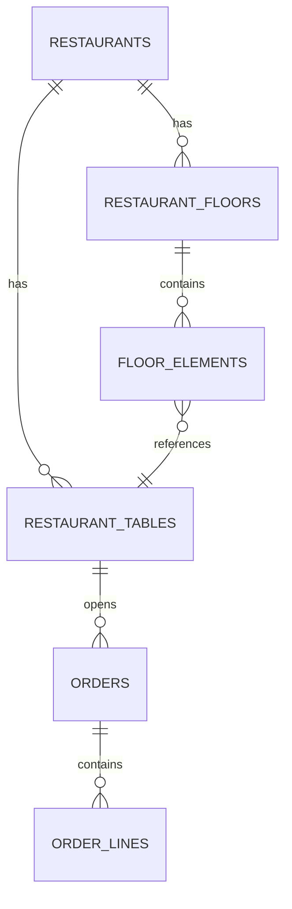
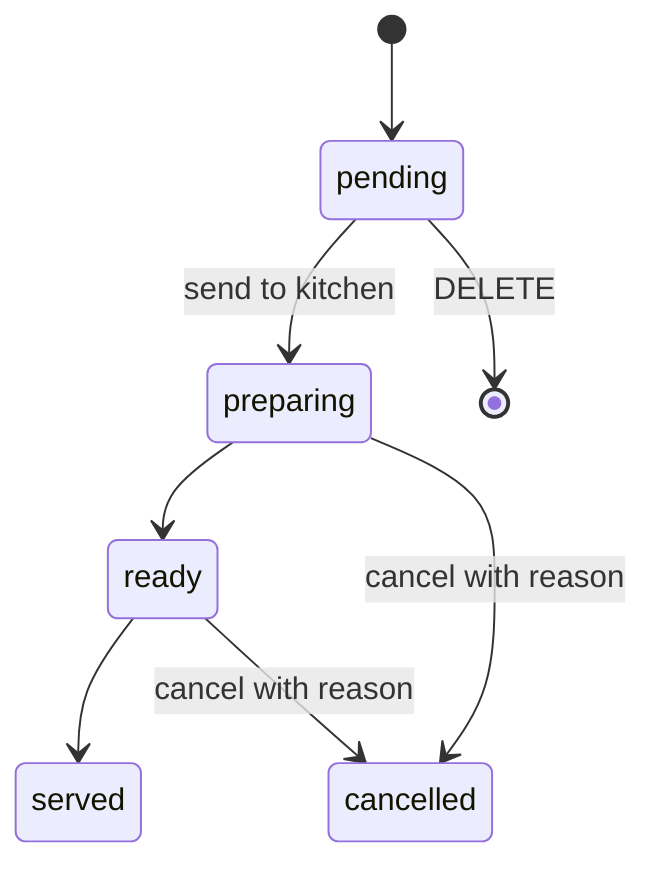
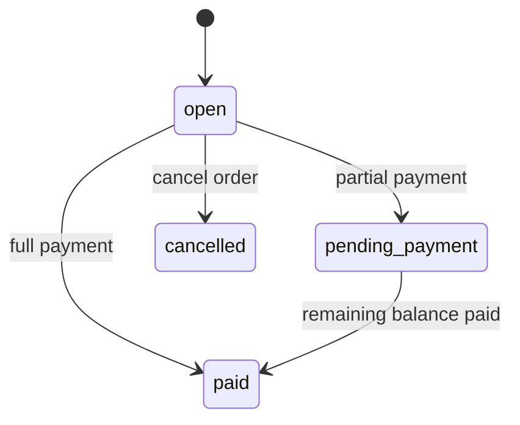
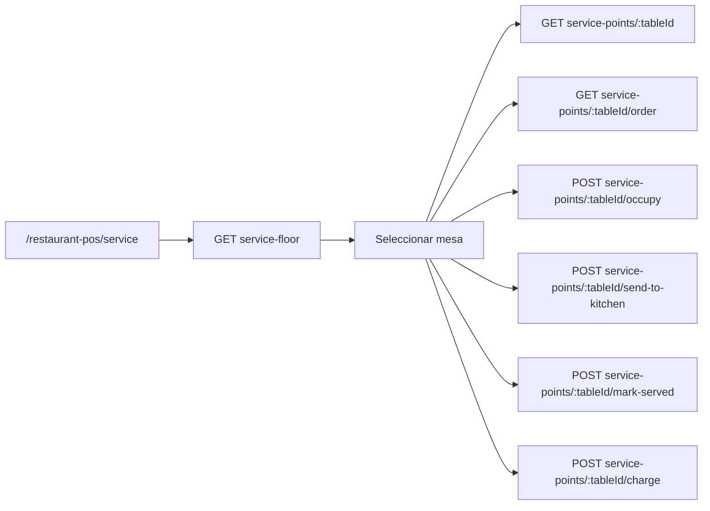
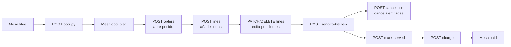

# Service Floor API

## Overview

Esta API da soporte a la ruta operativa de `service` en MesaFlow. Carga el plano del restaurante,
los puntos de servicio y el estado operativo de cada mesa, y expone el catalogo persistente con los
IDs reales necesarios para crear y editar pedidos.

## Estado de implementacion

```mermaid
flowchart LR
  T1[Task 1\nSchema Prisma] --> T2[Task 2\nDomain + Pricing]
  T2 --> T3[Task 3\nCatalogo persistente]
  T3 --> T4[Task 4\nApertura pedido]
  T4 --> T5[Task 5\nLineas configuradas]
  T5 --> T6[Task 6\nCiclo vida lineas]
  T6 --> T7[Task 7\nProyeccion servicio]
  T7 --> T8[Task 8\nPagos y cierre]
  T8 --> T9[Task 9\nREST E2E]
  T9 --> T10[Task 10\nAngular write]
  T10 --> T11[Task 11\nDocs finales]

  style T1 fill:#22c55e,color:#fff
  style T2 fill:#22c55e,color:#fff
  style T3 fill:#22c55e,color:#fff
  style T4 fill:#22c55e,color:#fff
  style T5 fill:#22c55e,color:#fff
  style T6 fill:#22c55e,color:#fff
  style T7 fill:#22c55e,color:#fff
  style T8 fill:#22c55e,color:#fff
  style T10 fill:#22c55e,color:#fff
  style T11 fill:#22c55e,color:#fff
```



> Task 9 (E2E Testcontainers) requiere Docker; diferido hasta que Docker este disponible en la maquina de desarrollo.

## Scope

Implementado (Tasks 1-8, 10-11):

- `GET /api/v1/restaurants/:id/menu` — catalogo con IDs persistentes
- `GET /api/v1/restaurants/:id/service-floor`
- `GET /api/v1/restaurants/:id/service-points/:tableId`
- `GET /api/v1/restaurants/:id/service-points/:tableId/order`
- `POST /api/v1/restaurants/:id/service-points/:tableId/occupy`
- `POST /api/v1/restaurants/:id/service-points/:tableId/send-to-kitchen`
- `POST /api/v1/restaurants/:id/service-points/:tableId/mark-served`
- `POST /api/v1/restaurants/:id/service-points/:tableId/charge`
- `POST /api/v1/restaurants/:id/service-points/:tableId/orders` — abrir o recuperar pedido activo
- `POST /api/v1/restaurants/:id/orders/:orderId/lines` — anadir linea configurada
- `PATCH /api/v1/restaurants/:id/orders/:orderId/lines/:lineId` — actualizar cantidad/nota
- `DELETE /api/v1/restaurants/:id/orders/:orderId/lines/:lineId` — eliminar linea pendiente
- `POST /api/v1/restaurants/:id/orders/:orderId/lines/:lineId/cancel` — cancelar linea enviada
- `POST /api/v1/restaurants/:id/orders/:orderId/payments` — registrar pago parcial o total

Angular (Task 10): `RestaurantPosApiService` expone los 7 metodos de pedido persistente:

- `openRestaurantOrder(restaurantId, tableId, guestCount)` — POST `.../service-points/:tableId/orders`
- `getRestaurantOrder(restaurantId, orderId)` — GET `.../orders/:orderId`
- `addRestaurantOrderLine(restaurantId, orderId, body)` — POST `.../orders/:orderId/lines`
- `updateRestaurantOrderLine(restaurantId, orderId, lineId, body)` — PATCH `.../orders/:orderId/lines/:lineId`
- `deleteRestaurantOrderLine(restaurantId, orderId, lineId)` — DELETE `.../orders/:orderId/lines/:lineId`
- `cancelRestaurantOrderLine(restaurantId, orderId, lineId, reason)` — POST `.../orders/:orderId/lines/:lineId/cancel`
- `registerRestaurantOrderPayment(restaurantId, orderId, amountCents, method)` — POST `.../orders/:orderId/payments`

Pendiente (Task 9):
- Tests E2E con Testcontainers (requiere Docker)

## Domain Model



## Endpoints

### GET /api/v1/restaurants/:id/menu

Devuelve el menu activo del restaurante con todos los IDs persistentes necesarios para construir
solicitudes de escritura de pedido (productos, grupos de modificadores, opciones, slots de combo,
componentes de plato combinado).

**Path params**

- `id`: identificador del restaurante

**Response 200**

```json
{
  "restaurantId": "restaurant-mesaflow-centro",
  "name": "Carta principal",
  "isActive": true,
  "sections": [
    {
      "id": "menu-section-uuid",
      "name": "Principales",
      "sortOrder": 2,
      "isVisible": true,
      "items": [
        {
          "id": "menu-item-uuid",
          "restaurantProductId": "rp-uuid",
          "productId": "product-uuid",
          "name": "Hamburguesa craft",
          "productType": "simple",
          "priceCents": 1250,
          "currency": "EUR",
          "isAvailable": true,
          "defaultCourse": "main",
          "preparationRoute": "kitchen",
          "modifierGroups": [
            {
              "id": "mg-uuid",
              "name": "Extras",
              "minSelections": 0,
              "maxSelections": 3,
              "isRequired": false,
              "options": [
                { "id": "opt-uuid", "name": "Queso", "priceDeltaCents": 100, "isAvailable": true }
              ]
            }
          ],
          "comboDefinition": null,
          "platterComponents": []
        },
        {
          "id": "menu-item-combo-uuid",
          "restaurantProductId": "rp-combo-uuid",
          "productId": "product-combo-uuid",
          "name": "Menu Classic Burger",
          "productType": "combo",
          "priceCents": 1390,
          "currency": "EUR",
          "isAvailable": true,
          "defaultCourse": "main",
          "preparationRoute": "kitchen",
          "modifierGroups": [],
          "comboDefinition": {
            "id": "combo-def-uuid",
            "slots": [
              {
                "id": "slot-uuid",
                "name": "Bebida",
                "minSelections": 1,
                "maxSelections": 1,
                "isRequired": true,
                "options": [
                  {
                    "id": "slot-opt-uuid",
                    "restaurantProductId": "rp-beer-uuid",
                    "name": "Cerveza",
                    "supplementPriceCents": 150,
                    "isAvailable": true
                  }
                ]
              }
            ]
          },
          "platterComponents": []
        }
      ]
    }
  ]
}
```

**Errors**

- `404` restaurante no encontrado o sin menu activo

---

### GET /api/v1/restaurants/:id/service-floor

Carga el plano operativo de servicio para el restaurante activo.

**Path params**

- `id`: identificador del restaurante

**Response 200**

```json
{
  "restaurantId": "restaurant-mesaflow-centro",
  "floor": {
    "id": "floor-main",
    "name": "Sala principal",
    "rows": 12,
    "columns": 16
  },
  "elements": [
    {
      "id": "floor-element-1",
      "type": "table",
      "label": "M1",
      "x": 1,
      "y": 1,
      "width": 2,
      "height": 2,
      "shape": "round",
      "tableId": "table-1"
    }
  ],
  "servicePoints": [
    {
      "table": {
        "id": "table-1",
        "tableNumber": 1,
        "name": "Mesa 1",
        "capacity": 2,
        "status": "occupied",
        "serviceStartedAt": "2026-06-21T12:00:00.000Z"
      },
      "summary": {
        "lineCount": 3,
        "guestCount": 2,
        "totalCents": 4250,
        "currency": "EUR",
        "servicePhase": {
          "course": "mains",
          "status": "pending"
        }
      }
    }
  ],
  "totals": {
    "servicePointCount": 14,
    "occupiedCount": 6,
    "openOrderCount": 5
  }
}
```

**Errors**

- `404` restaurante no encontrado

### GET /api/v1/restaurants/:id/service-points/:tableId

Carga el detalle operativo de una mesa o taburete.

**Path params**

- `id`: identificador del restaurante
- `tableId`: identificador de la mesa

**Response 200**

```json
{
  "table": {
    "id": "table-1",
    "tableNumber": 1,
    "name": "Mesa 1",
    "capacity": 2,
    "status": "occupied",
    "occupiedAt": "2026-06-21T12:00:00.000Z",
    "serviceStartedAt": "2026-06-21T12:00:00.000Z"
  },
  "floorElement": {
    "id": "floor-element-1",
    "label": "M1",
    "type": "table",
    "x": 1,
    "y": 1,
    "width": 2,
    "height": 2,
    "shape": "round"
  },
  "serviceInfo": {
    "guestCount": 2,
    "lineCount": 3,
    "totalCents": 4250,
    "currency": "EUR",
    "servicePhase": {
      "course": "mains",
      "status": "pending"
    },
    "durationMinutes": 34
  }
}
```

**Errors**

- `404` restaurante no encontrado
- `404` mesa no encontrada en el restaurante

### GET /api/v1/restaurants/:id/service-points/:tableId/order

Carga el pedido activo de una mesa.

**Path params**

- `id`: identificador del restaurante
- `tableId`: identificador de la mesa

**Response 200 con pedido abierto**

```json
{
  "order": {
    "id": "order-1",
    "tableId": "table-1",
    "status": "open",
    "openedAt": "2026-06-21T12:00:00.000Z",
    "updatedAt": "2026-06-21T12:25:00.000Z",
    "subtotalCents": 3512,
    "taxCents": 738,
    "totalCents": 4250,
    "currency": "EUR"
  },
  "lines": [
    {
      "id": "line-1",
      "productName": "Hamburguesa completa",
      "quantity": 2,
      "unitPriceCents": 1250,
      "subtotalCents": 2500,
      "status": "pending",
      "course": "mains",
      "kitchenNote": "Sin cebolla"
    }
  ]
}
```

**Response 200 sin pedido abierto**

```json
{
  "order": null,
  "lines": []
}
```

**Errors**

- `404` restaurante no encontrado
- `404` mesa no encontrada en el restaurante

### POST /api/v1/restaurants/:id/service-points/:tableId/occupy

Marca una mesa o taburete como servicio iniciado y devuelve su detalle actualizado.

**Path params**

- `id`: identificador del restaurante
- `tableId`: identificador de la mesa

**Response 201**

```json
{
  "table": {
    "id": "stool-1",
    "tableNumber": 5,
    "name": "Taburete 1",
    "capacity": 1,
    "status": "occupied",
    "occupiedAt": "2026-06-22T10:15:00.000Z",
    "serviceStartedAt": "2026-06-22T10:15:00.000Z"
  },
  "floorElement": {
    "id": "floor-element-8",
    "label": "Stool 1",
    "type": "stool",
    "x": 1,
    "y": 5,
    "width": 1,
    "height": 1,
    "shape": null
  },
  "serviceInfo": {
    "guestCount": 1,
    "lineCount": 0,
    "totalCents": 0,
    "currency": "EUR",
    "servicePhase": {
      "course": "none",
      "status": "no_order"
    },
    "durationMinutes": 0
  }
}
```

**Errors**

- `404` restaurante no encontrado
- `404` mesa no encontrada en el restaurante

### POST /api/v1/restaurants/:id/service-points/:tableId/send-to-kitchen

Marca las lineas pendientes del pedido activo como enviadas a cocina y actualiza la mesa a
`waiting_kitchen`.

**Path params**

- `id`: identificador del restaurante
- `tableId`: identificador de la mesa

**Response 201**

```json
{
  "table": {
    "id": "table-3",
    "tableNumber": 3,
    "name": "Mesa 3",
    "capacity": 6,
    "status": "waiting_kitchen",
    "occupiedAt": "2026-06-22T10:15:00.000Z",
    "serviceStartedAt": "2026-06-22T10:15:00.000Z"
  },
  "floorElement": {
    "id": "floor-element-3",
    "label": "M3",
    "type": "table",
    "x": 9,
    "y": 1,
    "width": 2,
    "height": 2,
    "shape": "rectangle"
  },
  "serviceInfo": {
    "guestCount": 6,
    "lineCount": 2,
    "totalCents": 2940,
    "currency": "EUR",
    "servicePhase": {
      "course": "mixed",
      "status": "pending"
    },
    "durationMinutes": 21
  }
}
```

**Errors**

- `400` la mesa no tiene lineas pendientes para enviar
- `404` restaurante no encontrado
- `404` mesa no encontrada en el restaurante

### POST /api/v1/restaurants/:id/service-points/:tableId/mark-served

Marca las lineas activas del pedido como servidas y actualiza la mesa a `served`.

**Path params**

- `id`: identificador del restaurante
- `tableId`: identificador de la mesa

**Response 201**

```json
{
  "table": {
    "id": "table-3",
    "tableNumber": 3,
    "name": "Mesa 3",
    "capacity": 6,
    "status": "served",
    "occupiedAt": "2026-06-22T10:15:00.000Z",
    "serviceStartedAt": "2026-06-22T10:15:00.000Z"
  },
  "floorElement": {
    "id": "floor-element-3",
    "label": "M3",
    "type": "table",
    "x": 9,
    "y": 1,
    "width": 2,
    "height": 2,
    "shape": "rectangle"
  },
  "serviceInfo": {
    "guestCount": 6,
    "lineCount": 2,
    "totalCents": 2940,
    "currency": "EUR",
    "servicePhase": {
      "course": "none",
      "status": "served"
    },
    "durationMinutes": 24
  }
}
```

**Errors**

- `400` la mesa no tiene lineas activas para marcar como servidas
- `404` restaurante no encontrado
- `404` mesa no encontrada en el restaurante

### POST /api/v1/restaurants/:id/service-points/:tableId/charge

Marca el pedido activo y la mesa como `paid`. La mesa debe tener un importe mayor que cero y no
puede estar libre, reservada, ya pagada o en limpieza.

Este endpoint representa la confirmacion operativa del cobro. La persistencia del metodo de pago,
transacciones y conciliacion se incorporara con los endpoints de payments.

**Path params**

- `id`: identificador del restaurante
- `tableId`: identificador de la mesa

**Response 201**

```json
{
  "table": {
    "id": "table-2",
    "tableNumber": 2,
    "name": "Mesa 2",
    "capacity": 4,
    "status": "paid",
    "occupiedAt": "2026-06-22T10:15:00.000Z",
    "serviceStartedAt": "2026-06-22T10:15:00.000Z"
  },
  "floorElement": {
    "id": "floor-element-2",
    "label": "M2",
    "type": "table",
    "x": 5,
    "y": 1,
    "width": 2,
    "height": 2,
    "shape": "rectangle"
  },
  "serviceInfo": {
    "guestCount": 4,
    "lineCount": 0,
    "totalCents": 0,
    "currency": "EUR",
    "servicePhase": {
      "course": "none",
      "status": "no_order"
    },
    "durationMinutes": 28
  }
}
```

Despues del cobro, `GET .../order` devuelve `order: null` porque ya no existe un pedido activo.

**Errors**

- `400` la mesa no tiene importe cobrable o su estado no permite cobrar
- `404` restaurante no encontrado
- `404` mesa no encontrada en el restaurante

---

### POST /api/v1/restaurants/:id/service-points/:tableId/orders

Abre un pedido nuevo para la mesa o devuelve el pedido activo existente (idempotente). Requiere autenticacion.

**Path params**

- `id`: identificador del restaurante
- `tableId`: identificador de la mesa

**Request body**

```json
{ "guestCount": 2 }
```

`guestCount` es opcional (por defecto 1).

**Response 201** — pedido recien abierto

**Response 200** — pedido activo ya existente

```json
{
  "order": {
    "id": "urn:uuid:...",
    "restaurantId": "restaurant-mesaflow-centro",
    "tableId": "table-1",
    "status": "open",
    "currency": "EUR",
    "guestCount": 2,
    "subtotalCents": 0,
    "taxCents": 0,
    "discountTotalCents": 0,
    "totalCents": 0,
    "paidCents": 0,
    "balanceCents": 0,
    "openedAt": "2026-06-24T10:00:00.000Z",
    "updatedAt": "2026-06-24T10:00:00.000Z",
    "closedAt": null
  },
  "lines": [],
  "payments": []
}
```

**Errors**

- `400` `guestCount` menor o igual a cero
- `401` sin autenticacion
- `404` mesa no encontrada en el restaurante

---

### POST /api/v1/restaurants/:id/orders/:orderId/lines

Anade una linea al pedido con toda su configuracion (modificadores, slots de combo, componentes de plato combinado). Requiere autenticacion.

**Path params**

- `id`: identificador del restaurante
- `orderId`: identificador del pedido

**Request body**

```json
{
  "restaurantProductId": "rp-uuid",
  "quantity": 2,
  "kitchenNote": "Sin cebolla",
  "modifiers": [
    { "modifierGroupId": "mg-uuid", "modifierOptionId": "opt-uuid", "quantity": 1 }
  ],
  "comboSlots": [
    { "comboSlotId": "slot-uuid", "restaurantProductId": "rp-drink-uuid", "quantity": 1 }
  ],
  "platterComponents": [
    { "platterComponentId": "comp-uuid", "included": false }
  ]
}
```

`kitchenNote`, `modifiers`, `comboSlots` y `platterComponents` son opcionales.

**Response 201**

Devuelve el pedido completo actualizado (mismo schema que apertura).

**Errors**

- `400` cantidad menor o igual a cero, IDs de modificador/slot/componente invalidos
- `401` sin autenticacion
- `404` pedido no encontrado, producto no encontrado en el restaurante
- `409` el pedido tiene un pago completado y no acepta mas lineas

---

### PATCH /api/v1/restaurants/:id/orders/:orderId/lines/:lineId

Actualiza la cantidad y/o la nota de cocina de una linea pendiente. Requiere autenticacion.

**Path params**

- `id`, `orderId`, `lineId`

**Request body**

```json
{ "quantity": 3, "kitchenNote": "Sin gluten" }
```

Ambos campos son opcionales; al menos uno debe estar presente para que la llamada sea util.

**Response 200**

Devuelve el pedido completo actualizado.

**Errors**

- `400` cantidad menor o igual a cero
- `401` sin autenticacion
- `404` pedido o linea no encontrados
- `409` la linea no esta en estado `pending` o el pedido tiene un pago completado

---

### DELETE /api/v1/restaurants/:id/orders/:orderId/lines/:lineId

Elimina fisicamente una linea pendiente del pedido. Requiere autenticacion.

**Path params**

- `id`, `orderId`, `lineId`

**Response 200**

Devuelve el pedido completo sin la linea eliminada.

**Errors**

- `401` sin autenticacion
- `404` pedido o linea no encontrados
- `409` la linea no esta en estado `pending` o el pedido tiene un pago completado

---

### POST /api/v1/restaurants/:id/orders/:orderId/lines/:lineId/cancel

Cancela una linea que ya fue enviada a cocina (`preparing` o `ready`). Requiere autenticacion.

**Path params**

- `id`, `orderId`, `lineId`

**Request body**

```json
{ "reason": "Cliente cambio de opinion" }
```

`reason` es obligatorio y no puede estar vacio.

**Response 200**

Devuelve el pedido completo con la linea en estado `cancelled`.

**Errors**

- `400` motivo de cancelacion vacio
- `401` sin autenticacion
- `404` pedido o linea no encontrados
- `409` la linea no esta en estado `preparing` ni `ready`, o el pedido tiene un pago completado

---

### POST /api/v1/restaurants/:id/orders/:orderId/payments

Registra un pago (parcial o total) sobre el pedido. Requiere autenticacion.

**Path params**

- `id`, `orderId`

**Request body**

```json
{ "amountCents": 1200, "method": "card" }
```

`method` acepta: `cash`, `card`, `bizum`, `other`.

**Response 201**

Devuelve el pedido completo. Si el pago cubre el saldo pendiente, el pedido pasa a `paid` y `closedAt` queda registrado.

**Errors**

- `400` `amountCents` menor o igual a cero, o pago supera el saldo pendiente
- `401` sin autenticacion
- `404` pedido no encontrado
- `409` el pedido ya esta `paid` o `cancelled`

---

## Estado de lineas y pedido





## Enums

### table.status

- `free`
- `occupied`
- `waiting_kitchen`
- `served`
- `payment_pending`
- `paid`
- `cleaning`
- `reserved`

### order.status (persistente)

- `open`
- `pending_payment`
- `paid`
- `cancelled`

### line.status (persistente)

- `pending`
- `preparing`
- `ready`
- `served`
- `cancelled`

### servicePhase.course

- `drinks`
- `starters`
- `mains`
- `desserts`
- `mixed`
- `none`

### servicePhase.status

- `no_order`
- `pending`
- `in_progress`
- `ready`
- `served`

## Derived Rules

`servicePhase` es derivado en backend y no se persiste.

### servicePhase.status

- si no hay lineas activas: `no_order`
- si todas las lineas activas estan `served`: `served`
- si alguna linea esta `ready` y ninguna esta `preparing`: `ready`
- si alguna linea esta `preparing`: `in_progress`
- si hay lineas `pending` y ninguna esta `preparing` ni `ready`: `pending`

### servicePhase.course

- si todas las lineas activas son del mismo curso: devolver ese curso
- si mezclan varios cursos: `mixed`
- si no hay lineas activas: `none`

### durationMinutes

- calcular desde `occupiedAt`
- si `occupiedAt` es null, usar `serviceStartedAt`
- si ambos son null, devolver `0`

### Active lines

Para este primer corte, una linea activa es cualquier linea cuyo estado no sea:

- `served`
- `cancelled`

## Frontend Consumption



Flujo esperado:

1. La ruta `service` carga `service-floor`.
2. El plano se pinta con `floor`, `elements` y `servicePoints`.
3. Al seleccionar una mesa, frontend pide:
   - `service-points/:tableId`
   - `service-points/:tableId/order`
4. Si `order` es `null`, frontend muestra mesa seleccionada sin pedido abierto.
5. Al pulsar `ocupar`, frontend llama a `service-points/:tableId/occupy` y refresca el panel.
6. Al pulsar `cocina`, frontend llama a `service-points/:tableId/send-to-kitchen` y vuelve a cargar `order`.
7. Al pulsar `servido`, frontend llama a `service-points/:tableId/mark-served` y mantiene las lineas locales sincronizadas con el cambio de estado de mesa.
8. Al confirmar el cobro, frontend llama a `service-points/:tableId/charge` y conserva localmente el metodo de pago y el resumen visible.

## Current Status



Lo que ya esta operativo hoy (Tasks 1-8):

- lectura y gestion del plano de servicio
- catalogo persistente con IDs reales para escritura
- apertura idempotente de pedido (con auth)
- adicion de lineas con modificadores, combos y platos combinados
- actualizacion de cantidad y nota de cocina en lineas pendientes
- eliminacion de lineas pendientes
- cancelacion de lineas enviadas con motivo obligatorio
- bloqueo de mutaciones tras pago completado
- send-to-kitchen y mark-served usan el repositorio persistente cuando hay pedido activo; fallback a demo en ausencia de pedido
- registro de pagos parciales y totales; orden pasa a `pending_payment` o `paid` segun saldo

Lo que sigue pendiente (Tasks 9-11):

- cobertura E2E backend con Testcontainers (requiere Docker)
- integracion Angular con pedidos persistentes
- documentacion final y quality check

## Error Model

- `400` validacion de entrada: cantidad invalida, razon de cancelacion vacia, IDs de configuracion invalidos
- `401` endpoint protegido sin token de autenticacion
- `404` recurso no encontrado (restaurante, mesa, pedido, linea, producto)
- `409` conflicto de estado: linea no modificable, pedido con pago completado
- `422` error semantico: pago superior al saldo pendiente
- `200` con `order: null` cuando la mesa existe pero no tiene pedido activo
