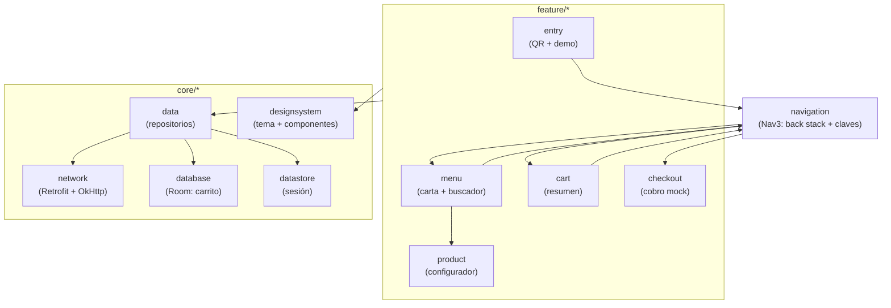
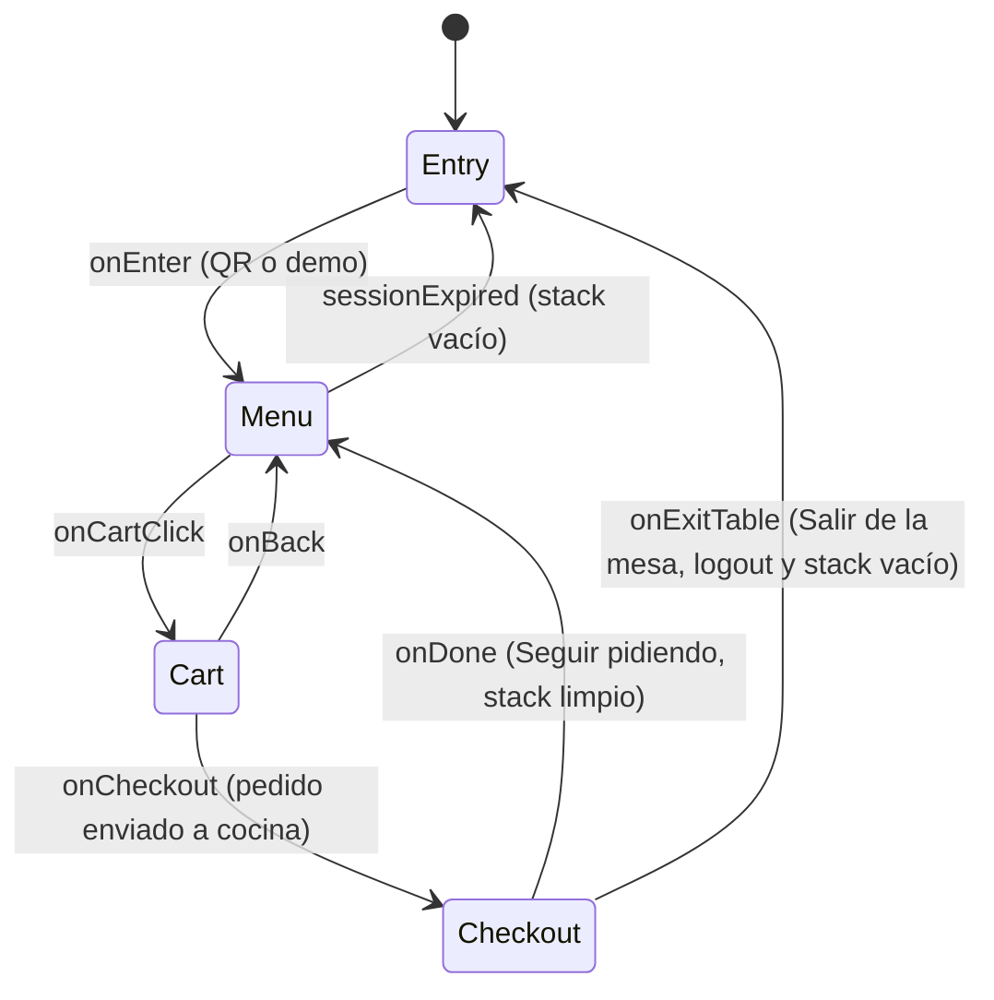
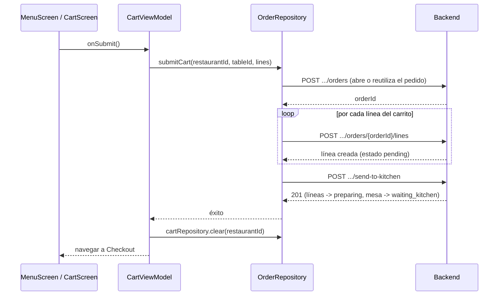

# MesaFlow Mobile — arquitectura

Documento técnico de la app cliente Android (`mobile/`). Complementa el plan de
fases (`docs/plan-mobile-app-cliente.md`) y el `mobile/README.md` (setup,
flujo de pedido). Aquí el foco es *cómo* está construida: capas, paquetes,
conexión al backend y los dos flujos críticos de extremo a extremo.

## Conexión al backend en desarrollo

- La URL base en debug es `http://127.0.0.1:3000/api/v1/`, alcanzada mediante un túnel de ADB
  (funciona igual en emulador y en dispositivo físico). Con el emulador/dispositivo ya arrancado
  y el backend levantado en local, ejecuta:
  ```
  adb reverse tcp:3000 tcp:3000
  ```
  Hay que repetir este comando cada vez que se reinicia el emulador o se reconecta el dispositivo
  (el túnel no persiste).
- El backend necesita `DEMO_LOGIN_ENABLED=true` para el modo demo (rol `waiter`).
- Solo el build de debug permite HTTP en claro (manifest de debug); release exige HTTPS.

> **Nota — por qué `adb reverse` y no `10.0.2.2`:** el alias `10.0.2.2` (NAT interno del
> emulador hacia el host) debería funcionar igual de bien y es más simple, pero en algunos
> entornos Windows falla con `SocketTimeoutException` de forma silenciosa (paquetes
> descartados) sin relación con firewall, antivirus, VPN ni con cómo escucha el backend —
> causa no confirmada, posiblemente un problema puntual del backend de red SLIRP del
> emulador en esa máquina. `adb reverse` evita esa capa de red virtual por completo (usa el
> canal de depuración de ADB), así que es la alternativa recomendada si `10.0.2.2` deja de
> responder. Si en tu máquina `10.0.2.2` funciona sin problemas, puedes usarlo en su lugar
> cambiando `BASE_URL` y sin necesitar el paso de `adb reverse`.

## Capas y paquetes

Single-activity (`MainActivity`) + Jetpack Compose, patrón MVVM/UDF
(ViewModel expone `StateFlow<UiState>`; la UI solo emite eventos). Organización
feature-first: cada pantalla vive en su propio paquete bajo `feature/` y solo
depende de `core/` (nunca de otra `feature/`).



- **`core/network`** — Retrofit + `kotlinx.serialization`; `AuthInterceptor` y
  `TokenAuthenticator` gestionan el token de sesión, `SessionCookieJar`
  persiste la cookie httpOnly entre llamadas.
- **`core/data`** — un repositorio por dominio (`MenuRepository`,
  `CartRepository`, `OrderRepository`, `AuthRepository`); traducen DTOs de red
  a los modelos de `core/model` y son el único punto que toca `core/network` +
  `core/database` a la vez.
- **`core/database`** — Room, solo para el carrito (persiste entre reinicios
  de la app; el resto del estado es efímero o vive en el backend).
- **`core/datastore`** — sesión activa (mesa/restaurante) vía Preferences
  DataStore.
- **`navigation`** — Navigation 3: el back stack (`rememberNavBackStack`) es
  estado propio de la composable raíz, no de un `ViewModel` compartido; las
  claves (`NavKeys.kt`) son `@Serializable` para sobrevivir a la muerte de
  proceso.

## Navegación entre pantallas



Entry → Menu, Checkout → Menu y Checkout → Entry **reemplazan** el stack (`backStack.clear()`)
para que atrás nunca vuelva al login ni a un cobro ya cerrado. Las
transiciones (`MesaFlowNavigation.kt`) son un fundido + deslizamiento sutil
(`transitionSpec`/`popTransitionSpec`, 220 ms), simétrico en ambas
direcciones e incluye `predictivePopTransitionSpec` para el gesto de retroceso
predictivo de Android.

### Pantalla de pago aceptado (ticket)

Tras confirmarse el pago, `PaymentAcceptedContent` (`CheckoutScreen.kt`)
muestra un ticket detallado en lugar del total a secas:

- **Número de pedido** (`Order.dailyNumber`): contador diario por restaurante
  calculado por el backend al abrir el pedido; viaja por `CheckoutKey` junto a
  la mesa, solo para mostrar.
- **Líneas del pedido**: `CheckoutKey.linesJson` lleva una foto serializada de
  las `CartLine` enviadas, porque el carrito Room se vacía en cuanto el envío
  a cocina tiene éxito y ya no se puede releer.
- **Importes reales**: se pintan `paidCents`/`balanceCents` del
  `PaymentResult`, no el total de navegación; si quedara saldo pendiente se
  muestra en rojo y se oculta "Salir de la mesa" (la cuenta no está cerrada).
- **Método de pago y hora**: el método sale de `CheckoutUiState.method` y la
  hora se sella en `paidAtMillis` al confirmarse el pago (no viene del
  backend).
- **Dos salidas**: "Seguir pidiendo" (vuelve a la carta) y "Salir de la mesa"
  (confirmación con `ExitTableConfirmDialog`, compartido con Ajustes; hace
  logout vía `CheckoutViewModel.onExitTableRequested()` y vacía el stack hasta
  Entry).
- **Accesibilidad**: al entrar, el foco salta al título para que TalkBack
  anuncie el éxito.

### Refresco periódico de la carta

El admin web puede cambiar la carta (orden, precios, disponibilidad) en
cualquier momento y el hosting gratuito no ofrece websockets fiables, así que
`MenuViewModel` repide la carta cada 3 minutos (`MENU_POLL_INTERVAL`) y la
compara estructuralmente con la actual. Solo corre con la app en primer plano
(`ProcessLifecycleOwner` + `repeatOnLifecycle(STARTED)`) para no gastar
batería ni mantener despierta la BD gratuita. Si hay cambios y el cliente está
en otra pantalla (Carrito/Ajustes), la carta se aplica en silencio; si está
mirándola, se muestra el banner "La carta se ha actualizado" y el cambio se
aplica al tocarlo (nunca se repinta la lista bajo el dedo). Un fallo del
polling se ignora (se reintenta al siguiente ciclo) y jamás vuelca la pantalla
al estado de error.

### Sondeos pensados para hosting gratuito

No hay cliente WebSocket a propósito: el hosting gratuito del backend no ofrece
sockets fiables, así que ambos refrescos son sondeos, pero baratos:

- **Caché HTTP condicional**: el backend marca los GET de carta y estado del
  pedido con `Cache-Control: private, max-age=0, must-revalidate` (más el ETag
  débil que Express genera por defecto), y OkHttp guarda la respuesta en una
  caché de disco (`NetworkModule`) y revalida con `If-None-Match`: las vueltas
  sin cambios son un 304 sin cuerpo.
- **El sondeo del pedido se apaga solo**: `CartViewModel` deja de sondear cuando
  todas las líneas llegan a un estado final (servido/cancelado) y, como el de la
  carta, solo corre con la app en primer plano (`ProcessLifecycleOwner`).

## Flujo crítico: pedir y enviar a cocina



Si cualquier paso falla (incluido `send-to-kitchen`), `OrderRepository` no
limpia el carrito Room: la línea se conserva y el usuario puede reintentar sin
perder su configuración. El paso de `send-to-kitchen` es imprescindible: sin
él las líneas quedan en `pending` y el panel de cocina no las ve nunca (ver
`mobile/README.md` → *Flujo del pedido contra el backend*).

## Validación

Diagramas verificados con el validador Mermaid del repo:

```bash
python C:\Users\Thor_\.codex\skills\mermaid-docs-validator\scripts\validate_mermaid_docs.py docs
```
