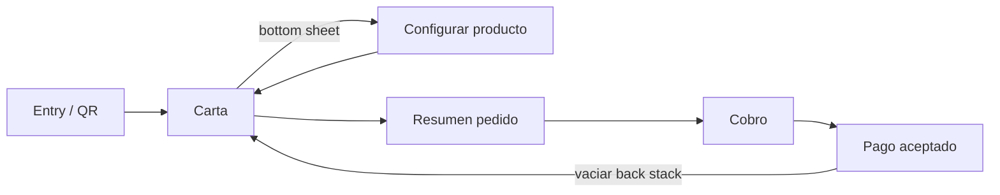

# Plan de desarrollo — MesaFlow Mobile (app cliente Android)

App Android nativa para que el cliente del restaurante pida y "pague" desde su mesa escaneando un QR. Vive en `mobile/` dentro del monorepo, junto a `frontend/` y `backend/`.

**Decisiones fijadas:**

| Decisión | Elección |
|---|---|
| Ubicación | Monorepo, carpeta `mobile/` |
| UI | Jetpack Compose + Material 3 **Expressive** (`MaterialExpressiveTheme`) |
| Navegación | **Navigation 3** (estable desde nov. 2025, back stack como estado propio) |
| Arquitectura | MVVM + UDF, feature-first (package-by-feature en un solo módulo `:app`) |
| DI | Hilt |
| Async | Coroutines + Flow (StateFlow en ViewModels) |
| Red | Retrofit + kotlinx.serialization (converter) + OkHttp |
| Persistencia | Room (carrito), DataStore (sesión, mesa/restaurante activo) |
| Imágenes | Coil 3 |
| QR | CameraX + ML Kit Barcode Scanning (+ App Links como vía alternativa futura) |
| Backend | **API real de MesaFlow desde el principio** (`/api/v1`), fakes solo en tests y previews |
| Pago | **Mock** detrás de un puerto `PaymentGateway` (pasarela real en iteraciones futuras) |
| Idiomas | es / en / ca (resources por locale, coherente con Transloco del frontend) |
| Tests | Vitest no aplica aquí: JUnit5 + Turbine + MockK + MockWebServer + Compose UI Testing |

---

## 1. Lo que el backend ya ofrece (verificado en el código)

No hace falta escribir casi nada nuevo en NestJS: la app cliente reutiliza los endpoints existentes autenticándose como usuario demo/cliente con permiso `service` y scope del restaurante.

| Necesidad de la app | Endpoint existente |
|---|---|
| Entrar como demo | `POST /api/v1/auth/demo-login` (`{ role }`, catálogo en `GET /auth/public-config`, requiere `DEMO_LOGIN_ENABLED=true`) |
| Login normal / refresh / logout / sesión | `POST /auth/login`, `POST /auth/refresh` (cookie `refresh_token`), `POST /auth/logout`, `GET /auth/me` |
| Carta con secciones, extras, menús y platters | `GET /restaurants/:id/menu` → secciones → items con `modifierGroups`, `comboDefinition.slots`, `platterComponents` (`removable`/`replaceable`), `priceCents`, `imageUrl`, `isAvailable` |
| Abrir pedido en la mesa | `POST /restaurants/:id/service-points/:tableId/orders` (devuelve el activo si ya existe — idempotente, ideal para varios comensales) |
| Añadir línea configurada | `POST /restaurants/:id/orders/:orderId/lines` con `restaurantProductId`, `quantity`, `kitchenNote`, `modifiers`, `comboSlots`, `platterComponents` |
| Editar / borrar línea | `PATCH` / `DELETE /orders/:orderId/lines/:lineId` |
| Registrar pago (cuando el mock "acepta") | `POST /restaurants/:id/orders/:orderId/payments` (`amountCents`, `method: cash\|card\|bizum\|other`) |
| Estado del pedido en tiempo real | Socket.IO namespace `/realtime`, evento `order:invalidated` (payload ligero, reobtener por REST) — opcional, hay polling |

### Prerrequisitos backend (pocos y pequeños)

1. **Formato del QR**: definir el contenido del QR de mesa. Propuesta: URL `https://<dominio>/t/<restaurantId>/<tableId>` — sirve hoy para el escáner in-app y mañana para App Links sin reimprimir QRs.
2. **Rol demo "cliente"**: comprobar que el catálogo de `demo-login` incluye un rol con permiso `service` y scope del restaurante demo (si solo hay roles de staff, añadir uno `customer`/reutilizar `waiter`). Las cuentas demo solo tienen bloqueadas las mutaciones de identidad, no los pedidos — encaja.
3. **Dev en local**: el móvil debe alcanzar el backend (IP LAN o `adb reverse tcp:3000 tcp:3000`) y la app permitir cleartext HTTP solo en build de debug (`network_security_config.xml`).
4. (Opcional, iteración futura) Endpoints "públicos de cliente" sin JWT de staff, si algún día el cliente no debe pasar por demo-login.

---

## 2. Arquitectura y estructura de carpetas

```txt
mobile/
├── app/src/main/kotlin/com/mesaflow/client/
│   ├── MainActivity.kt                  # single-activity, NavDisplay de Nav3
│   ├── MesaFlowApp.kt                   # @HiltAndroidApp
│   ├── navigation/                      # NavKeys serializables + back stack
│   ├── core/
│   │   ├── designsystem/                # MaterialExpressiveTheme, tokens, componentes base
│   │   ├── network/                     # Retrofit, OkHttp, AuthInterceptor, Authenticator, CookieJar
│   │   ├── database/                    # Room: carrito
│   │   ├── datastore/                   # sesión, restaurante/mesa activos, idioma
│   │   ├── model/                       # modelos de dominio (Menu, MenuItem, Cart, Order…)
│   │   └── common/                      # Result/AppError, dispatchers, formateo de precios
│   └── feature/
│       ├── entry/                       # bienvenida + escáner QR + modo demo
│       ├── menu/                        # carta, buscador, categorías
│       ├── productconfig/               # bottom sheet extras/menús/platters
│       ├── cart/                        # resumen del pedido
│       ├── checkout/                    # cobro (mock)
│       └── paymentresult/               # pago aceptado
├── app/src/test/                        # unit: ViewModels, use cases, mappers
├── app/src/androidTest/                 # Compose UI tests de flujos
└── gradle/libs.versions.toml            # version catalog
```

Regla UDF en cada feature: `Screen` (composable tonto) ← `UiState` (data class inmutable) ← `ViewModel` (StateFlow + eventos) ← `Repository` (core). Los composables nunca tocan Retrofit/Room directamente.

### Rutas Navigation 3



- Claves de ruta como `@Serializable data class`: `Entry`, `Menu`, `ProductConfig(itemId)`, `Cart`, `Checkout`, `PaymentResult(orderId)`.
- `ProductConfig` se presenta como **bottom sheet** sobre la carta (metadata de Nav3), no pantalla completa: el usuario no pierde el scroll de la carta.
- Tras `PaymentResult`, "volver a la carta" reemplaza el back stack (no se puede volver atrás a un cobro ya aceptado).
- **Carrito flotante persistente** (barra inferior con nº de artículos + total) visible en la carta; es el acceso natural a `Cart`.

---

## 3. Fases de desarrollo

Cada fase termina con la app compilando, sus tests en verde y algo demostrable. Orden pensado para tener demo visual pronto.

### Fase 0 — Bootstrap del proyecto (≈ ½ día)

1. Crear proyecto en `mobile/` (Empty Compose Activity, Kotlin DSL, minSdk 26, targetSdk actual).
2. `libs.versions.toml` con: compose-bom, material3 (con Expressive), navigation3, hilt, kotlinx-serialization, retrofit, okhttp, room, datastore, coil, camerax, mlkit-barcode, turbine, mockk, mockwebserver.
3. Hilt cableado (`@HiltAndroidApp`, `@AndroidEntryPoint`).
4. `.gitignore` Android + añadir `mobile/` al README raíz del monorepo.

**Cierre:** la app arranca en emulador mostrando un placeholder con el tema por defecto.

### Fase 1 — Design system y tema (≈ 1 día)

1. `MaterialExpressiveTheme` con esquema de color de marca (semilla desde el color MesaFlow), modo claro y oscuro, tipografía y shapes.
2. Componentes base en `core/designsystem`: botón primario/secundario, `CategoryChip`, `QuantityStepper`, `PriceText` (formatea `priceCents` + `currency` según locale), `SkeletonBox`, `EmptyState`, `ErrorState`.
3. `@Preview` claro/oscuro de cada componente (equivalente móvil de las stories de Storybook).

**Cierre:** catálogo de previews revisable; contraste y foco correctos en ambos modos.

### Fase 2 — Core de red y sesión (≈ 1–1,5 días)

1. Retrofit + kotlinx.serialization contra `/api/v1`; DTOs espejo de los del backend (menu, order, auth).
2. `TokenStore` (DataStore) para `accessToken` + datos de usuario; **CookieJar persistente** para la cookie `refresh_token` (el backend la emite httpOnly con path `/api/v1/auth`).
3. `AuthInterceptor` (añade Bearer) + `Authenticator` de OkHttp (ante 401, llama a `/auth/refresh` y reintenta una vez; si falla, expulsa a `Entry`).
4. `AuthRepository`: `demoLogin(role)`, `login(email, pass)`, `logout()`, `sessionFlow`.
5. Mapeo de errores HTTP → `AppError` sellado (sin filtrar detalles técnicos a UI).

**Tests:** MockWebServer para login/refresh/expulsión; Turbine sobre `sessionFlow`.

**Cierre (Gherkin):**

```gherkin
Scenario: Refresco transparente de sesión
  Given una sesión con access token caducado
  When la app pide la carta
  Then se refresca el token una sola vez y la petición original se completa
```

### Fase 3 — Feature Entry: QR + modo demo (≈ 1,5 días)

1. Pantalla de bienvenida: logo, botón "Escanear QR de la mesa" y botón discreto "Entrar en modo demo".
2. Escáner: CameraX + ML Kit con overlay de recorte, permiso de cámara bien pedido (explicación previa, estado denegado con salida a ajustes).
3. Parser del QR (`https://<dominio>/t/<restaurantId>/<tableId>`) con test unitario de formatos inválidos.
4. Modo demo: `GET /auth/public-config` → si `demoLoginEnabled`, `POST /auth/demo-login` con el rol de cliente y restaurante/mesa demo predefinidos.
5. Persistir `restaurantId` + `tableId` en DataStore y navegar a `Menu` (reemplazando `Entry` en el back stack).

**Cierre:** con backend local corriendo, escanear un QR impreso o pulsar demo lleva a la carta real.

### Fase 4 — Carta: buscador y categorías (≈ 2 días)

1. `MenuRepository` → `GET /restaurants/:id/menu`; cache en memoria + refresh manual (pull-to-refresh).
2. UI: header con nombre del restaurante y mesa, fila de `CategoryChip` (una por sección visible), grid/lista de productos con imagen (Coil), nombre, descripción corta y precio. Ítems `isAvailable=false` visibles pero deshabilitados ("Agotado").
3. Buscador de texto (filtrado local por nombre/descripción, sin tildes) combinable con el chip de categoría; ambos como estado del ViewModel (UDF puro, fácil de testear).
4. Estados: skeleton de carga, vacío ("No hay resultados para tu búsqueda."), error con reintento.
5. Barra de carrito flotante (aparece cuando hay ≥1 artículo) con animación de entrada.

**Cierre (Gherkin):**

```gherkin
Scenario: Buscar dentro de una categoría
  Given la carta cargada con secciones "Principales" y "Postres"
  When el cliente selecciona "Postres" y escribe "choco"
  Then solo se muestran postres cuyo nombre o descripción contiene "choco"
```

### Fase 5 — Configurador de producto y carrito local (≈ 2–3 días, el corazón de la app)

1. Bottom sheet `ProductConfig` al tocar un producto, con tres bloques según `productType`:
   - **`modifierGroups`** (extras): grupos `single` → radio; `multiple` → checkboxes con `minSelections`/`maxSelections` e `isRequired` validados; cada opción muestra su `priceDeltaCents`.
   - **`comboDefinition.slots`** (menús): un selector por slot (ej. "Elige principal", "Elige bebida") con `supplementPriceCents` visible.
   - **`platterComponents`**: lista de elementos con toggle para quitar los `removable` ("Sin cebolla") y, si `replaceable`, sustitución.
2. `QuantityStepper` + campo opcional "Nota para cocina" + precio total dinámico (`computed` a partir de la selección).
3. Botón "Añadir al pedido" deshabilitado hasta cumplir las selecciones obligatorias, con mensaje amable de qué falta.
4. Carrito en **Room** (`CartLine` con selección serializada): sobrevive a que maten el proceso; `CartRepository` expone `Flow<Cart>` con totales.
5. La lógica de validación y precio va en clases puras de `core/model` con tests unitarios exhaustivos (aquí se concentra el riesgo).

**Cierre (Gherkin):**

```gherkin
Scenario: Configurar un menú con extra y elemento quitado
  Given un producto tipo combo con slot obligatorio "Bebida" y modificador "Extra queso" (+1,00 €)
  When el cliente elige bebida, añade extra queso y quita la cebolla
  Then el precio mostrado suma el suplemento y el extra
  And el botón añadir solo se habilita con el slot obligatorio resuelto
```

### Fase 6 — Resumen y envío del pedido (≈ 1,5 días)

1. Pantalla `Cart`: líneas editables (cantidad, borrar, reabrir configuración), subtotal por línea y total.
2. "Pedir": `OrderRepository` abre pedido (`POST .../service-points/:tableId/orders` — si ya hay uno activo el backend devuelve ese) y envía cada línea (`POST .../lines` con `modifiers`/`comboSlots`/`platterComponents`).
3. Envío robusto: estados por línea (pendiente/enviada/fallida), reintento de las fallidas sin duplicar las enviadas; el carrito local solo se vacía cuando todas confirman.
4. Tras enviar, el resumen pasa a "pedido en curso" mostrando líneas ya pedidas + botón "Ir a pagar". Refresco del estado por polling ligero (el socket realtime queda como mejora futura).

**Cierre:** el pedido hecho desde el móvil aparece en el POS Angular en la mesa correcta.

### Fase 7 — Cobro mock y pago aceptado (≈ 1–1,5 días)

1. Puerto `PaymentGateway` en `feature/checkout` con una sola implementación por ahora: `MockPaymentGateway` (delay 1,5 s + resultado configurable éxito/rechazo). Hilt elige la implementación en el módulo — cambiar a Stripe/Adyen mañana no toca ninguna pantalla.
2. Pantalla `Checkout`: desglose del total, selección de método (tarjeta/Bizum/efectivo — visual), botón "Pagar" con estado de progreso; caso rechazado con mensaje amable y reintento.
3. Si el mock acepta, registrar el pago real en backend: `POST .../orders/:orderId/payments` (`amountCents` = total, `method`), para que el POS lo vea cuadrado.
4. Pantalla `PaymentResult`: animación de éxito (Expressive brilla aquí), resumen del pedido, número de mesa y botón "Volver a la carta" (back stack limpio).

**Cierre (Gherkin):**

```gherkin
Scenario: Pago simulado aceptado
  Given un pedido enviado con total 24,50 €
  When el cliente pulsa pagar y la pasarela mock acepta
  Then se registra un pago de 2450 céntimos en el backend
  And se muestra la pantalla de pago aceptado
```

### Fase 8 — Pulido, i18n y entrega (≈ 1,5–2 días)

1. i18n completa es/en/ca (`values/`, `values-en/`, `values-ca/`), formato de moneda por locale; tono de los textos igual que el resto de MesaFlow (formal, amable, sin culpar al usuario).
2. Animaciones de transición entre pantallas con Nav3 y micro-animaciones (añadir al carrito → badge de la barra).
3. Accesibilidad: `contentDescription`, tamaños táctiles ≥48 dp, TalkBack por el flujo completo, contraste en ambos temas.
4. Tests de UI (Compose) de los dos flujos críticos: demo → carta → configurar → pedir, y pedir → pagar → aceptado.
5. APK: `release` firmado con keystore propio, R8 activado; documentar el build en `mobile/README.md`.
6. Docs: `docs/mobile-app.md` (o `mobile/docs/`) con arquitectura + 2–3 diagramas Mermaid pequeños, validados con el validador del repo.

**Cierre:** checklist final tipo frontend del CLAUDE.md — i18n completa, dark/light, accesibilidad, tests de flujos críticos en verde, APK instalable.

---

## 4. Iteraciones futuras (backlog, fuera de alcance ahora)

- **Pago real**: implementación `StripePaymentGateway` (Payment Sheet) detrás del mismo puerto; propinas y división de cuenta.
- **App Links verificados**: abrir la app directamente desde el QR sin escáner in-app (el formato de URL ya lo permite).
- **Realtime**: suscripción al socket `/realtime` para ver el estado de las líneas (en cocina/servido) en vivo.
- **Estado del pedido enriquecido**: pantalla "tu pedido se está preparando" con progreso por línea.
- **Endpoints públicos de cliente** en backend (sin demo-login) + rate limiting.
- **Modularización Gradle** (`:feature:*`, `:core:*`) cuando el proyecto o el equipo crezca — la estructura de paquetes ya lo deja preparado.
- Valoraciones, llamar al camarero, repetir último pedido.

## 5. Riesgos y puntos de atención

- **Cookie de refresh en móvil**: el backend emite `refresh_token` como cookie httpOnly; en Android se gestiona con un CookieJar persistente de OkHttp. Verificar pronto (Fase 2) que el flujo refresh funciona desde la app — es el riesgo técnico más raro del proyecto.
- **Un pedido por mesa**: el pedido es de la mesa, no del comensal; si dos móviles piden a la vez comparten pedido (el backend ya lo resuelve devolviendo el activo). Decidir si eso es lo deseado para la demo (probablemente sí).
- **Precio siempre desde backend**: la app calcula el precio en el configurador solo para mostrar; el total cobrable sale de la respuesta del pedido (`RestaurantOrderResponseDto`), nunca del cálculo local.
- **Material 3 Expressive** evoluciona rápido: fijar versión del BOM de Compose en el catalog y actualizar conscientemente.
