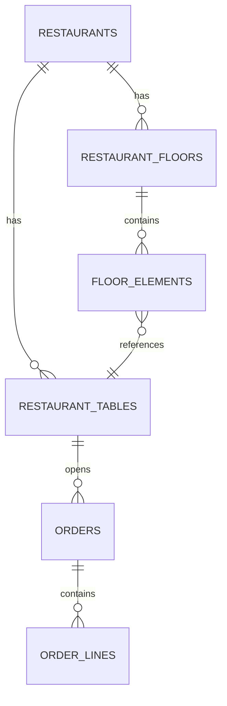
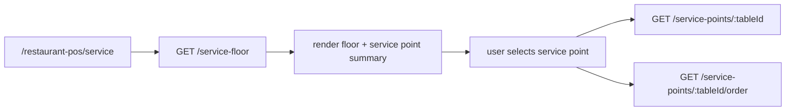

# Service Floor API Implementation Plan

> **For agentic workers:** REQUIRED SUB-SKILL: Use superpowers:subagent-driven-development (recommended) or superpowers:executing-plans to implement this plan task-by-task. Steps use checkbox (`- [ ]`) syntax for tracking.

**Goal:** Add the first backend read-only service API for the Angular `service` route so the app can load the operational floor, service point detail, and active order detail from NestJS instead of frontend-only mocks.

**Architecture:** Extend the existing `restaurants` backend module with read-focused service endpoints that aggregate floor, table, and order state into frontend-friendly DTOs. Keep business derivations such as `servicePhase`, active line filtering, and duration calculation in backend application/domain code so Angular can stay mostly presentational.

**Tech Stack:** NestJS, Prisma, PostgreSQL, Vitest, Supertest, Angular frontend consumer

---

### Task 1: Write the backend contract documentation first

**Files:**
- Create: `backend/docs/service-floor-api.md`
- Reference: `backend/src/restaurants/presentation/rest/restaurants.controller.ts`
- Reference: `frontend/docs/testing.md`

- [ ] **Step 1: Create the API doc with the approved scope**

Write `backend/docs/service-floor-api.md` with these sections:

```md
# Service Floor API

## Overview
- Read-only API for `/restaurant-pos/service`

## Scope
- GET /api/v1/restaurants/:id/service-floor
- GET /api/v1/restaurants/:id/service-points/:tableId
- GET /api/v1/restaurants/:id/service-points/:tableId/order

## Domain Model

```

- [ ] **Step 2: Add the response and enum sections**

Include:

```md
## Enums
- table.status
- order.status
- line.status
- servicePhase.course
- servicePhase.status

## Error Model
- 404 restaurant not found
- 404 table not found in restaurant
- 200 with order: null when the table exists but has no open order
```

- [ ] **Step 3: Review the doc for consistency**

Check:

- the endpoint paths match the approved design
- `order: null` is documented as `200`
- no write endpoints appear in this first-cut document

- [ ] **Step 4: Commit**

```bash
git add backend/docs/service-floor-api.md
git commit -m "docs: define service floor api contract"
```

### Task 2: Add failing e2e tests for the new service endpoints

**Files:**
- Modify: `backend/test/app.e2e-spec.ts`
- Reference: `backend/src/restaurants/presentation/rest/restaurants.controller.ts`

- [ ] **Step 1: Add a failing e2e test for `GET /service-floor`**

Add a test like:

```ts
it('returns the operational service floor for one restaurant', async () => {
  const response = await request(app.getHttpServer())
    .get('/api/v1/restaurants/restaurant-mesaflow-centro/service-floor')
    .expect(200);

  expect(response.body).toEqual(
    expect.objectContaining({
      restaurantId: 'restaurant-mesaflow-centro',
      floor: expect.objectContaining({
        id: expect.any(String),
        rows: expect.any(Number),
        columns: expect.any(Number),
      }),
      elements: expect.any(Array),
      servicePoints: expect.any(Array),
      totals: expect.objectContaining({
        servicePointCount: expect.any(Number),
        occupiedCount: expect.any(Number),
        openOrderCount: expect.any(Number),
      }),
    }),
  );
});
```

- [ ] **Step 2: Add a failing e2e test for `GET /service-points/:tableId`**

```ts
it('returns one service point detail by table id', async () => {
  const response = await request(app.getHttpServer())
    .get('/api/v1/restaurants/restaurant-mesaflow-centro/service-points/table-1')
    .expect(200);

  expect(response.body).toEqual(
    expect.objectContaining({
      table: expect.objectContaining({ id: 'table-1' }),
      floorElement: expect.objectContaining({ tableId: undefined }),
      serviceInfo: expect.objectContaining({
        lineCount: expect.any(Number),
        totalCents: expect.any(Number),
        currency: expect.any(String),
        durationMinutes: expect.any(Number),
      }),
    }),
  );
});
```

Then adjust the `floorElement` expectation to the final DTO shape after implementation.

- [ ] **Step 3: Add a failing e2e test for `GET /service-points/:tableId/order` with open order**

```ts
it('returns the active order detail for a service point', async () => {
  const response = await request(app.getHttpServer())
    .get('/api/v1/restaurants/restaurant-mesaflow-centro/service-points/table-1/order')
    .expect(200);

  expect(response.body).toEqual(
    expect.objectContaining({
      order: expect.objectContaining({
        tableId: 'table-1',
        status: expect.any(String),
        totalCents: expect.any(Number),
        currency: expect.any(String),
      }),
      lines: expect.any(Array),
    }),
  );
});
```

- [ ] **Step 4: Add a failing e2e test for `GET /service-points/:tableId/order` without open order**

Pick a restaurant table from seeded data with no open order, or add one in the seed/mocks if missing:

```ts
it('returns order null when the service point exists but has no open order', async () => {
  const response = await request(app.getHttpServer())
    .get('/api/v1/restaurants/restaurant-mesaflow-centro/service-points/table-3/order')
    .expect(200);

  expect(response.body).toEqual({
    order: null,
    lines: [],
  });
});
```

- [ ] **Step 5: Run the e2e spec to verify the new tests fail**

Run:

```bash
pnpm test:e2e -- test/app.e2e-spec.ts
```

Expected: FAIL with `404` or missing route/use case errors for the new endpoints.

- [ ] **Step 6: Commit**

```bash
git add backend/test/app.e2e-spec.ts
git commit -m "test: add service floor api e2e coverage"
```

### Task 3: Define backend read models for the service API

**Files:**
- Create: `backend/src/restaurants/domain/service-floor.models.ts`
- Modify: `backend/src/restaurants/domain/restaurant-read.models.ts`
- Reference: `backend/src/restaurants/domain/restaurant-reservation.models.ts`

- [ ] **Step 1: Write the failing domain typing usage in use-case stubs**

Before full implementation, introduce imports in upcoming use cases that expect these types:

```ts
export type ServicePhaseCourse = 'drinks' | 'starters' | 'mains' | 'desserts' | 'mixed' | 'none';
export type ServicePhaseStatus = 'no_order' | 'pending' | 'in_progress' | 'ready' | 'served';
```

- [ ] **Step 2: Create the service-floor domain models**

Add `backend/src/restaurants/domain/service-floor.models.ts`:

```ts
export type TableStatus = 'free' | 'occupied' | 'reserved' | 'dirty' | 'combined';
export type OrderStatus = 'open' | 'sent' | 'served' | 'paid' | 'cancelled';
export type OrderLineStatus = 'draft' | 'pending' | 'preparing' | 'ready' | 'served' | 'cancelled';

export interface ServicePhaseView {
  course: ServicePhaseCourse;
  status: ServicePhaseStatus;
}

export interface ServicePointSummaryView {
  lineCount: number;
  guestCount: number;
  totalCents: number;
  currency: string;
  servicePhase: ServicePhaseView;
}
```

Continue in the same file with:

```ts
export interface ServiceFloorView {
  restaurantId: string;
  floor: {
    id: string;
    name: string;
    rows: number;
    columns: number;
  };
  elements: Array<{
    id: string;
    type: string;
    label: string;
    x: number;
    y: number;
    width: number;
    height: number;
    shape: string | null;
    tableId: string | null;
  }>;
  servicePoints: Array<{
    table: {
      id: string;
      tableNumber: number;
      name: string;
      capacity: number;
      status: TableStatus;
      serviceStartedAt: string | null;
    };
    summary: ServicePointSummaryView;
  }>;
  totals: {
    servicePointCount: number;
    occupiedCount: number;
    openOrderCount: number;
  };
}
```

- [ ] **Step 3: Add detail and order view interfaces**

Add:

```ts
export interface ServicePointDetailView {
  table: {
    id: string;
    tableNumber: number;
    name: string;
    capacity: number;
    status: TableStatus;
    occupiedAt: string | null;
    serviceStartedAt: string | null;
  };
  floorElement: {
    id: string;
    label: string;
    type: string;
    x: number;
    y: number;
    width: number;
    height: number;
    shape: string | null;
  } | null;
  serviceInfo: ServicePointSummaryView & {
    durationMinutes: number;
  };
}

export interface ServicePointOrderView {
  order: {
    id: string;
    tableId: string;
    status: OrderStatus;
    openedAt: string;
    updatedAt: string;
    subtotalCents: number;
    taxCents: number;
    totalCents: number;
    currency: string;
  } | null;
  lines: Array<{
    id: string;
    productName: string;
    quantity: number;
    unitPriceCents: number;
    subtotalCents: number;
    status: OrderLineStatus;
    course: ServicePhaseCourse;
    kitchenNote: string | null;
  }>;
}
```

- [ ] **Step 4: Run backend typecheck/build to catch typing errors**

Run:

```bash
pnpm build
```

Expected: PASS or remaining failures only from not-yet-created use cases/imports.

- [ ] **Step 5: Commit**

```bash
git add backend/src/restaurants/domain/service-floor.models.ts backend/src/restaurants/domain/restaurant-read.models.ts
git commit -m "feat: add service floor read models"
```

### Task 4: Add the application port methods needed for service reads

**Files:**
- Modify: `backend/src/restaurants/application/ports/restaurant-read-repository.port.ts`
- Reference: `backend/src/restaurants/domain/service-floor.models.ts`

- [ ] **Step 1: Add the failing interface methods**

Extend the port with:

```ts
import type { ServiceFloorView, ServicePointDetailView, ServicePointOrderView } from '../../domain/service-floor.models';

export interface RestaurantReadRepository {
  // existing methods...
  getRestaurantServiceFloor(restaurantId: string): Promise<ServiceFloorView | null>;
  getRestaurantServicePoint(restaurantId: string, tableId: string): Promise<ServicePointDetailView | null>;
  getRestaurantServicePointOrder(restaurantId: string, tableId: string): Promise<ServicePointOrderView | null>;
}
```

- [ ] **Step 2: Run build to verify implementations now fail**

Run:

```bash
pnpm build
```

Expected: FAIL because the Prisma repository does not yet implement the new methods.

- [ ] **Step 3: Commit**

```bash
git add backend/src/restaurants/application/ports/restaurant-read-repository.port.ts
git commit -m "refactor: extend restaurant read port for service api"
```

### Task 5: Implement service-phase derivation helpers

**Files:**
- Create: `backend/src/restaurants/domain/service-phase.ts`
- Test: `backend/src/restaurants/domain/service-phase.spec.ts`

- [ ] **Step 1: Write the failing domain tests**

Create:

```ts
import { describe, expect, it } from 'vitest';
import { deriveServicePhase, getServiceDurationMinutes } from './service-phase';

describe('deriveServicePhase', () => {
  it('returns no_order when there are no active lines', () => {
    expect(deriveServicePhase([])).toEqual({ course: 'none', status: 'no_order' });
  });

  it('returns pending when only pending lines exist', () => {
    expect(deriveServicePhase([{ status: 'pending', course: 'mains' }])).toEqual({ course: 'mains', status: 'pending' });
  });

  it('returns in_progress when any line is preparing', () => {
    expect(deriveServicePhase([{ status: 'preparing', course: 'mains' }])).toEqual({ course: 'mains', status: 'in_progress' });
  });

  it('returns ready when ready lines exist and none are preparing', () => {
    expect(deriveServicePhase([{ status: 'ready', course: 'mains' }])).toEqual({ course: 'mains', status: 'ready' });
  });

  it('returns mixed when active lines span several courses', () => {
    expect(
      deriveServicePhase([
        { status: 'pending', course: 'drinks' },
        { status: 'pending', course: 'mains' },
      ]),
    ).toEqual({ course: 'mixed', status: 'pending' });
  });
});
```

- [ ] **Step 2: Run the focused test and verify it fails**

Run:

```bash
pnpm test -- src/restaurants/domain/service-phase.spec.ts
```

Expected: FAIL because the helper module does not exist yet.

- [ ] **Step 3: Implement the minimal helper**

Create:

```ts
type ServiceLinePhaseInput = {
  status: 'draft' | 'pending' | 'preparing' | 'ready' | 'served' | 'cancelled';
  course: 'drinks' | 'starters' | 'mains' | 'desserts' | 'mixed' | 'none';
};

const isActive = (line: ServiceLinePhaseInput) => line.status !== 'served' && line.status !== 'cancelled';

export const deriveServicePhase = (lines: ServiceLinePhaseInput[]) => {
  const active = lines.filter(isActive);

  if (active.length === 0) {
    return { course: 'none', status: 'no_order' } as const;
  }

  const courses = new Set(active.map((line) => line.course));
  const course = courses.size === 1 ? active[0]!.course : 'mixed';

  if (active.some((line) => line.status === 'preparing')) {
    return { course, status: 'in_progress' } as const;
  }

  if (active.some((line) => line.status === 'ready')) {
    return { course, status: 'ready' } as const;
  }

  if (active.some((line) => line.status === 'pending' || line.status === 'draft')) {
    return { course, status: 'pending' } as const;
  }

  return { course, status: 'served' } as const;
};

export const getServiceDurationMinutes = (occupiedAt: string | null, serviceStartedAt: string | null, now = new Date()) => {
  const anchor = occupiedAt ?? serviceStartedAt;
  if (!anchor) return 0;

  const diff = now.getTime() - new Date(anchor).getTime();
  return Math.max(0, Math.floor(diff / 60000));
};
```

- [ ] **Step 4: Run the focused test until it passes**

Run:

```bash
pnpm test -- src/restaurants/domain/service-phase.spec.ts
```

Expected: PASS

- [ ] **Step 5: Commit**

```bash
git add backend/src/restaurants/domain/service-phase.ts backend/src/restaurants/domain/service-phase.spec.ts
git commit -m "feat: derive service phase in backend"
```

### Task 6: Add read-only service use cases

**Files:**
- Create: `backend/src/restaurants/application/use-cases/get-restaurant-service-floor.use-case.ts`
- Create: `backend/src/restaurants/application/use-cases/get-restaurant-service-point.use-case.ts`
- Create: `backend/src/restaurants/application/use-cases/get-restaurant-service-point-order.use-case.ts`
- Reference: `backend/src/restaurants/application/use-cases/get-restaurant-floors.use-case.ts`

- [ ] **Step 1: Write minimal use case tests or scaffold from existing patterns**

Follow the same result pattern as:

```ts
return ok(view);
return err(restaurantNotFound({ restaurantId }));
```

- [ ] **Step 2: Implement `GetRestaurantServiceFloorUseCase`**

```ts
import { Inject, Injectable } from '@nestjs/common';
import { restaurantNotFound } from '../../../shared/errors/application-error';
import { err, ok, type Result } from '../../../shared/result/result';
import type { ApplicationError } from '../../../shared/errors/application-error';
import type { ServiceFloorView } from '../../domain/service-floor.models';
import { RESTAURANT_READ_REPOSITORY, type RestaurantReadRepository } from '../ports/restaurant-read-repository.port';

@Injectable()
export class GetRestaurantServiceFloorUseCase {
  constructor(@Inject(RESTAURANT_READ_REPOSITORY) private readonly restaurants: RestaurantReadRepository) {}

  async execute(restaurantId: string): Promise<Result<ServiceFloorView, ApplicationError>> {
    const view = await this.restaurants.getRestaurantServiceFloor(restaurantId);
    return view ? ok(view) : err(restaurantNotFound({ restaurantId }));
  }
}
```

- [ ] **Step 3: Implement the service-point detail and order use cases**

Mirror the same structure for:

```ts
GetRestaurantServicePointUseCase
GetRestaurantServicePointOrderUseCase
```

For the order use case, if the table exists but has no open order, still return:

```ts
ok({ order: null, lines: [] })
```

- [ ] **Step 4: Run backend build**

Run:

```bash
pnpm build
```

Expected: PASS or remaining failures only from repository/controller wiring not done yet.

- [ ] **Step 5: Commit**

```bash
git add backend/src/restaurants/application/use-cases/get-restaurant-service-floor.use-case.ts backend/src/restaurants/application/use-cases/get-restaurant-service-point.use-case.ts backend/src/restaurants/application/use-cases/get-restaurant-service-point-order.use-case.ts
git commit -m "feat: add service read use cases"
```

### Task 7: Implement Prisma-backed service read mapping

**Files:**
- Modify: `backend/src/restaurants/infrastructure/persistence/prisma-restaurant-read.repository.ts`
- Reference: `backend/prisma/schema.prisma`
- Reference: `backend/src/restaurants/domain/service-phase.ts`

- [ ] **Step 1: Inspect current Prisma repository shape**

Confirm the repository already reads:

- restaurant floors
- floor elements
- restaurant tables
- reservations

Then identify whether `orders` and `order_lines` already exist in Prisma for service reads. If they do not exist yet, stop here and split the plan because these endpoints depend on Phase 2 persistence being present.

- [ ] **Step 2: Add `getRestaurantServiceFloor`**

Implementation shape:

```ts
async getRestaurantServiceFloor(restaurantId: string): Promise<ServiceFloorView | null> {
  const restaurant = await this.prisma.restaurant.findUnique({
    where: { id: restaurantId },
    include: {
      floors: { include: { elements: true } },
      tables: true,
      orders: { include: { lines: true } },
    },
  });

  if (!restaurant) return null;

  // map active floor, elements, service point summaries, totals
}
```

- [ ] **Step 3: Add the mapping rules**

Inside the mapper:

- choose the active/primary floor for service
- expose `elements` as layout DTO data
- build a lookup `tableId -> open order`
- compute `lineCount`, `guestCount`, `totalCents`, `currency`, `servicePhase`
- compute `servicePointCount`, `occupiedCount`, `openOrderCount`

- [ ] **Step 4: Add `getRestaurantServicePoint`**

Return one table plus its linked floor element and derived summary:

```ts
async getRestaurantServicePoint(restaurantId: string, tableId: string): Promise<ServicePointDetailView | null> {
  // return null if the restaurant or table is missing
}
```

- [ ] **Step 5: Add `getRestaurantServicePointOrder`**

Rules:

- if restaurant/table do not exist: return `null`
- if table exists and open order does not exist: return `{ order: null, lines: [] }`
- otherwise map the active order snapshot

- [ ] **Step 6: Run the backend build**

Run:

```bash
pnpm build
```

Expected: PASS

- [ ] **Step 7: Run the e2e spec**

Run:

```bash
pnpm test:e2e -- test/app.e2e-spec.ts
```

Expected: the new service endpoint tests move from FAIL to PASS.

- [ ] **Step 8: Commit**

```bash
git add backend/src/restaurants/infrastructure/persistence/prisma-restaurant-read.repository.ts
git commit -m "feat: map service floor reads from prisma"
```

### Task 8: Add REST DTOs for the service API

**Files:**
- Create: `backend/src/restaurants/presentation/rest/dto/service-floor-response.dto.ts`
- Create: `backend/src/restaurants/presentation/rest/dto/service-point-detail-response.dto.ts`
- Create: `backend/src/restaurants/presentation/rest/dto/service-point-order-response.dto.ts`
- Reference: `backend/src/restaurants/presentation/rest/dto/restaurant-floors-response.dto.ts`

- [ ] **Step 1: Write DTO classes mirroring the approved JSON**

Example scaffold:

```ts
export class ServiceFloorResponseDto {
  restaurantId!: string;
  floor!: { id: string; name: string; rows: number; columns: number };
  elements!: Array<{ id: string; type: string; label: string; x: number; y: number; width: number; height: number; shape: string | null; tableId: string | null }>;
  servicePoints!: Array<unknown>;
  totals!: { servicePointCount: number; occupiedCount: number; openOrderCount: number };

  static fromDomain(view: ServiceFloorView): ServiceFloorResponseDto {
    return Object.assign(new ServiceFloorResponseDto(), view);
  }
}
```

- [ ] **Step 2: Create the detail and order DTOs**

Repeat the same pattern for:

```ts
ServicePointDetailResponseDto
ServicePointOrderResponseDto
```

- [ ] **Step 3: Run build**

Run:

```bash
pnpm build
```

Expected: PASS

- [ ] **Step 4: Commit**

```bash
git add backend/src/restaurants/presentation/rest/dto/service-floor-response.dto.ts backend/src/restaurants/presentation/rest/dto/service-point-detail-response.dto.ts backend/src/restaurants/presentation/rest/dto/service-point-order-response.dto.ts
git commit -m "feat: add service api response dtos"
```

### Task 9: Expose the new controller routes

**Files:**
- Modify: `backend/src/restaurants/presentation/rest/restaurants.controller.ts`
- Modify: `backend/src/restaurants/restaurants.module.ts`

- [ ] **Step 1: Add the use cases to the controller constructor**

Add:

```ts
private readonly getRestaurantServiceFloor: GetRestaurantServiceFloorUseCase,
private readonly getRestaurantServicePoint: GetRestaurantServicePointUseCase,
private readonly getRestaurantServicePointOrder: GetRestaurantServicePointOrderUseCase,
```

- [ ] **Step 2: Add `GET :id/service-floor`**

```ts
@Get(':id/service-floor')
@Version('1')
@ApiOkResponse({ type: ServiceFloorResponseDto })
@ApiNotFoundResponse({ description: 'Restaurant not found.' })
async serviceFloor(@Param('id') id: string): Promise<ServiceFloorResponseDto> {
  return ServiceFloorResponseDto.fromDomain(unwrapResultOrThrow(await this.getRestaurantServiceFloor.execute(id)));
}
```

- [ ] **Step 3: Add `GET :id/service-points/:tableId`**

```ts
@Get(':id/service-points/:tableId')
@Version('1')
@ApiOkResponse({ type: ServicePointDetailResponseDto })
@ApiNotFoundResponse({ description: 'Restaurant or table not found.' })
async servicePoint(@Param('id') id: string, @Param('tableId') tableId: string): Promise<ServicePointDetailResponseDto> {
  return ServicePointDetailResponseDto.fromDomain(unwrapResultOrThrow(await this.getRestaurantServicePoint.execute(id, tableId)));
}
```

- [ ] **Step 4: Add `GET :id/service-points/:tableId/order`**

```ts
@Get(':id/service-points/:tableId/order')
@Version('1')
@ApiOkResponse({ type: ServicePointOrderResponseDto })
@ApiNotFoundResponse({ description: 'Restaurant or table not found.' })
async servicePointOrder(@Param('id') id: string, @Param('tableId') tableId: string): Promise<ServicePointOrderResponseDto> {
  return ServicePointOrderResponseDto.fromDomain(unwrapResultOrThrow(await this.getRestaurantServicePointOrder.execute(id, tableId)));
}
```

- [ ] **Step 5: Register the new use cases in the module**

Add the three classes to the providers array in `backend/src/restaurants/restaurants.module.ts`.

- [ ] **Step 6: Run the e2e spec**

Run:

```bash
pnpm test:e2e -- test/app.e2e-spec.ts
```

Expected: PASS for the new routes.

- [ ] **Step 7: Commit**

```bash
git add backend/src/restaurants/presentation/rest/restaurants.controller.ts backend/src/restaurants/restaurants.module.ts
git commit -m "feat: expose service floor api routes"
```

### Task 10: Prepare the frontend integration handoff

**Files:**
- Create: `frontend/docs/service-data-flow.md`
- Modify: `frontend/docs/architecture.md`
- Reference: `frontend/src/app/features/restaurant-pos/state/restaurant-pos.store.ts`
- Reference: `frontend/src/app/features/restaurant-pos/api/restaurant-pos-api.service.ts`

- [ ] **Step 1: Document the frontend fetch sequence**

Create `frontend/docs/service-data-flow.md`:

```md
# Service Data Flow


```

- [ ] **Step 2: Note the backend/frontend responsibility split**

Document:

- backend derives `servicePhase`
- backend returns `order: null` for an existing table without open order
- frontend remains responsible for selection state and UI formatting

- [ ] **Step 3: Commit**

```bash
git add frontend/docs/service-data-flow.md frontend/docs/architecture.md
git commit -m "docs: describe service route data flow"
```

### Task 11: Final verification before handoff

**Files:**
- Verify only

- [ ] **Step 1: Run backend build**

Run:

```bash
pnpm build
```

Expected: PASS

- [ ] **Step 2: Run the focused backend e2e suite**

Run:

```bash
pnpm test:e2e -- test/app.e2e-spec.ts
```

Expected: PASS

- [ ] **Step 3: Run any focused frontend tests only if the Angular service consumer is touched**

If frontend integration starts in the same branch, run:

```bash
pnpm test -- --watch=false --include src/app/features/restaurant-pos/**/*.spec.ts
```

- [ ] **Step 4: Check git status**

Run:

```bash
git status --short
```

Expected: no unexpected files such as archives, generated zips, or unrelated docs.

- [ ] **Step 5: Final commit if verification changed snapshots/docs**

```bash
git add <verified-files>
git commit -m "chore: finalize service floor api verification"
```
