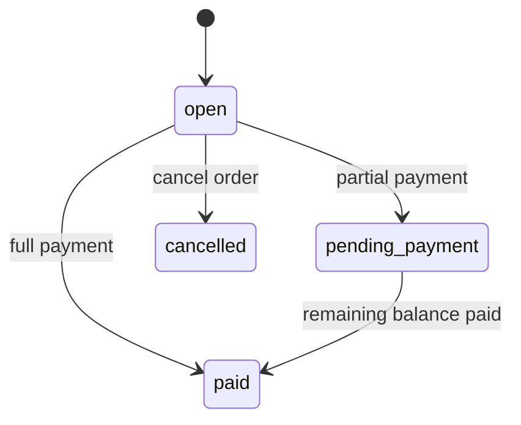
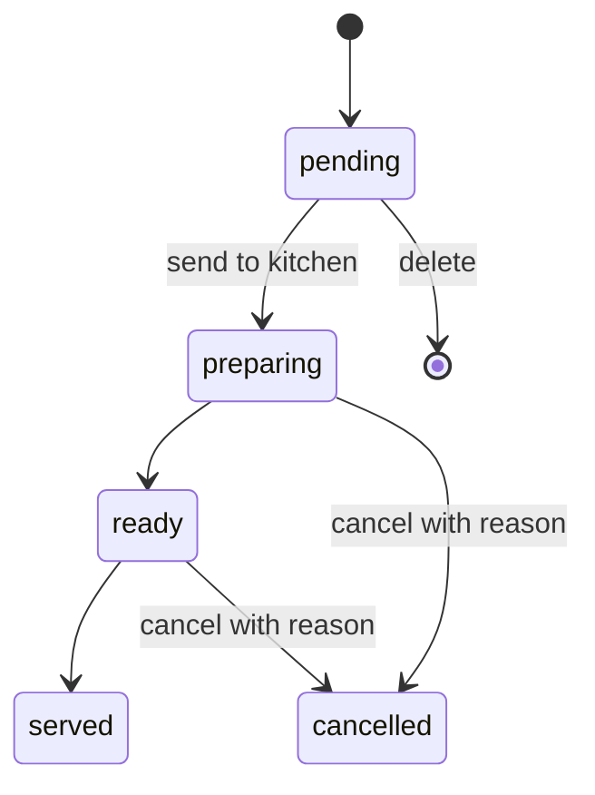
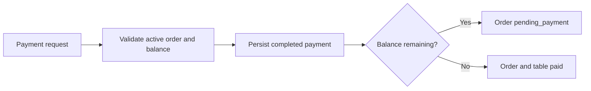

# Restaurant Order Write Flow Implementation Plan

> **For agentic workers:** REQUIRED SUB-SKILL: Use superpowers:subagent-driven-development (recommended) or superpowers:executing-plans to implement this plan task-by-task. Steps use checkbox (`- [ ]`) syntax for tracking.

**Goal:** Persist restaurant orders, configured lines, cancellations, and partial payments so the Angular service route and `charge` use one backend source of truth.

**Architecture:** Add a Prisma-backed `RestaurantOrderRepository` dedicated to the order aggregate while retaining the current restaurant read adapter for layout and table presentation. Application use cases combine both ports: Prisma owns orders, lines, totals, kitchen status, and payments; the existing read adapter owns visual floor data and table presentation status. Angular submits IDs and selections, then replaces local order state with the complete backend response.

**Tech Stack:** NestJS 11, Prisma 6, PostgreSQL 16, Vitest, Testcontainers, Supertest, Angular 21 signals, RxJS, Angular HTTP testing, Testing Library.

---

## Scope And File Map

### Persistence

- Modify `backend/prisma/schema.prisma`
  - add the table relation, order currency/tax/guest count, line tax/cancellation snapshots, child quantities
- Create `backend/prisma/migrations/20260622120000_add_order_write_flow/migration.sql`
  - apply columns, foreign key, checks, and partial unique index for one active order per table
- Modify `backend/prisma/seeds/mesaflow-orders.seed.ts`
  - populate the new required snapshot fields
- Modify `backend/prisma/seeds/mesaflow-demo.seed.ts`
  - use the stable restaurant ID exposed by the service API
- Modify `backend/prisma/seeds/mesaflow-layout.seed.ts`
  - use stable table IDs matching the service-floor contract

### Backend domain and application

- Create `backend/src/restaurants/domain/restaurant-order.models.ts`
  - command and response types for orders, lines, selections, and payments
- Create `backend/src/restaurants/domain/order-pricing.ts`
  - inclusive-tax integer calculations and order-total helpers
- Create `backend/src/restaurants/domain/order-pricing.spec.ts`
  - focused pure tests
- Create `backend/src/restaurants/application/ports/restaurant-order-repository.port.ts`
  - persistence boundary for the order aggregate
- Create `backend/src/restaurants/infrastructure/persistence/prisma-restaurant-order.repository.ts`
  - transactional Prisma implementation and mapping
- Create `backend/src/restaurants/infrastructure/persistence/prisma-restaurant-order.repository.integration-spec.ts`
  - Testcontainers coverage for persistence and concurrency
- Create focused use cases under `backend/src/restaurants/application/use-cases/`
  - open, add, update, delete, cancel, pay
- Create `backend/src/restaurants/application/ports/restaurant-order-catalog-repository.port.ts`
  - expose real Prisma IDs for sellable products and their configurations
- Create `backend/src/restaurants/infrastructure/persistence/prisma-restaurant-order-catalog.repository.ts`
  - load the active menu with modifier, combo, and platter details
- Modify the current service-floor use cases
  - read and transition the persistent order instead of the demo order copy
- Modify `backend/src/restaurants/application/ports/restaurant-read-repository.port.ts`
  - replace order mutation methods with a table-presentation status update
- Modify `backend/src/restaurants/infrastructure/demo-restaurant-read.repository.ts`
  - retain layout/table state only for service projection; remove ownership of order mutations
- Modify `backend/src/restaurants/domain/service-floor.models.ts`
  - align statuses with Prisma and expose paid/balance fields

### Backend HTTP

- Create request DTOs under `backend/src/restaurants/presentation/rest/dto/`
- Expand `backend/src/restaurants/presentation/rest/dto/service-point-order-response.dto.ts`
- Modify `backend/src/restaurants/presentation/rest/restaurants.controller.ts`
- Modify `backend/src/restaurants/restaurants.module.ts`
- Modify `backend/src/identity/identity.module.ts`
  - export `AuthGuard` for authenticated order writes
- Modify shared application error mapping
- Modify `backend/test/app.e2e-spec.ts`

### Angular

- Modify `frontend/src/app/features/restaurant-pos/api/restaurant-pos-api.models.ts`
- Modify `frontend/src/app/features/restaurant-pos/api/restaurant-pos-api.service.ts`
- Modify `frontend/src/app/features/restaurant-pos/api/restaurant-pos-api.service.spec.ts`
- Modify `frontend/src/app/features/restaurant-pos/models/order.models.ts`
- Modify `frontend/src/app/features/restaurant-pos/models/payment.models.ts`
- Modify `frontend/src/app/features/restaurant-pos/state/restaurant-pos.store.ts`
- Modify `frontend/src/app/features/restaurant-pos/state/restaurant-pos.store.spec.ts`
- Modify the restaurant service page and its spec
- Keep repeated Testing Library interactions in a local `createServicePageActions()` helper

### Documentation

- Modify `backend/docs/service-floor-api.md`
- Validate every Mermaid fence after editing

## Contract Decisions Locked By This Plan

- Menu prices are final prices with tax included.
- `subtotalCents` is the gross sum before discounts.
- `taxCents` is the tax portion included in that gross amount.
- Inclusive tax per line is `Math.round(lineGross * rate / (100 + rate))`.
- `totalCents` is `subtotalCents - discountTotalCents`.
- `balanceCents` is `totalCents - completedPaymentCents`.
- Opening an order requires the authenticated user ID for `openedByUserId`.
- An active order has status `open` or `pending_payment`.
- The first completed payment freezes all line mutations.
- `charge` accepts `{ amountCents, method }` and delegates to the normal payment use case.
- A pending line may be updated or deleted.
- A `preparing` or `ready` line may be cancelled with a reason.
- A `served` or `cancelled` line is immutable.
- Kitchen submission maps persisted `pending` lines to `preparing`; no second `sent_to_kitchen` line enum is introduced.

## Execution Preflight

The current branch already contains uncommitted service-floor and Angular integration work. Before
Task 1:

- run the existing focused backend/frontend tests recorded for that work
- inspect `git diff` and confirm those edits are the previously approved service baseline
- commit that baseline separately
- never use broad `git add backend` or `git add frontend`; stage only the files listed by the current
  task
- do not create an isolated worktree until the current baseline is committed, because the plan
  depends on those edits

### Task 1: Extend The Prisma Order Schema

**Files:**
- Modify: `backend/prisma/schema.prisma`
- Create: `backend/prisma/migrations/20260622120000_add_order_write_flow/migration.sql`
- Modify: `backend/prisma/seeds/mesaflow-orders.seed.ts`
- Modify: `backend/prisma/seeds/mesaflow-demo.seed.ts`
- Modify: `backend/prisma/seeds/mesaflow-layout.seed.ts`
- Test: `backend/src/shared/prisma/mesaflow-order-write-schema.integration-spec.ts`

- [ ] **Step 1: Write the failing schema integration test**

Create `backend/src/shared/prisma/mesaflow-order-write-schema.integration-spec.ts` using the existing
Testcontainers setup. Seed one restaurant, table, user, order, line, and payment, then assert the new
fields and database constraint:

```ts
it('stores order tax, cancellation, and payment snapshots', async () => {
  const stored = await prisma.order.findUniqueOrThrow({
    where: { id: order.id },
    include: { lines: true, payments: true },
  });

  expect(stored).toMatchObject({
    tableId: table.id,
    currency: 'EUR',
    guestCount: 2,
    taxCents: 191,
  });
  expect(stored.lines[0]).toMatchObject({
    taxRateNameSnapshot: 'IVA General',
    taxRatePercentSnapshot: new Prisma.Decimal('21.00'),
    taxCents: 191,
    cancellationReason: null,
    cancelledAt: null,
  });
});

it('prevents two active orders for the same table', async () => {
  await prisma.order.create({ data: activeOrderData({ tableId: table.id }) });

  await expect(
    prisma.order.create({ data: activeOrderData({ tableId: table.id }) }),
  ).rejects.toMatchObject({ code: 'P2002' });
});
```

- [ ] **Step 2: Run the schema test and verify it fails**

Run from `backend/`:

```powershell
pnpm test:integration -- mesaflow-order-write-schema.integration-spec.ts
```

Expected: FAIL because the new Prisma fields and active-order constraint do not exist.

- [ ] **Step 3: Update the Prisma models**

Apply these field-level changes:

```prisma
model RestaurantTable {
  // existing fields
  orders Order[]
}

model Order {
  // existing fields
  tableId      String?
  table        RestaurantTable? @relation(fields: [tableId], references: [id], onDelete: SetNull)
  currency     String
  guestCount   Int
  taxCents     Int              @default(0)
}

model OrderLine {
  // existing fields
  courseSnapshot           ProductCourse
  preparationRouteSnapshot PreparationRoute
  taxRateNameSnapshot    String?
  taxRatePercentSnapshot Decimal? @db.Decimal(5, 2)
  taxCents               Int      @default(0)
  cancellationReason     String?
  cancelledAt            DateTime?
}

model OrderLineModifier {
  // existing fields
  quantity Int @default(1)
}

model OrderLineComboSlot {
  // existing fields
  quantity Int @default(1)
}
```

Keep source product references nullable so historical snapshots survive catalog deletion.

- [ ] **Step 4: Write the committed SQL migration**

The migration must add database checks and the partial unique index Prisma cannot model:

```sql
ALTER TABLE "orders"
  ADD COLUMN "currency" TEXT NOT NULL DEFAULT 'EUR',
  ADD COLUMN "guestCount" INTEGER NOT NULL DEFAULT 1,
  ADD COLUMN "taxCents" INTEGER NOT NULL DEFAULT 0;

ALTER TABLE "order_lines"
  ADD COLUMN "courseSnapshot" "ProductCourse",
  ADD COLUMN "preparationRouteSnapshot" "PreparationRoute",
  ADD COLUMN "taxRateNameSnapshot" TEXT,
  ADD COLUMN "taxRatePercentSnapshot" DECIMAL(5,2),
  ADD COLUMN "taxCents" INTEGER NOT NULL DEFAULT 0,
  ADD COLUMN "cancellationReason" TEXT,
  ADD COLUMN "cancelledAt" TIMESTAMP(3);

UPDATE "order_lines" AS line
SET
  "courseSnapshot" = COALESCE(product."defaultCourse", 'other'::"ProductCourse"),
  "preparationRouteSnapshot" = COALESCE(product."defaultPreparationRoute", 'direct'::"PreparationRoute")
FROM "products" AS product
WHERE product."id" = line."productId";

UPDATE "order_lines"
SET
  "courseSnapshot" = COALESCE("courseSnapshot", 'other'::"ProductCourse"),
  "preparationRouteSnapshot" = COALESCE("preparationRouteSnapshot", 'direct'::"PreparationRoute");

ALTER TABLE "order_lines"
  ALTER COLUMN "courseSnapshot" SET NOT NULL,
  ALTER COLUMN "preparationRouteSnapshot" SET NOT NULL;

ALTER TABLE "order_line_modifiers"
  ADD COLUMN "quantity" INTEGER NOT NULL DEFAULT 1;

ALTER TABLE "order_line_combo_slots"
  ADD COLUMN "quantity" INTEGER NOT NULL DEFAULT 1;

ALTER TABLE "orders"
  ADD CONSTRAINT "orders_tableId_fkey"
  FOREIGN KEY ("tableId") REFERENCES "restaurant_tables"("id")
  ON DELETE SET NULL ON UPDATE CASCADE;

ALTER TABLE "orders"
  ADD CONSTRAINT "orders_guestCount_check" CHECK ("guestCount" > 0);
ALTER TABLE "orders"
  ADD CONSTRAINT "orders_money_check"
  CHECK ("subtotalCents" >= 0 AND "discountTotalCents" >= 0 AND "taxCents" >= 0 AND "totalCents" >= 0);
ALTER TABLE "order_lines"
  ADD CONSTRAINT "order_lines_quantity_check" CHECK ("quantity" > 0);
ALTER TABLE "payments"
  ADD CONSTRAINT "payments_amount_check" CHECK ("amountCents" > 0);

CREATE UNIQUE INDEX "orders_one_active_per_table_idx"
  ON "orders" ("tableId")
  WHERE "tableId" IS NOT NULL AND "status" IN ('open', 'pending_payment');
```

Before adding `orders_tableId_fkey`, normalize the existing demo identifiers so the public service
contract and Prisma rows refer to the same entities:

```sql
UPDATE "restaurants"
SET "id" = 'restaurant-mesaflow-centro'
WHERE "name" = 'MesaFlow Centro' AND "id" <> 'restaurant-mesaflow-centro';

UPDATE "restaurant_tables"
SET "id" = CASE
  WHEN "tableNumber" BETWEEN 1 AND 4 THEN 'table-' || "tableNumber"::text
  WHEN "tableNumber" BETWEEN 5 AND 7 THEN 'stool-' || ("tableNumber" - 4)::text
  ELSE "id"
END
WHERE "restaurantId" = 'restaurant-mesaflow-centro';
```

Run normalization before creating the table foreign key. The schema integration test must verify
that dependent floor elements, reservations, and orders remain attached through `ON UPDATE CASCADE`.

Remove the default from `orders.currency` in a final `ALTER COLUMN` after existing rows are
backfilled if the generated migration needs to support non-empty databases.

- [ ] **Step 5: Update order seeds**

Populate `currency`, `guestCount`, and `taxCents` on each seeded order, plus line tax snapshots. Use
the product tax rate rather than hardcoding zero. Preserve the existing deterministic IDs.

```ts
await upsertOrder(prisma, {
  // existing deterministic fields
  currency: 'EUR',
  guestCount: 2,
  taxCents: 234,
});

await replaceOrderLines(prisma, orderId, [{
  // existing line fields
  taxRateNameSnapshot: 'IVA General',
  taxRatePercentSnapshot: '21.00',
  taxCents: 234,
  courseSnapshot: 'main',
  preparationRouteSnapshot: 'kitchen',
  cancellationReason: null,
  cancelledAt: null,
}]);
```

Set `id: 'restaurant-mesaflow-centro'` in the restaurant create branch. In the layout seed, set
`id: tableNumber <= 4 ? \`table-${tableNumber}\` : \`stool-${tableNumber - 4}\`` in each table create
branch. Existing rows are normalized by the migration.

- [ ] **Step 6: Generate Prisma and run the focused test**

```powershell
pnpm prisma:generate
pnpm test:integration -- mesaflow-order-write-schema.integration-spec.ts
```

Expected: Prisma generation succeeds and the focused integration spec passes.

- [ ] **Step 7: Commit the persistence contract**

```powershell
git add -- backend/prisma/schema.prisma backend/prisma/migrations/20260622120000_add_order_write_flow/migration.sql backend/prisma/seeds/mesaflow-orders.seed.ts backend/prisma/seeds/mesaflow-demo.seed.ts backend/prisma/seeds/mesaflow-layout.seed.ts backend/src/shared/prisma/mesaflow-order-write-schema.integration-spec.ts
git commit -m "feat: extend order persistence for write flow"
```

### Task 2: Add Order Domain Models And Pricing Rules

**Files:**
- Create: `backend/src/restaurants/domain/restaurant-order.models.ts`
- Create: `backend/src/restaurants/domain/order-pricing.ts`
- Create: `backend/src/restaurants/domain/order-pricing.spec.ts`

- [ ] **Step 1: Write failing pricing tests**

```ts
describe('order pricing', () => {
  it('extracts included tax using integer cents', () => {
    expect(includedTaxCents(1350, 21)).toBe(234);
    expect(includedTaxCents(980, 10)).toBe(89);
    expect(includedTaxCents(250, 0)).toBe(0);
  });

  it('excludes cancelled lines from totals', () => {
    expect(calculateOrderTotals([
      { subtotalCents: 1350, taxCents: 234, status: 'pending' },
      { subtotalCents: 980, taxCents: 89, status: 'cancelled' },
    ], 0)).toEqual({
      subtotalCents: 1350,
      taxCents: 234,
      totalCents: 1350,
    });
  });

  it('calculates paid amount and remaining balance from completed payments only', () => {
    expect(calculatePaymentSummary(2750, [
      { amountCents: 1000, status: 'completed' },
      { amountCents: 500, status: 'failed' },
    ])).toEqual({ paidCents: 1000, balanceCents: 1750 });
  });
});
```

- [ ] **Step 2: Verify the tests fail**

```powershell
pnpm test -- order-pricing.spec.ts
```

Expected: FAIL because the pricing functions do not exist.

- [ ] **Step 3: Define the complete domain contract**

`restaurant-order.models.ts` must define:

```ts
export type OrderStatus = 'open' | 'pending_payment' | 'paid' | 'cancelled';
export type OrderLineStatus = 'pending' | 'preparing' | 'ready' | 'served' | 'cancelled';
export type PaymentMethod = 'cash' | 'card' | 'bizum' | 'other';

export type OpenRestaurantOrderCommand = {
  restaurantId: string;
  tableId: string;
  openedByUserId: string;
  guestCount: number;
};

export type AddOrderLineCommand = {
  restaurantId: string;
  orderId: string;
  restaurantProductId: string;
  quantity: number;
  kitchenNote: string | null;
  modifiers: Array<{ modifierGroupId: string; modifierOptionId: string; quantity: number }>;
  comboSlots: Array<{ comboSlotId: string; restaurantProductId: string; quantity: number }>;
  platterComponents: Array<{ platterComponentId: string; included: boolean }>;
};

export type UpdateOrderLineCommand = {
  restaurantId: string;
  orderId: string;
  lineId: string;
  quantity?: number;
  kitchenNote?: string | null;
};

export type DeleteOrderLineCommand = {
  restaurantId: string;
  orderId: string;
  lineId: string;
};

export type CancelOrderLineCommand = DeleteOrderLineCommand & {
  reason: string;
};

export type RegisterOrderPaymentCommand = {
  restaurantId: string;
  orderId: string;
  amountCents: number;
  method: PaymentMethod;
};

export type RestaurantOrderModifierView = {
  groupName: string;
  optionName: string;
  priceDeltaCents: number;
  quantity: number;
};

export type RestaurantOrderComboSlotView = {
  slotName: string;
  selectedProductName: string;
  supplementPriceCents: number;
  quantity: number;
};

export type RestaurantOrderPlatterComponentView = {
  componentName: string;
  removed: boolean;
  replacementName: string | null;
  priceDeltaCents: number;
};

export type RestaurantOrderLineView = {
  id: string;
  restaurantProductId: string | null;
  productId: string | null;
  productName: string;
  productType: 'simple' | 'combo' | 'platter';
  course: 'drinks' | 'starter' | 'main' | 'dessert' | 'other';
  preparationRoute: 'direct' | 'bar' | 'kitchen' | 'cold_station' | 'dessert_station';
  basePriceCents: number;
  unitPriceCents: number;
  quantity: number;
  subtotalCents: number;
  taxRateName: string | null;
  taxRatePercent: number | null;
  taxCents: number;
  status: OrderLineStatus;
  kitchenNote: string | null;
  cancellationReason: string | null;
  cancelledAt: string | null;
  configurationSignature: string;
  modifiers: RestaurantOrderModifierView[];
  comboSlots: RestaurantOrderComboSlotView[];
  platterComponents: RestaurantOrderPlatterComponentView[];
};

export type RestaurantOrderPaymentView = {
  id: string;
  method: PaymentMethod;
  amountCents: number;
  status: 'pending' | 'completed' | 'failed' | 'refunded';
  paidAt: string | null;
};

export type RestaurantOrderView = {
  order: {
    id: string;
    restaurantId: string;
    tableId: string | null;
    status: OrderStatus;
    currency: string;
    guestCount: number;
    subtotalCents: number;
    taxCents: number;
    discountTotalCents: number;
    totalCents: number;
    paidCents: number;
    balanceCents: number;
    openedAt: string;
    updatedAt: string;
    closedAt: string | null;
  };
  lines: RestaurantOrderLineView[];
  payments: RestaurantOrderPaymentView[];
};
```

Include complete line child snapshots and cancellation fields in `RestaurantOrderLineView`.

- [ ] **Step 4: Implement pure pricing helpers**

```ts
export function includedTaxCents(grossCents: number, ratePercent: number): number {
  if (ratePercent <= 0) return 0;
  return Math.round((grossCents * ratePercent) / (100 + ratePercent));
}

export function calculateOrderTotals(
  lines: Array<{ subtotalCents: number; taxCents: number; status: OrderLineStatus }>,
  discountTotalCents: number,
) {
  const active = lines.filter((line) => line.status !== 'cancelled');
  const subtotalCents = active.reduce((sum, line) => sum + line.subtotalCents, 0);
  const taxCents = active.reduce((sum, line) => sum + line.taxCents, 0);
  return {
    subtotalCents,
    taxCents,
    totalCents: Math.max(0, subtotalCents - discountTotalCents),
  };
}
```

- [ ] **Step 5: Run the focused unit tests**

```powershell
pnpm test -- order-pricing.spec.ts
```

Expected: PASS.

- [ ] **Step 6: Commit the domain contract**

```powershell
git add -- backend/src/restaurants/domain/restaurant-order.models.ts backend/src/restaurants/domain/order-pricing.ts backend/src/restaurants/domain/order-pricing.spec.ts
git commit -m "feat: define restaurant order domain rules"
```

### Task 3: Expose The Persistent Sellable Catalog

**Files:**
- Create: `backend/src/restaurants/application/ports/restaurant-order-catalog-repository.port.ts`
- Create: `backend/src/restaurants/infrastructure/persistence/prisma-restaurant-order-catalog.repository.ts`
- Create: `backend/src/restaurants/infrastructure/persistence/prisma-restaurant-order-catalog.repository.integration-spec.ts`
- Modify: `backend/src/restaurants/domain/restaurant-read.models.ts`
- Modify: `backend/src/restaurants/application/use-cases/get-restaurant-menu.use-case.ts`
- Modify: `backend/src/restaurants/presentation/rest/dto/restaurant-menu-response.dto.ts`
- Modify: `backend/src/restaurants/restaurants.module.ts`
- Modify: `frontend/src/app/features/restaurant-pos/api/restaurant-pos-api.models.ts`
- Modify: `frontend/src/app/features/restaurant-pos/api/restaurant-pos-api.service.ts`
- Modify: `frontend/src/app/features/restaurant-pos/state/restaurant-pos.store.ts`

- [ ] **Step 1: Write a failing catalog integration test**

Load the seeded active menu and assert that every item exposes the real `restaurant_products.id`.
For configured products, assert the nested IDs required by write requests:

```ts
const menu = await repository.findActiveMenu('restaurant-mesaflow-centro');
const burger = menu?.sections.flatMap((section) => section.items)
  .find((item) => item.name === 'Hamburguesa craft');

expect(burger).toMatchObject({
  restaurantProductId: expect.any(String),
  productId: expect.any(String),
  modifierGroups: expect.arrayContaining([
    expect.objectContaining({
      id: expect.any(String),
      options: expect.arrayContaining([
        expect.objectContaining({ id: expect.any(String), name: 'Queso' }),
      ]),
    }),
  ]),
});
```

Add equivalent assertions for combo slot IDs/options and platter component IDs.

- [ ] **Step 2: Verify the integration test fails**

```powershell
pnpm test:integration -- prisma-restaurant-order-catalog.repository.integration-spec.ts
```

Expected: FAIL because the repository and expanded menu contract do not exist.

- [ ] **Step 3: Define the catalog port and response shape**

```ts
export const RESTAURANT_ORDER_CATALOG_REPOSITORY = Symbol('RESTAURANT_ORDER_CATALOG_REPOSITORY');

export interface RestaurantOrderCatalogRepository {
  findActiveMenu(restaurantId: string): Promise<RestaurantMenu | null>;
}

export type RestaurantMenuItem = {
  id: string;
  restaurantProductId: string;
  productId: string;
  name: string;
  productType: 'simple' | 'combo' | 'platter';
  priceCents: number;
  currency: string;
  isAvailable: boolean;
  defaultCourse: 'drinks' | 'starter' | 'main' | 'dessert' | 'other';
  preparationRoute: 'direct' | 'bar' | 'kitchen' | 'cold_station' | 'dessert_station';
  modifierGroups: RestaurantMenuModifierGroup[];
  comboDefinition: RestaurantMenuComboDefinition | null;
  platterComponents: RestaurantMenuPlatterComponent[];
};
```

Define nested modifier groups/options, combo slots/options, and platter components with their real
Prisma IDs, selection limits, availability, and supplement prices.

- [ ] **Step 4: Implement the Prisma catalog query**

Query the single active menu for the restaurant and include:

```ts
sections: {
  orderBy: { sortOrder: 'asc' },
  include: {
    items: {
      orderBy: { sortOrder: 'asc' },
      include: {
        restaurantProduct: {
          include: {
            product: {
              include: {
                comboDefinition: {
                  include: {
                    slots: {
                      orderBy: { sortOrder: 'asc' },
                      include: {
                        options: {
                          orderBy: { sortOrder: 'asc' },
                          include: { restaurantProduct: { include: { product: true } } },
                        },
                      },
                    },
                  },
                },
                platterDefinition: { include: { components: { orderBy: { sortOrder: 'asc' } } } },
              },
            },
            modifierGroups: {
              orderBy: { sortOrder: 'asc' },
              include: {
                modifierGroup: { include: { options: { orderBy: { sortOrder: 'asc' } } } },
              },
            },
          },
        },
      },
    },
  },
}
```

Map `menu_items.id` to `id`, and expose `restaurantProductId` separately. Do not overload one ID
with two meanings.

- [ ] **Step 5: Route `GetRestaurantMenuUseCase` through the catalog port**

Register the Prisma catalog repository in `RestaurantsModule` and inject the new port into
`GetRestaurantMenuUseCase`. Leave layout and reservation reads on `RestaurantReadRepository`.

- [ ] **Step 6: Hydrate frontend products with backend IDs**

Add `getRestaurantMenu()` to the Angular API service. Extend the store product model with
`restaurantProductId`, and map modifier group IDs, option IDs, combo slot IDs/options, and platter
component IDs from the response.

The existing mock catalog remains only as a test/offline fallback. The service route must load the
active menu after resolving the active restaurant and use the backend-hydrated products for order
writes.

- [ ] **Step 7: Run catalog verification**

```powershell
pnpm test:integration -- prisma-restaurant-order-catalog.repository.integration-spec.ts
pnpm test -- get-restaurant-menu
pnpm build
```

From `frontend/`:

```powershell
pnpm test -- --watch=false restaurant-pos-api.service.spec.ts restaurant-pos.store.spec.ts
pnpm build
```

Expected: the menu exposes persistent IDs and both builds pass.

- [ ] **Step 8: Commit the persistent catalog boundary**

```powershell
git add -- backend/src/restaurants/application/ports/restaurant-order-catalog-repository.port.ts backend/src/restaurants/infrastructure/persistence/prisma-restaurant-order-catalog.repository.ts backend/src/restaurants/infrastructure/persistence/prisma-restaurant-order-catalog.repository.integration-spec.ts backend/src/restaurants/domain/restaurant-read.models.ts backend/src/restaurants/application/use-cases/get-restaurant-menu.use-case.ts backend/src/restaurants/presentation/rest/dto/restaurant-menu-response.dto.ts backend/src/restaurants/restaurants.module.ts frontend/src/app/features/restaurant-pos/api/restaurant-pos-api.models.ts frontend/src/app/features/restaurant-pos/api/restaurant-pos-api.service.ts frontend/src/app/features/restaurant-pos/state/restaurant-pos.store.ts
git commit -m "feat: expose persistent restaurant order catalog"
```

### Task 4: Implement Idempotent Order Opening

**Files:**
- Create: `backend/src/restaurants/application/ports/restaurant-order-repository.port.ts`
- Create: `backend/src/restaurants/infrastructure/persistence/prisma-restaurant-order.repository.ts`
- Create: `backend/src/restaurants/infrastructure/persistence/prisma-restaurant-order.repository.integration-spec.ts`
- Create: `backend/src/restaurants/application/use-cases/open-restaurant-order.use-case.ts`
- Create: `backend/src/restaurants/application/use-cases/open-restaurant-order.use-case.spec.ts`
- Create: `backend/src/restaurants/presentation/rest/dto/open-restaurant-order.dto.ts`
- Create: `backend/src/restaurants/presentation/rest/dto/restaurant-order-response.dto.ts`
- Modify: `backend/src/restaurants/presentation/rest/restaurants.controller.ts`
- Modify: `backend/src/restaurants/restaurants.module.ts`
- Modify: `backend/src/identity/identity.module.ts`

- [ ] **Step 1: Write the failing use-case tests**

Cover new and existing orders:

```ts
it('returns the active order without creating another', async () => {
  repository.findActiveByTable.mockResolvedValue(existingOrder);

  const result = await useCase.execute({
    restaurantId: 'restaurant-1',
    tableId: 'table-1',
    openedByUserId: 'user-1',
    guestCount: 2,
  });

  expect(result).toEqual(ok({ order: existingOrder, created: false }));
  expect(repository.open).not.toHaveBeenCalled();
});
```

Also test restaurant missing, table missing, non-positive guest count, and Prisma unique-conflict
recovery by re-reading the winning active order.

- [ ] **Step 2: Verify the use-case tests fail**

```powershell
pnpm test -- open-restaurant-order.use-case.spec.ts
```

Expected: FAIL because the port and use case do not exist.

- [ ] **Step 3: Define the write port**

```ts
export const RESTAURANT_ORDER_REPOSITORY = Symbol('RESTAURANT_ORDER_REPOSITORY');

export interface RestaurantOrderRepository {
  tableExists(restaurantId: string, tableId: string): Promise<boolean>;
  findActiveByTable(restaurantId: string, tableId: string): Promise<RestaurantOrderView | null>;
  findById(restaurantId: string, orderId: string): Promise<RestaurantOrderView | null>;
  open(command: OpenRestaurantOrderCommand): Promise<RestaurantOrderView>;
  addLine(command: AddOrderLineCommand): Promise<RestaurantOrderView>;
  updatePendingLine(command: UpdateOrderLineCommand): Promise<RestaurantOrderView>;
  deletePendingLine(command: DeleteOrderLineCommand): Promise<RestaurantOrderView>;
  cancelLine(command: CancelOrderLineCommand): Promise<RestaurantOrderView>;
  sendPendingLinesToKitchen(restaurantId: string, tableId: string): Promise<RestaurantOrderView | null>;
  markActiveLinesServed(restaurantId: string, tableId: string): Promise<RestaurantOrderView | null>;
  registerPayment(command: RegisterOrderPaymentCommand): Promise<RestaurantOrderView>;
}
```

- [ ] **Step 4: Implement Prisma opening and mapping**

Use a transaction for lookup/create. Catch `Prisma.PrismaClientKnownRequestError` with `P2002` from
the partial index and re-read the active order. The mapper must include lines and payments and derive
`paidCents` and `balanceCents`.

```ts
async open(command: OpenRestaurantOrderCommand): Promise<RestaurantOrderView> {
  return this.prisma.$transaction(async (tx) => {
    const restaurant = await tx.restaurant.findUniqueOrThrow({ where: { id: command.restaurantId } });
    const order = await tx.order.create({
      data: {
        restaurantId: command.restaurantId,
        tableId: command.tableId,
        openedByUserId: command.openedByUserId,
        status: 'open',
        currency: restaurant.currency,
        guestCount: command.guestCount,
        subtotalCents: 0,
        taxCents: 0,
        discountTotalCents: 0,
        totalCents: 0,
      },
    });
    return this.loadOrder(tx, order.id);
  });
}
```

- [ ] **Step 5: Add the authenticated HTTP endpoint**

Export `AuthGuard` from `IdentityModule`, import `IdentityModule` in `RestaurantsModule`, and add:

```ts
@Post(':id/service-points/:tableId/orders')
@Version('1')
@UseGuards(AuthGuard)
async openOrder(
  @Param('id') restaurantId: string,
  @Param('tableId') tableId: string,
  @Body() body: OpenRestaurantOrderDto,
  @Req() request: AuthenticatedRequest,
): Promise<RestaurantOrderResponseDto> {
  const result = unwrapResultOrThrow(await this.openRestaurantOrder.execute({
    restaurantId,
    tableId,
    openedByUserId: request.auth.userId,
    guestCount: body.guestCount ?? 1,
  }));
  return RestaurantOrderResponseDto.fromDomain(result.order);
}
```

Inject the passthrough Express response and set the approved dynamic status:

```ts
@Res({ passthrough: true }) response: Response
// ...
response.status(result.created ? HttpStatus.CREATED : HttpStatus.OK);
```

Import `Response` from `express`, and keep one endpoint implementation.

- [ ] **Step 6: Run unit and integration tests**

```powershell
pnpm test -- open-restaurant-order.use-case.spec.ts
pnpm test:integration -- prisma-restaurant-order.repository.integration-spec.ts
pnpm build
```

Expected: all pass.

- [ ] **Step 7: Commit order opening**

```powershell
git add -- backend/src/restaurants/application/ports/restaurant-order-repository.port.ts backend/src/restaurants/infrastructure/persistence/prisma-restaurant-order.repository.ts backend/src/restaurants/infrastructure/persistence/prisma-restaurant-order.repository.integration-spec.ts backend/src/restaurants/application/use-cases/open-restaurant-order.use-case.ts backend/src/restaurants/application/use-cases/open-restaurant-order.use-case.spec.ts backend/src/restaurants/presentation/rest/dto/open-restaurant-order.dto.ts backend/src/restaurants/presentation/rest/dto/restaurant-order-response.dto.ts backend/src/restaurants/presentation/rest/restaurants.controller.ts backend/src/restaurants/restaurants.module.ts backend/src/identity/identity.module.ts
git commit -m "feat: open persistent restaurant orders"
```

### Task 5: Add Fully Configured Order Lines

**Files:**
- Create: `backend/src/restaurants/application/use-cases/add-restaurant-order-line.use-case.ts`
- Create: `backend/src/restaurants/application/use-cases/add-restaurant-order-line.use-case.spec.ts`
- Create: `backend/src/restaurants/presentation/rest/dto/add-restaurant-order-line.dto.ts`
- Modify: `backend/src/restaurants/infrastructure/persistence/prisma-restaurant-order.repository.ts`
- Modify: `backend/src/restaurants/infrastructure/persistence/prisma-restaurant-order.repository.integration-spec.ts`
- Modify: `backend/src/restaurants/presentation/rest/restaurants.controller.ts`
- Modify: `backend/src/restaurants/restaurants.module.ts`
- Modify: `backend/src/shared/errors/application-error.ts`
- Modify: `backend/src/shared/http/application-error.mapper.ts`

- [ ] **Step 1: Write failing use-case tests for simple and configured products**

Test:

- simple product uses backend price and ignores any absent client price
- modifier selections obey assigned groups and min/max rules
- combo slots obey required and max selection rules
- platter removals only target removable components
- cross-restaurant products return `404`
- an order with completed payments returns `409`

Representative assertion:

```ts
expect(repository.addLine).toHaveBeenCalledWith(
  expect.objectContaining({
    restaurantProductId: 'sale-burger',
    quantity: 2,
    kitchenNote: 'Sin cebolla',
    modifiers: [{ modifierGroupId: 'extras', modifierOptionId: 'cheese', quantity: 1 }],
  }),
);
```

- [ ] **Step 2: Verify tests fail**

```powershell
pnpm test -- add-restaurant-order-line.use-case.spec.ts
```

Expected: FAIL because the use case and DTO do not exist.

- [ ] **Step 3: Implement catalog loading and validation inside the Prisma transaction**

Load one `restaurantProduct` with:

```ts
include: {
  restaurant: { include: { organization: true } },
  product: {
    include: {
      taxRate: true,
      comboDefinition: { include: { slots: { include: { options: { include: { restaurantProduct: { include: { product: true } } } } } } } },
      platterDefinition: { include: { components: true } },
    },
  },
  modifierGroups: {
    include: { modifierGroup: { include: { options: true } } },
  },
}
```

Validate all IDs against this loaded graph. Calculate:

```ts
const basePriceCents = restaurantProduct.priceCents;
const supplementCents =
  modifierSnapshots.reduce((sum, item) => sum + item.priceDeltaCents * item.quantity, 0) +
  comboSnapshots.reduce((sum, item) => sum + item.supplementPriceCents * item.quantity, 0);
const unitPriceCents = basePriceCents + supplementCents;
const subtotalCents = unitPriceCents * command.quantity;
const taxCents = includedTaxCents(subtotalCents, Number(product.taxRate?.ratePercent ?? 0));
```

Create the line and all child snapshots atomically, generate a deterministic
`configurationSignature` from normalized IDs plus note, then recalculate order totals.

- [ ] **Step 4: Add validation errors and HTTP mapping**

Add stable codes:

```ts
| 'order_not_found'
| 'order_line_not_found'
| 'restaurant_product_not_found'
| 'invalid_order_configuration'
| 'invalid_order_state'
| 'payment_exceeds_balance';
```

Map not-found codes to `404`, state conflicts to `409`, and catalog/payment semantic errors to
`UnprocessableEntityException`.

- [ ] **Step 5: Add DTO validation and controller route**

`AddRestaurantOrderLineDto` uses nested DTOs with `@ValidateNested`, `@Type`, `@IsString`,
`@IsNotEmpty`, `@IsInt`, and `@Min(1)`. Do not use `@IsUUID` because deterministic demo IDs such as
`table-3` and `order-demo-service` are valid in the current system.

```ts
@Post(':id/orders/:orderId/lines')
@Version('1')
@UseGuards(AuthGuard)
async addOrderLine(
  @Param('id') restaurantId: string,
  @Param('orderId') orderId: string,
  @Body() body: AddRestaurantOrderLineDto,
): Promise<RestaurantOrderResponseDto> {
  return RestaurantOrderResponseDto.fromDomain(
    unwrapResultOrThrow(await this.addRestaurantOrderLine.execute({
      restaurantId,
      orderId,
      ...body,
      kitchenNote: body.kitchenNote?.trim() || null,
      modifiers: body.modifiers ?? [],
      comboSlots: body.comboSlots ?? [],
      platterComponents: body.platterComponents ?? [],
    })),
  );
}
```

- [ ] **Step 6: Add repository integration scenarios**

Persist and reload:

- a burger with required cooking option and extra cheese
- a combo with drink and side slot snapshots
- a platter with one removed component
- tax and totals for quantity two
- rejection after a completed payment

- [ ] **Step 7: Run focused verification**

```powershell
pnpm test -- add-restaurant-order-line.use-case.spec.ts
pnpm test:integration -- prisma-restaurant-order.repository.integration-spec.ts
pnpm build
```

Expected: PASS.

- [ ] **Step 8: Commit configured lines**

```powershell
git add -- backend/src/restaurants/application/use-cases/add-restaurant-order-line.use-case.ts backend/src/restaurants/application/use-cases/add-restaurant-order-line.use-case.spec.ts backend/src/restaurants/presentation/rest/dto/add-restaurant-order-line.dto.ts backend/src/restaurants/infrastructure/persistence/prisma-restaurant-order.repository.ts backend/src/restaurants/infrastructure/persistence/prisma-restaurant-order.repository.integration-spec.ts backend/src/restaurants/presentation/rest/restaurants.controller.ts backend/src/restaurants/restaurants.module.ts backend/src/shared/errors/application-error.ts backend/src/shared/http/application-error.mapper.ts
git commit -m "feat: persist configured restaurant order lines"
```

### Task 6: Update, Delete, And Cancel Lines

**Files:**
- Create: `backend/src/restaurants/application/use-cases/update-restaurant-order-line.use-case.ts`
- Create: `backend/src/restaurants/application/use-cases/delete-restaurant-order-line.use-case.ts`
- Create: `backend/src/restaurants/application/use-cases/cancel-restaurant-order-line.use-case.ts`
- Create focused specs for all three use cases
- Create: `backend/src/restaurants/presentation/rest/dto/update-restaurant-order-line.dto.ts`
- Create: `backend/src/restaurants/presentation/rest/dto/cancel-restaurant-order-line.dto.ts`
- Modify repository, controller, module, and integration spec

- [ ] **Step 1: Write failing state-rule tests**

Cover:

```ts
it.each(['preparing', 'ready', 'served', 'cancelled'])(
  'rejects editing a %s line',
  async (status) => {
  repository.findById.mockResolvedValue(orderWithLine({ status }));
    expect(await useCase.execute(command)).toEqual(
      err(expect.objectContaining({ code: 'invalid_order_state' })),
    );
  },
);
```

Also assert:

- update requires quantity or kitchen note
- update quantity recalculates from stored `unitPriceCents` and stored tax rate
- delete physically removes only `pending`
- cancel accepts only `preparing` or `ready`
- cancel requires a trimmed reason
- every mutation is blocked after the first completed payment

- [ ] **Step 2: Verify focused tests fail**

```powershell
pnpm test -- update-restaurant-order-line.use-case.spec.ts delete-restaurant-order-line.use-case.spec.ts cancel-restaurant-order-line.use-case.spec.ts
```

Expected: FAIL.

- [ ] **Step 3: Implement transactional repository mutations**

Use conditional `updateMany`/`deleteMany` predicates to protect concurrent state changes:

```ts
const updated = await tx.orderLine.updateMany({
  where: {
    id: command.lineId,
    orderId: command.orderId,
    status: 'pending',
    order: {
      restaurantId: command.restaurantId,
      payments: { none: { status: 'completed' } },
    },
  },
  data: {
    quantity: command.quantity,
    kitchenNote: command.kitchenNote,
    subtotalCents: stored.unitPriceCents * command.quantity,
    taxCents: includedTaxCents(
      stored.unitPriceCents * command.quantity,
      Number(stored.taxRatePercentSnapshot ?? 0),
    ),
  },
});
```

If the affected row count is zero, re-read to distinguish `404` from `409`. After every successful
mutation, recalculate and persist order totals in the same transaction.

- [ ] **Step 4: Add the three HTTP routes**

```ts
@Patch(':id/orders/:orderId/lines/:lineId')
@Delete(':id/orders/:orderId/lines/:lineId')
@Post(':id/orders/:orderId/lines/:lineId/cancel')
```

All three require `AuthGuard` and return the common updated order DTO.

- [ ] **Step 5: Run focused and integration tests**

```powershell
pnpm test -- restaurant-order-line
pnpm test:integration -- prisma-restaurant-order.repository.integration-spec.ts
pnpm build
```

Expected: PASS, including line-freeze concurrency coverage.

- [ ] **Step 6: Commit line lifecycle**

```powershell
git add -- backend/src/restaurants/application/use-cases/update-restaurant-order-line.use-case.ts backend/src/restaurants/application/use-cases/update-restaurant-order-line.use-case.spec.ts backend/src/restaurants/application/use-cases/delete-restaurant-order-line.use-case.ts backend/src/restaurants/application/use-cases/delete-restaurant-order-line.use-case.spec.ts backend/src/restaurants/application/use-cases/cancel-restaurant-order-line.use-case.ts backend/src/restaurants/application/use-cases/cancel-restaurant-order-line.use-case.spec.ts backend/src/restaurants/presentation/rest/dto/update-restaurant-order-line.dto.ts backend/src/restaurants/presentation/rest/dto/cancel-restaurant-order-line.dto.ts backend/src/restaurants/infrastructure/persistence/prisma-restaurant-order.repository.ts backend/src/restaurants/infrastructure/persistence/prisma-restaurant-order.repository.integration-spec.ts backend/src/restaurants/presentation/rest/restaurants.controller.ts backend/src/restaurants/restaurants.module.ts
git commit -m "feat: manage restaurant order line lifecycle"
```

### Task 7: Move Kitchen And Service Projections Onto Persistent Orders

**Files:**
- Modify: `backend/src/restaurants/application/use-cases/get-restaurant-service-floor.use-case.ts`
- Modify: `backend/src/restaurants/application/use-cases/get-restaurant-service-point.use-case.ts`
- Modify: `backend/src/restaurants/application/use-cases/get-restaurant-service-point-order.use-case.ts`
- Modify: `backend/src/restaurants/application/use-cases/send-restaurant-service-point-order-to-kitchen.use-case.ts`
- Modify: `backend/src/restaurants/application/use-cases/mark-restaurant-service-point-order-served.use-case.ts`
- Create: `backend/src/restaurants/application/use-cases/get-restaurant-service-floor.use-case.spec.ts`
- Create: `backend/src/restaurants/application/use-cases/get-restaurant-service-point.use-case.spec.ts`
- Create: `backend/src/restaurants/application/use-cases/get-restaurant-service-point-order.use-case.spec.ts`
- Create: `backend/src/restaurants/application/use-cases/send-restaurant-service-point-order-to-kitchen.use-case.spec.ts`
- Create: `backend/src/restaurants/application/use-cases/mark-restaurant-service-point-order-served.use-case.spec.ts`
- Modify: `backend/src/restaurants/application/ports/restaurant-read-repository.port.ts`
- Modify: `backend/src/restaurants/infrastructure/demo-restaurant-read.repository.ts`
- Modify: `backend/src/restaurants/domain/service-floor.models.ts`
- Modify: `backend/src/restaurants/domain/service-phase.ts`
- Modify: `backend/src/restaurants/presentation/rest/dto/service-point-order-response.dto.ts`

- [ ] **Step 1: Write failing projection tests**

Prove that:

- service-floor totals come from `RestaurantOrderRepository`
- service-point detail total and phase use persistent lines
- order GET includes paid/balance, children, and cancellation data
- send-to-kitchen changes persisted `pending` lines to `preparing`
- mark-served changes `preparing` and `ready` lines to `served`
- cancelled lines never become served

- [ ] **Step 2: Verify tests fail**

```powershell
pnpm test -- get-restaurant-service send-restaurant-service mark-restaurant-service
```

Expected: FAIL because current use cases read and mutate the demo order copy.

- [ ] **Step 3: Narrow the read repository to table presentation**

Replace order-owned mutation methods with:

```ts
setServicePointStatus(
  restaurantId: string,
  tableId: string,
  status: ServiceTableStatus,
): Promise<ServicePointDetailView | null>;
```

Keep `occupyServicePoint` because occupancy timestamps are still part of the current presentation
adapter. Delete the in-memory order mutation code after all consumers move to the order port.

- [ ] **Step 4: Compose projections in use cases**

For each table in the base service-floor view:

```ts
const order = await this.orders.findActiveByTable(restaurantId, servicePoint.table.id);
const lines = order?.lines.filter((line) => line.status !== 'cancelled') ?? [];
return {
  ...servicePoint,
  summary: {
    lineCount: lines.length,
    guestCount: order?.order.guestCount ?? servicePoint.summary.guestCount,
    totalCents: order?.order.totalCents ?? 0,
    currency: order?.order.currency ?? servicePoint.summary.currency,
    servicePhase: deriveServicePhase(lines.map(toServicePhaseLine)),
  },
};
```

Map Prisma course values `starter | main | dessert | drinks | other` to service values
`starters | mains | desserts | drinks | mixed/none`.

- [ ] **Step 5: Refactor kitchen actions**

`SendRestaurantServicePointOrderToKitchenUseCase` calls
`orders.sendPendingLinesToKitchen()` and then sets table presentation status to `waiting_kitchen`.
`MarkRestaurantServicePointOrderServedUseCase` calls `orders.markActiveLinesServed()` and then sets
table status to `served`.

Return `invalid_service_action` when no eligible line changed.

- [ ] **Step 6: Align response status vocabulary**

Remove `sent_to_kitchen` and `picked_up` from backend persisted response types. The API line statuses
become:

```ts
'pending' | 'preparing' | 'ready' | 'served' | 'cancelled'
```

The API order statuses become:

```ts
'open' | 'pending_payment' | 'paid' | 'cancelled'
```

- [ ] **Step 7: Run service regression tests**

```powershell
pnpm test -- service
pnpm test:integration -- prisma-restaurant-order.repository.integration-spec.ts
pnpm build
```

Expected: PASS.

- [ ] **Step 8: Commit persistent service projections**

```powershell
git add -- backend/src/restaurants/application/use-cases/get-restaurant-service-floor.use-case.ts backend/src/restaurants/application/use-cases/get-restaurant-service-floor.use-case.spec.ts backend/src/restaurants/application/use-cases/get-restaurant-service-point.use-case.ts backend/src/restaurants/application/use-cases/get-restaurant-service-point.use-case.spec.ts backend/src/restaurants/application/use-cases/get-restaurant-service-point-order.use-case.ts backend/src/restaurants/application/use-cases/get-restaurant-service-point-order.use-case.spec.ts backend/src/restaurants/application/use-cases/send-restaurant-service-point-order-to-kitchen.use-case.ts backend/src/restaurants/application/use-cases/send-restaurant-service-point-order-to-kitchen.use-case.spec.ts backend/src/restaurants/application/use-cases/mark-restaurant-service-point-order-served.use-case.ts backend/src/restaurants/application/use-cases/mark-restaurant-service-point-order-served.use-case.spec.ts backend/src/restaurants/application/ports/restaurant-read-repository.port.ts backend/src/restaurants/infrastructure/demo-restaurant-read.repository.ts backend/src/restaurants/domain/service-floor.models.ts backend/src/restaurants/domain/service-phase.ts backend/src/restaurants/presentation/rest/dto/service-point-order-response.dto.ts
git commit -m "refactor: use persistent orders in restaurant service"
```

### Task 8: Register Partial Payments And Make Charge Real

**Files:**
- Create: `backend/src/restaurants/application/use-cases/register-restaurant-order-payment.use-case.ts`
- Create: `backend/src/restaurants/application/use-cases/register-restaurant-order-payment.use-case.spec.ts`
- Create: `backend/src/restaurants/presentation/rest/dto/register-order-payment.dto.ts`
- Modify: `backend/src/restaurants/application/use-cases/charge-restaurant-service-point.use-case.ts`
- Modify its spec
- Modify repository, controller, module, response DTO, integration spec, shared errors

- [ ] **Step 1: Write failing payment tests**

Cover:

- first partial payment creates `completed` payment and sets `pending_payment`
- final payment sets `paid` and `closedAt`
- mixed `cash` and `card` payments sum correctly
- amount zero is `400`
- overpayment is `422`
- paid order is `409`
- concurrent payments cannot exceed the remaining balance
- `charge` delegates with the table's active order and updates table status according to balance

- [ ] **Step 2: Verify tests fail**

```powershell
pnpm test -- register-restaurant-order-payment.use-case.spec.ts charge-restaurant-service-point.use-case.spec.ts
```

Expected: FAIL.

- [ ] **Step 3: Implement serializable payment registration**

Use a serializable transaction:

```ts
return this.prisma.$transaction(
  async (tx) => {
    const order = await this.loadOrderForUpdate(tx, command.restaurantId, command.orderId);
    const { balanceCents } = paymentSummary(order);
    if (command.amountCents > balanceCents) throw new PaymentExceedsBalanceError();

    await tx.payment.create({
      data: {
        orderId: order.id,
        method: command.method,
        amountCents: command.amountCents,
        status: 'completed',
        paidAt: new Date(),
      },
    });

    const paid = command.amountCents === balanceCents;
    await tx.order.update({
      where: { id: order.id },
      data: {
        status: paid ? 'paid' : 'pending_payment',
        closedAt: paid ? new Date() : null,
      },
    });
    return this.loadOrder(tx, order.id);
  },
  { isolationLevel: Prisma.TransactionIsolationLevel.Serializable },
);
```

Retry PostgreSQL serialization conflicts a bounded maximum of two times; never retry arbitrary
application errors.

- [ ] **Step 4: Add canonical payments endpoint**

```ts
@Post(':id/orders/:orderId/payments')
@Version('1')
@UseGuards(AuthGuard)
async registerPayment(
  @Param('id') restaurantId: string,
  @Param('orderId') orderId: string,
  @Body() body: RegisterOrderPaymentDto,
): Promise<RestaurantOrderResponseDto>
```

- [ ] **Step 5: Refactor `charge`**

Change its request body to the same `{ amountCents, method }` contract. Resolve the active order by
restaurant/table, call `RegisterRestaurantOrderPaymentUseCase`, then:

- set table presentation status to `payment_pending` when balance remains
- set table presentation status to `paid` when balance is zero
- return a response containing both `servicePoint` and the updated common `order`

Do not call the old `chargeServicePoint()` demo mutation.

- [ ] **Step 6: Run focused and integration tests**

```powershell
pnpm test -- payment charge
pnpm test:integration -- prisma-restaurant-order.repository.integration-spec.ts
pnpm build
```

Expected: PASS.

- [ ] **Step 7: Commit real payments**

```powershell
git add -- backend/src/restaurants/application/use-cases/register-restaurant-order-payment.use-case.ts backend/src/restaurants/application/use-cases/register-restaurant-order-payment.use-case.spec.ts backend/src/restaurants/presentation/rest/dto/register-order-payment.dto.ts backend/src/restaurants/application/use-cases/charge-restaurant-service-point.use-case.ts backend/src/restaurants/application/use-cases/charge-restaurant-service-point.use-case.spec.ts backend/src/restaurants/infrastructure/persistence/prisma-restaurant-order.repository.ts backend/src/restaurants/infrastructure/persistence/prisma-restaurant-order.repository.integration-spec.ts backend/src/restaurants/presentation/rest/restaurants.controller.ts backend/src/restaurants/restaurants.module.ts backend/src/restaurants/presentation/rest/dto/restaurant-order-response.dto.ts backend/src/shared/errors/application-error.ts backend/src/shared/http/application-error.mapper.ts
git commit -m "feat: register partial restaurant payments"
```

### Task 9: Add Backend HTTP End-To-End Coverage

**Files:**
- Create: `backend/test/restaurant-order.e2e-spec.ts`
- Create: `backend/test/support/restaurant-order-test-fixture.ts`
- Modify: `backend/test/app.e2e-spec.ts`

- [ ] **Step 1: Create a PostgreSQL-backed e2e fixture**

Follow the integration Testcontainers pattern, apply `prisma db push --skip-generate`, seed the
minimum organization/restaurant/table/catalog/user graph, create the Nest app, and authenticate the
test user through the existing login endpoint. Return:

```ts
{
  app,
  prisma,
  accessToken,
  restaurantId,
  tableId,
  products: { burger, combo, platter },
}
```

Keep current memory-backed general e2e tests intact; move only obsolete simulated `charge` assertions
out of `app.e2e-spec.ts`.

- [ ] **Step 2: Write the critical e2e flow**

```ts
const open = await request(server)
  .post(`/api/v1/restaurants/${restaurantId}/service-points/${tableId}/orders`)
  .set('Authorization', `Bearer ${accessToken}`)
  .send({ guestCount: 2 })
  .expect(201);

const sameOrder = await request(server)
  .post(`/api/v1/restaurants/${restaurantId}/service-points/${tableId}/orders`)
  .set('Authorization', `Bearer ${accessToken}`)
  .send({ guestCount: 2 })
  .expect(200);

expect(sameOrder.body.order.id).toBe(open.body.order.id);
```

Continue the scenario through:

- add simple/configured/combo/platter lines
- update quantity/note
- delete one pending line
- send to kitchen
- cancel a sent line with reason
- reject cancellation without reason
- partial cash payment
- reject every line mutation after payment
- final card payment
- reject overpayment and further payment
- verify `GET .../order` and service point show the persisted result

- [ ] **Step 3: Add tenant and state error scenarios**

Assert exact statuses:

- `401` without bearer token
- `404` for cross-restaurant product/order/line
- `409` for invalid line state and post-payment mutation
- `422` for invalid modifier/slot/component configuration and overpayment

- [ ] **Step 4: Run backend e2e**

```powershell
pnpm test:e2e -- restaurant-order.e2e-spec.ts
```

Expected: PASS when Docker is available. If Docker is unavailable, report the skipped external
dependency and still run unit/build verification.

- [ ] **Step 5: Commit backend e2e**

```powershell
git add -- backend/test/restaurant-order.e2e-spec.ts backend/test/support/restaurant-order-test-fixture.ts backend/test/app.e2e-spec.ts
git commit -m "test: cover restaurant order write flow"
```

### Task 10: Connect Angular To Persistent Orders

**Files:**
- Modify: `frontend/src/app/features/restaurant-pos/api/restaurant-pos-api.models.ts`
- Modify: `frontend/src/app/features/restaurant-pos/api/restaurant-pos-api.service.ts`
- Modify: `frontend/src/app/features/restaurant-pos/api/restaurant-pos-api.service.spec.ts`
- Modify: `frontend/src/app/features/restaurant-pos/models/order.models.ts`
- Modify: `frontend/src/app/features/restaurant-pos/models/payment.models.ts`
- Modify: `frontend/src/app/features/restaurant-pos/state/restaurant-pos.store.ts`
- Modify: `frontend/src/app/features/restaurant-pos/state/restaurant-pos.store.spec.ts`
- Modify: `frontend/src/app/features/restaurant-pos/pages/restaurant-pos-service-page/restaurant-pos-service-page.ts`
- Modify: `frontend/src/app/features/restaurant-pos/pages/restaurant-pos-service-page/restaurant-pos-service-page.spec.ts`

- [ ] **Step 1: Write failing API service tests**

Add one test per endpoint and assert exact method/body:

```ts
service.addOrderLine('restaurant-1', 'order-1', {
  restaurantProductId: 'sale-burger',
  quantity: 1,
  kitchenNote: 'Sin cebolla',
  modifiers: [{ modifierGroupId: 'extras', modifierOptionId: 'cheese', quantity: 1 }],
  comboSlots: [],
  platterComponents: [],
}).subscribe();

const request = http.expectOne('/api/v1/restaurants/restaurant-1/orders/order-1/lines');
expect(request.request.method).toBe('POST');
expect(request.request.body.restaurantProductId).toBe('sale-burger');
```

Cover open, add, patch, delete, cancel, payment, and the new charge body.

- [ ] **Step 2: Verify API tests fail**

```powershell
pnpm test -- --watch=false restaurant-pos-api.service.spec.ts
```

Expected: FAIL.

- [ ] **Step 3: Add API request/response types and methods**

The order DTO uses integer cents and includes:

```ts
export type RestaurantOrderDto = {
  order: {
    id: string;
    tableId: string | null;
    status: 'open' | 'pending_payment' | 'paid' | 'cancelled';
    currency: string;
    subtotalCents: number;
    taxCents: number;
    totalCents: number;
    paidCents: number;
    balanceCents: number;
  };
  lines: RestaurantOrderLineDto[];
  payments: RestaurantOrderPaymentDto[];
};
```

Extend frontend `PaymentMethod` with `bizum | other`; retain `pending` only as local UI state if still
needed.

- [ ] **Step 4: Write failing store hydration tests**

Test that one backend response:

- replaces local lines instead of merging preview prices
- converts cents to the existing decimal currency model exactly once
- preserves modifiers, combo slots, platter components, note, and cancellation data
- stores order ID, paid amount, and balance
- freezes line controls when status is `pending_payment`

- [ ] **Step 5: Implement a single backend-order hydration boundary**

Add:

```ts
hydratePersistentOrder(tableId: string, dto: RestaurantOrderDto): void
```

Map response lines into `OrderLine` snapshots and replace `ordersByTable[tableId]`. Do not allow
page code to hand-assemble totals.

- [ ] **Step 6: Write failing service-page integration tests with an actions object**

Inside the page spec:

```ts
const createServicePageActions = () => ({
  selectTable: (name: string) => fireEvent.click(screen.getByRole('button', { name })),
  addProduct: (name: string) => fireEvent.click(screen.getByRole('button', { name })),
  increaseLine: (name: string) => fireEvent.click(screen.getByRole('button', { name: `Aumentar ${name}` })),
  payCash: () => fireEvent.click(screen.getByRole('button', { name: /cobrar en efectivo/i })),
});
```

Keep assertions in each test. Cover:

- first product opens/reuses order, then posts the line
- configured products send IDs/selections, not prices
- increase/note/delete call PATCH/DELETE
- sent-line removal calls cancellation with reason
- partial payment keeps payment-pending UI and balance
- final payment marks paid
- failed write preserves last confirmed backend state and shows an error

- [ ] **Step 7: Replace local-first service mutations**

In the page:

1. require active restaurant and selected table
2. open/recover order when no persistent order ID exists
3. post the selected product configuration
4. hydrate the returned order
5. refresh service point only when table presentation status can change

Use `switchMap` for open-then-add and `finalize` for pending UI state. Do not subscribe inside
subscribe.

```ts
this.ensurePersistentOrder$(restaurant.id, tableId).pipe(
  switchMap((order) => this.api.addOrderLine(restaurant.id, order.order.id, request)),
).subscribe({
  next: (order) => this.store.hydratePersistentOrder(tableId, order),
  error: () => this.store.setServiceError(ORDER_WRITE_ERROR),
});
```

- [ ] **Step 8: Connect quantity, notes, deletion/cancellation, and payments**

Pending line:

- PATCH quantity/note
- DELETE removal

Preparing/ready line:

- prompt or existing UI control supplies mandatory reason
- POST cancellation

Payment:

- send the chosen method and either entered partial amount or current balance
- hydrate order and service point from the response
- disable all line mutation controls after `paidCents > 0`

- [ ] **Step 9: Run focused frontend tests**

```powershell
pnpm test -- --watch=false restaurant-pos-api.service.spec.ts restaurant-pos.store.spec.ts restaurant-pos-service-page.spec.ts
pnpm build
```

Expected: focused tests and build pass.

- [ ] **Step 10: Commit Angular integration**

```powershell
git add -- frontend/src/app/features/restaurant-pos/api/restaurant-pos-api.models.ts frontend/src/app/features/restaurant-pos/api/restaurant-pos-api.service.ts frontend/src/app/features/restaurant-pos/api/restaurant-pos-api.service.spec.ts frontend/src/app/features/restaurant-pos/models/order.models.ts frontend/src/app/features/restaurant-pos/models/payment.models.ts frontend/src/app/features/restaurant-pos/state/restaurant-pos.store.ts frontend/src/app/features/restaurant-pos/state/restaurant-pos.store.spec.ts frontend/src/app/features/restaurant-pos/pages/restaurant-pos-service-page/restaurant-pos-service-page.ts frontend/src/app/features/restaurant-pos/pages/restaurant-pos-service-page/restaurant-pos-service-page.spec.ts
git commit -m "feat: connect pos service to persistent orders"
```

### Task 11: Update API Documentation And Run Final Quality Checks

**Files:**
- Modify: `backend/docs/service-floor-api.md`

- [ ] **Step 1: Update endpoint documentation**

Document request/response/error examples for:

- opening or recovering an order
- adding a complete configured line
- updating and deleting pending lines
- cancelling sent lines
- registering partial payments
- charging with a real payment body

Remove statements saying line writes and payment persistence are future work.

- [ ] **Step 2: Add validated Mermaid state diagrams**

Order:



Line:



Payment flow:



- [ ] **Step 3: Validate Mermaid**

Run the repository Mermaid validator command documented by the `mermaid-docs-validator` skill.
Expected: every diagram in `backend/docs/service-floor-api.md` parses successfully.

- [ ] **Step 4: Run backend quality checks**

From `backend/`:

```powershell
pnpm prisma:generate
pnpm test
pnpm test:integration
pnpm test:e2e
pnpm build
```

Expected: all pass. Integration/e2e require Docker.

- [ ] **Step 5: Run frontend quality checks**

From `frontend/`:

```powershell
pnpm test -- --watch=false
pnpm build
```

Expected: all pass; only previously known CSS budget warnings are acceptable.

- [ ] **Step 6: Check the complete diff**

```powershell
git diff --check
git status --short
```

Expected: no whitespace errors and no unrelated files staged.

- [ ] **Step 7: Commit documentation**

```powershell
git add backend/docs/service-floor-api.md
git commit -m "docs: document restaurant order write api"
```

## Final Acceptance Checklist

- [ ] Opening the same table twice returns one active order.
- [ ] The authenticated user is stored as `openedByUserId`.
- [ ] Angular never sends authoritative price, tax, or subtotal values.
- [ ] Simple, modifier, combo, and platter lines persist complete snapshots.
- [ ] Pending lines update/delete; preparing/ready lines cancel with a reason.
- [ ] Served and cancelled lines are immutable.
- [ ] The first completed payment freezes every line mutation.
- [ ] Partial payments support multiple methods without overpayment.
- [ ] `charge` creates a `payments` row and shares payment rules.
- [ ] Kitchen, served, order GET, and service summaries read persistent orders.
- [ ] Auth sessions, layout routes, menu reads, and reservations remain passing.
- [ ] Backend docs contain current endpoint examples and valid Mermaid diagrams.
