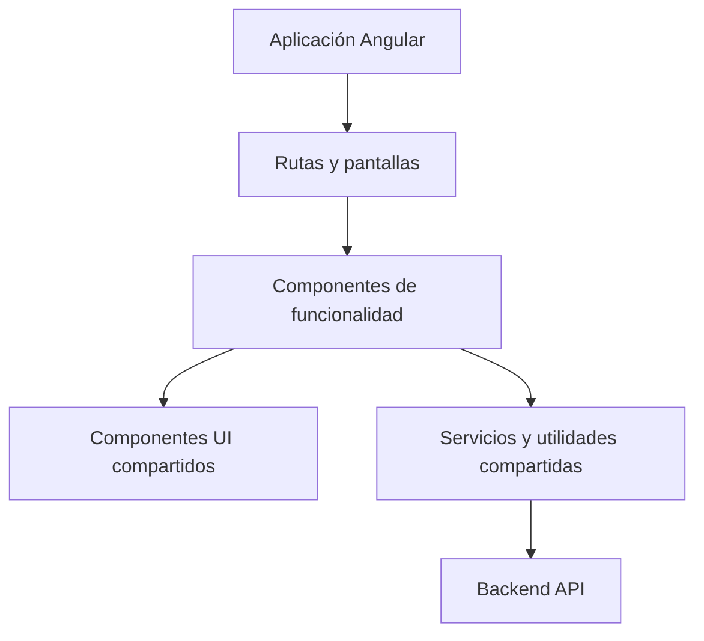
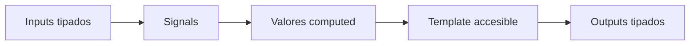

# Arquitectura Frontend

Este documento describe la estructura frontend preferida para la aplicación Angular.

## Objetivos

- Mantener las funcionalidades fáciles de probar y modificar.
- Preferir APIs modernas de Angular y estado compatible con signals.
- Mantener componentes UI compartidos consistentes, accesibles y documentados.
- Usar textos amables, formales y directos en la interfaz.

## Estructura General



## Dirección De Componentes

Prefiere componentes standalone con APIs públicas tipadas:

- Inputs con `input()`.
- Outputs con `output()`.
- Estado local con `signal()`.
- Estado derivado con `computed()`.
- Efectos secundarios con `effect()` solo cuando sean necesarios.



## Shared UI

Los componentes reutilizables viven en `frontend/src/app/shared/ui/<component>/` y mantienen juntos
implementación, tests e historias de Storybook.

Usa nombres comunes para variantes y tamaños cuando sea posible:

- Variants: `primary`, `secondary`, `neutral`, `danger`, `violet`.
- Sizes: `sm`, `md`, `lg`.

## Features Y Modelos De Dominio

Cada feature debe mantener sus contratos cerca del código que los consume. Cuando un modelo empiece
a mezclar varios conceptos, divídelo por dominio y conserva un barrel para no hacer incómodos los
imports.

Ejemplo recomendado:

```txt
features/<feature>/models/
  floor-plan.models.ts
  order.models.ts
  payment.models.ts
  product.models.ts
  service.models.ts
  table.models.ts
  <feature>.models.ts
```

El fichero `<feature>.models.ts` puede reexportar los modelos especializados:

```ts
export * from './order.models';
export * from './product.models';
export * from './service.models';
```

Esto permite imports estables desde la feature y evita que un único fichero de modelos se convierta
en un cajón de tipos sin frontera clara.

Como regla práctica:

- Los tipos de plano, mesa, pedido, producto y pago deben vivir en ficheros distintos si cambian por
  motivos diferentes.
- Los modelos de servicio pueden componer tipos de otros dominios, pero no deberían duplicarlos.
- Las pages y stores pueden importar desde el barrel de la feature cuando la comodidad compense.
- Los componentes muy acotados pueden importar el modelo concreto si mejora la legibilidad.

## Estado De Feature

Mantén el estado de pantalla y los filtros de flujo en pages o stores. Los componentes de feature
deben recibir estado por `input()` y comunicar acciones por `output()` siempre que sea razonable.

En diálogos y paneles, evita esconder estado de negocio dentro del componente. Por ejemplo, una
búsqueda de productos puede renderizar el `query`, la vista activa, la categoría y los favoritos que
recibe, pero la page o el store deberían decidir qué productos se muestran y cómo se persisten esos
favoritos.

## Documentación

Usa esta carpeta para arquitectura frontend, estrategia de testing y notas técnicas del producto.
Usa `frontend/src/app/shared/ui/docs/` para documentación MDX de Storybook sobre el sistema UI.
