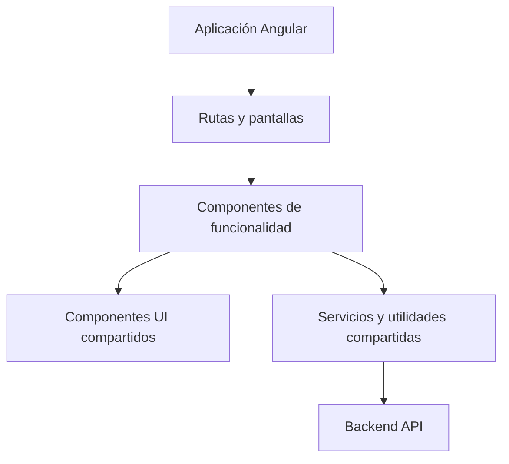
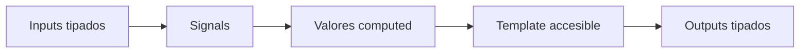

# Arquitectura Frontend

Este documento describe la estructura frontend preferida para la aplicación Angular.

## Objetivos

- Mantener las funcionalidades fáciles de probar y modificar.
- Preferir APIs modernas de Angular y estado compatible con signals.
- Mantener componentes UI compartidos consistentes, accesibles y documentados.
- Usar textos amables, formales y directos en la interfaz.

## Estructura General

## Dirección De Componentes

Prefiere componentes standalone con APIs públicas tipadas:

- Inputs con `input()`.
- Outputs con `output()`.
- Estado local con `signal()`.
- Estado derivado con `computed()`.
- Efectos secundarios con `effect()` solo cuando sean necesarios.

## Shared UI

Los componentes reutilizables viven en `frontend/src/app/shared/ui/<component>/` y mantienen juntos
implementación, tests e historias de Storybook.

Usa nombres comunes para variantes y tamaños cuando sea posible:

- Variants: `primary`, `secondary`, `neutral`, `danger`, `violet`.
- Sizes: `sm`, `md`, `lg`.

## Documentación

Usa esta carpeta para arquitectura frontend, estrategia de testing y notas técnicas del producto.
Usa `frontend/src/app/shared/ui/docs/` para documentación MDX de Storybook sobre el sistema UI.
