# Arquitectura Frontend

Este documento describe la estructura frontend preferida para la aplicación Angular.

## Objetivos

- Mantener las funcionalidades fáciles de probar y modificar.
- Preferir APIs modernas de Angular y estado compatible con signals.
- Mantener componentes UI compartidos consistentes, accesibles y documentados.
- Usar textos amables, formales y directos en la interfaz.

## Estructura General

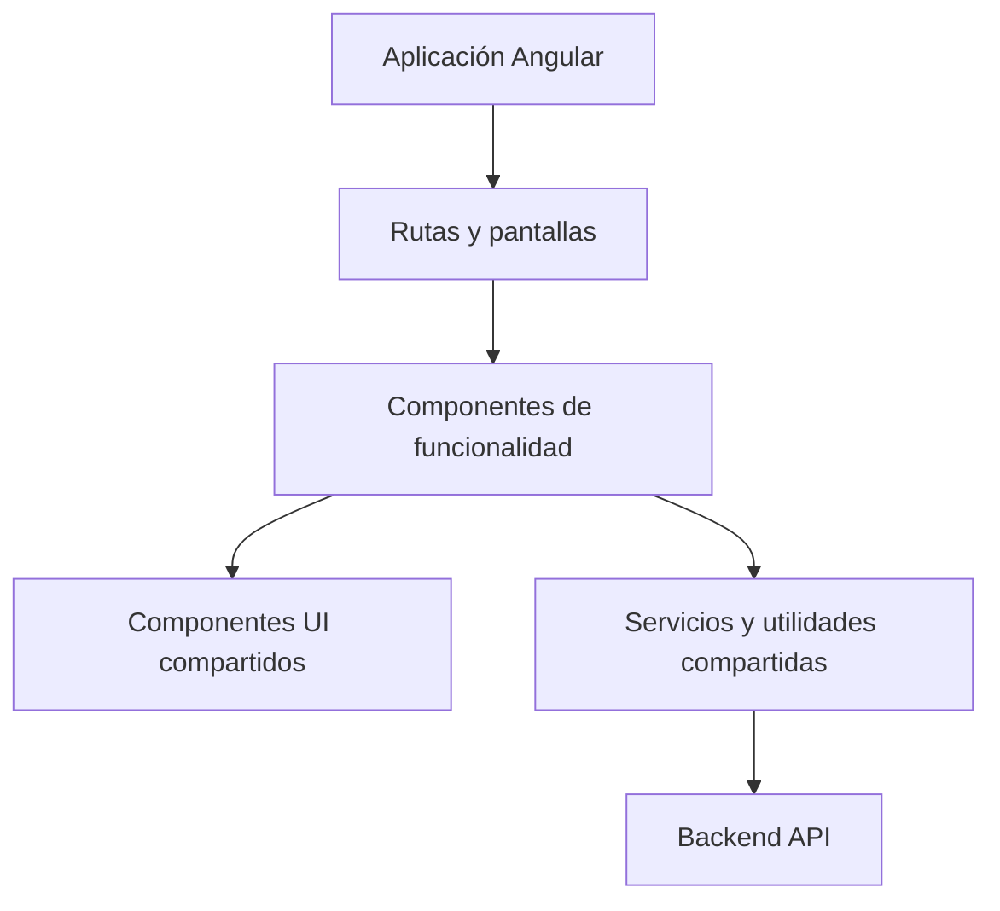

## Dirección De Componentes

Prefiere componentes standalone con APIs públicas tipadas:

- Inputs con `input()`.
- Outputs con `output()`.
- Estado local con `signal()`.
- Estado derivado con `computed()`.
- Efectos secundarios con `effect()` solo cuando sean necesarios.

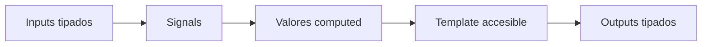

## Shared UI

Los componentes reutilizables viven en `frontend/src/app/shared/ui/<component>/` y mantienen juntos
implementación, tests e historias de Storybook.

Usa nombres comunes para variantes y tamaños cuando sea posible:

- Variants: `primary`, `secondary`, `neutral`, `danger`, `violet`.
- Sizes: `sm`, `md`, `lg`.

## Features Y Modelos De Dominio

Cada feature debe mantener sus contratos cerca del código que los consume. Cuando un modelo empiece
a mezclar varios conceptos, divídelo por dominio y conserva un barrel para no hacer incómodos los
imports.

Ejemplo recomendado:

```txt
features/<feature>/models/
  floor-plan.models.ts
  order.models.ts
  payment.models.ts
  product.models.ts
  service.models.ts
  table.models.ts
  <feature>.models.ts
```

El fichero `<feature>.models.ts` puede reexportar los modelos especializados:

```ts
export * from './order.models';
export * from './product.models';
export * from './service.models';
```

Esto permite imports estables desde la feature y evita que un único fichero de modelos se convierta
en un cajón de tipos sin frontera clara.

Como regla práctica:

- Los tipos de plano, mesa, pedido, producto y pago deben vivir en ficheros distintos si cambian por
  motivos diferentes.
- Los modelos de servicio pueden componer tipos de otros dominios, pero no deberían duplicarlos.
- Las pages y stores pueden importar desde el barrel de la feature cuando la comodidad compense.
- Los componentes muy acotados pueden importar el modelo concreto si mejora la legibilidad.

## Estado De Feature

Mantén el estado de pantalla y los filtros de flujo en pages o stores. Los componentes de feature
deben recibir estado por `input()` y comunicar acciones por `output()` siempre que sea razonable.

En diálogos y paneles, evita esconder estado de negocio dentro del componente. Por ejemplo, una
búsqueda de productos puede renderizar el `query`, la vista activa, la categoría y los favoritos que
recibe, pero la page o el store deberían decidir qué productos se muestran y cómo se persisten esos
favoritos.

## Módulo Menu V1

El catálogo del POS vive en `frontend/src/app/features/menu/` y queda separado del snapshot de
pedido. El menú define categorías, productos, disponibilidad y modificadores actuales; cada
`OrderLine` guarda una copia de lo elegido en el momento de añadir el producto: nombre, precio base,
modificadores seleccionados, nota de cocina, precio unitario, subtotal y `configurationSignature`.

Estructura actual:

```txt
features/menu/
  components/combo-customizer-dialog/
  components/modifier-group-form-dialog/
  components/product-customizer-dialog/
  models/
    combo.model.ts
    menu-category.model.ts
    modifier-group.model.ts
    modifier-option.model.ts
    product-customization.model.ts
    product.model.ts
    selected-modifier.model.ts
    menu.models.ts
  pages/menu-page/
  services/
    menu-mock.service.ts
    menu-pricing.service.ts
    menu-validation.service.ts
```

Reglas de frontera:

- `MenuMockService` expone el catálogo mock para POS y la vista `/restaurant-pos/menu`.
- `MenuPricingService` resuelve grupos, construye modificadores seleccionados, calcula precios y
  crea `configurationSignature`.
- `MenuValidationService` valida disponibilidad, opciones válidas, grupos requeridos, selección
  única, máximos y slots de combo.
- `RestaurantPosStore` crea y conserva el snapshot de `OrderLine`; las pantallas no recalculan el
  precio de una línea ya creada.
- `ComboCustomizerDialog` configura slots de combo con selección por defecto, suplementos y rechazo
  de productos no disponibles.
- Las líneas de combo guardan `selectedComboSlots` como snapshot: slot, producto elegido, curso,
  política de preparación y suplemento aplicado.

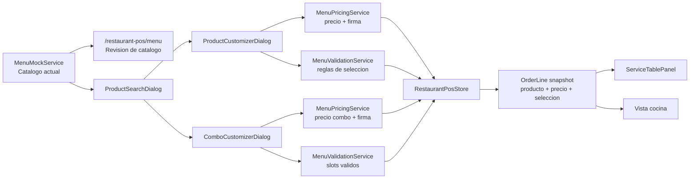

El flujo operativo queda así:

1. La persona abre búsqueda de producto o revisa el catálogo en `Menú`.
2. Un producto simple se añade directo con `addProductToSelectedTable(productId)`.
3. Un producto con modificadores abre `ProductCustomizerDialog`.
4. Un combo abre `ComboCustomizerDialog`, carga selecciones por defecto y permite cambiar productos
   disponibles por slot.
5. Confirmar un producto usa `OrderWriteService.addProduct(productId)` para simples, o
   `OrderWriteService.addCustomizedProduct(productId, optionIds, kitchenNote)` para productos con
   modificadores.
6. Confirmar un combo usa `OrderWriteService.addCombo(comboProductId, slotSelections)`.
7. La store mergea líneas con la misma `configurationSignature`; distintas notas, modificadores o
   selecciones de combo
   generan líneas separadas.
8. Servicio y cocina leen el snapshot de `OrderLine`, mostrando extras, `SIN ...`, nota de cocina o
   slots de combo sin depender de cambios posteriores del catálogo.

## Administración de Menú

`MenuPage` conecta con el backend para gestionar secciones (pestaña Categorías) y productos
(pestaña Productos) del menú activo.

### Servicio de API

`MenuApiService` (`features/menu/services/menu-api.service.ts`) actúa como capa de traducción entre
el backend y el modelo de frontend:

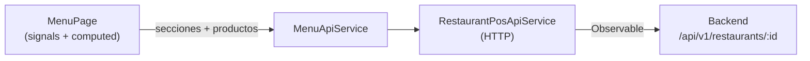

Métodos expuestos por `MenuApiService`:

| Método | Descripción |
|---|---|
| `getMenu()` | Lee el menú activo e incluye `menuId` en `MenuData` |
| `createSection(menuId, name, isVisible)` | Crea sección nueva |
| `updateSection(menuId, sectionId, data)` | Actualiza `name` o `isVisible` |
| `deleteSection(menuId, sectionId)` | Elimina sección |
| `listProducts()` | Lista todos los productos del restaurante (incluye sin sección) |
| `addSectionItem(menuId, sectionId, restaurantProductId)` | Asigna producto a sección |
| `removeSectionItem(menuId, sectionId, itemId)` | Elimina ítem de sección |
| `getProduct(productId)` | Detalle completo de un producto |
| `createProduct(data)` | Crea producto en el catálogo |
| `updateProduct(productId, data)` | Actualiza campos del producto |
| `deleteProduct(productId)` | Elimina producto del catálogo |
| `listModifierGroups()` | Lista grupos de modificadores de la organización |
| `createModifierGroup(data)` | Crea un grupo con sus opciones iniciales |
| `deleteModifierGroup(groupId)` | Elimina un grupo (falla si está en uso) |

### Carga paralela del catálogo

Al inicializar y en cada recarga, `MenuPage` lanza `getMenu()` y `listProducts()` en paralelo con
`forkJoin`:

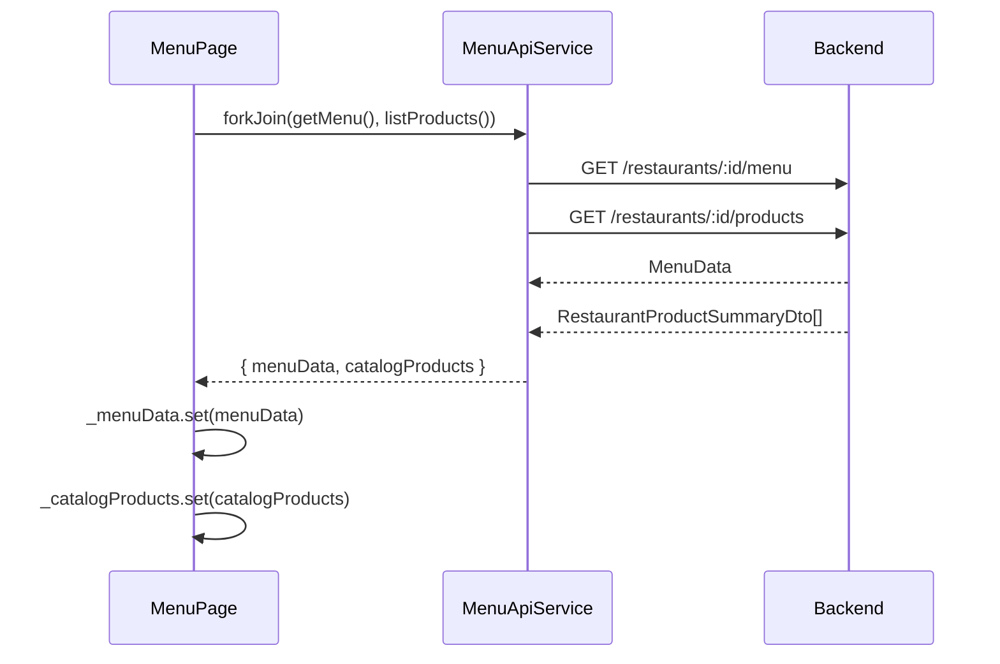

El computed `products` fusiona ambas fuentes: los productos en secciones vienen de `menuData` (con
`categoryId` poblado); los productos del catálogo que no aparecen en ninguna sección se añaden con
`categoryId: ''`. Esto permite mostrar un inventario completo en la pestaña Productos aunque no
todos estén asignados a una sección.

### Productos sin sección

Un producto con `categoryId === ''` es un producto del catálogo no asignado a ninguna sección del
menú. En la tarjeta de producto se muestra el badge **Sin sección** y el botón **Añadir a sección**,
que abre un selector con las secciones existentes y llama a `addSectionItem`.

### Estado de la pestaña Categorías

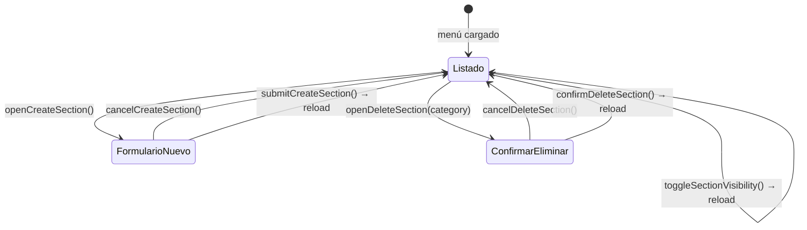

### Estado de la pestaña Productos

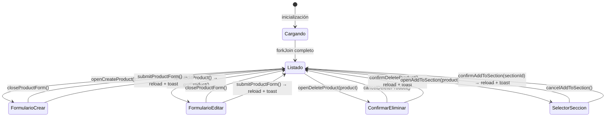

Signals de producto en `MenuPage`:

| Signal | Tipo | Descripción |
|---|---|---|
| `_catalogProducts` | `RestaurantProductSummaryDto[]` | Productos cargados de `listProducts()` |
| `products` | `computed<Product[]>` | Fusión de menú + catálogo |
| `productFormOpen` | `boolean` | Visibilidad del formulario crear/editar |
| `productFormProduct` | `RestaurantProductDetailDto \| null` | `null` en crear, detalle en editar |
| `productFormLoading` | `boolean` | Spinner del botón de guardar |
| `productToDelete` | `Product \| null` | Producto pendiente de confirmación |
| `deleteProductOpen` | `boolean` | Visibilidad del diálogo de borrado |
| `addToSectionProduct` | `Product \| null` | Producto pendiente de asignación |
| `addToSectionOpen` | `boolean` | Visibilidad del selector de sección |

### Feedback con toasts

Todas las mutaciones muestran un toast de éxito en `complete` y un toast de error en `error`. Los
errores 409 se distinguen por `mapHttpError(err).type === 'conflict'` para dar un mensaje más
específico (nombre duplicado, producto ya en sección).

### Estado de la pestaña Modificadores

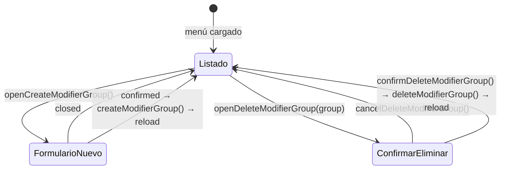

Signals de grupos de modificadores en `MenuPage`:

| Signal | Tipo | Descripción |
|---|---|---|
| `modifierGroupFormOpen` | `boolean` | Visibilidad del diálogo `ModifierGroupFormDialog` |
| `modifierGroupFormLoading` | `boolean` | Spinner del botón guardar del diálogo |
| `modifierGroupToDelete` | `RestaurantMenuModifierGroupDto \| null` | Grupo pendiente de confirmación |
| `deleteModifierGroupOpen` | `boolean` | Visibilidad del diálogo de borrado |
| `deleteModifierGroupLoading` | `boolean` | Spinner del botón confirmar borrado |

`ModifierGroupFormDialog` (`components/modifier-group-form-dialog/`) mantiene su propio estado
de formulario con signals (`name`, `selectionType`, `isRequired`, `options`) y emite `confirmed`
con `CreateModifierGroupRequest` cuando el usuario confirma. La validez (`isValid`) requiere nombre
no vacío y al menos una opción con nombre. Un `effect()` limpia el formulario cada vez que `open`
pasa a `true`.

### Reglas de frontera

- `MenuApiService` no transforma datos de dominio; mapea las respuestas DTO directamente.
- `MenuPage` gestiona todo el estado CRUD con signals propios; no hay store externo.
- El `menuId` se obtiene del menú cargado (no hardcodeado) para soportar múltiples menús.
- La recarga siempre relanza `forkJoin(getMenu(), listProducts())` para mantener ambas listas
  sincronizadas tras cualquier mutación.
- Los grupos de modificadores se cargan con `listModifierGroups()` en el mismo `forkJoin`
  de inicialización; sus mutaciones también relanza la carga completa.

## Interceptor HTTP de autenticación

`authInterceptor` (`features/identity/auth.interceptor.ts`) añade la cabecera
`Authorization: Bearer <token>` a todas las peticiones hacia la propia API, y gestiona el refresco
de token ante respuestas `401`.

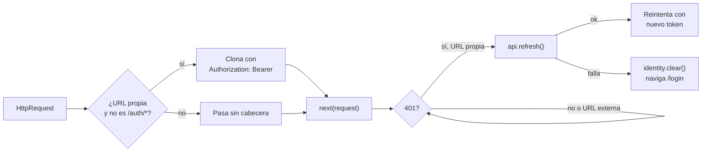

**Regla de URL propia:** una URL se considera propia cuando es relativa (no comienza por `http`) o
cuando su origen coincide con `window.location.origin`. Las peticiones a servicios externos como
`https://api.cloudinary.com` no reciben la cabecera y sus errores `401` no activan el refresco de
token. Esto evita que las cabeceras Bearer interfieran con esquemas de autenticación propios de
esos servicios (firma Cloudinary, etc.).

## API de Pedidos Persistentes

El servicio HTTP de pedidos vive en:

```txt
features/restaurant-pos/api/
  restaurant-pos-api.models.ts   # tipos DTO para pedidos, líneas y pagos
  restaurant-pos-api.service.ts  # métodos HTTP sobre RestaurantPosApiService
  restaurant-pos-api.service.spec.ts
```

`RestaurantPosApiService` centraliza todas las llamadas al backend. Los métodos de pedidos
persistentes siguen el contrato de `/api/v1/restaurants/:id/orders`:

| Método | Verbo | Ruta |
|---|---|---|
| `openRestaurantOrder` | POST | `/restaurants/:id/service-points/:tableId/orders` |
| `getRestaurantOrder` | GET | `/restaurants/:id/orders/:orderId` |
| `addRestaurantOrderLine` | POST | `/restaurants/:id/orders/:orderId/lines` |
| `updateRestaurantOrderLine` | PATCH | `/restaurants/:id/orders/:orderId/lines/:lineId` |
| `deleteRestaurantOrderLine` | DELETE | `/restaurants/:id/orders/:orderId/lines/:lineId` |
| `cancelRestaurantOrderLine` | POST | `/restaurants/:id/orders/:orderId/lines/:lineId/cancel` |
| `registerRestaurantOrderPayment` | POST | `/restaurants/:id/orders/:orderId/payments` |
| `updateRestaurantOrderLineStatus` | PATCH | `/restaurants/:id/orders/:orderId/lines/:lineId/status` |
| `freeRestaurantServicePoint` | POST | `/restaurants/:id/service-points/:tableId/free` |

Todos devuelven `Observable<RestaurantOrderDto>` (o `Observable<void>` para delete). El tipo
`RestaurantOrderDto` incluye el pedido con sus totales, las líneas con estado de ciclo de vida y
los pagos registrados:

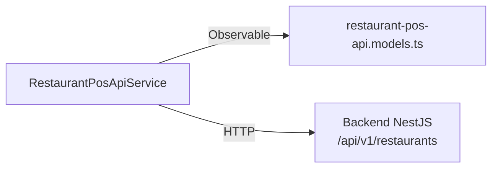

### Tipos DTO de pedido

`restaurant-pos-api.models.ts` exporta los tipos primitivos de estado alineados con el backend:

- `OrderStatusDto` — `open | pending_payment | paid | cancelled`
- `OrderLineStatusDto` — `pending | preparing | ready | served | cancelled`
- `OrderPaymentMethodDto` — `cash | card | bizum | other`
- `RestaurantOrderDto` — pedido completo con `order`, `lines[]` y `payments[]`
- Tipos de request: `OpenRestaurantOrderRequest`, `AddRestaurantOrderLineRequest`,
  `UpdateRestaurantOrderLineRequest`, `CancelRestaurantOrderLineRequest`,
  `RegisterRestaurantOrderPaymentRequest`

### Reglas de frontera

- `RestaurantPosApiService` no transforma ni deriva datos; mapea parámetros a URLs y devuelve el
  DTO del backend directamente.
- El store o la page que consuma estos métodos es responsable de mantener el estado de pedido
  activo y de reemplazarlo con la respuesta de cada mutación.
- No duplicar los tipos `OrderLineStatusDto` / `OrderStatusDto` en modelos de dominio frontend;
  importar desde `restaurant-pos-api.models.ts`.

## Persistencia de escritura en las páginas POS

### Identificador de pedido en el store

`TableOrder` incluye un campo opcional `id?: string` que almacena el ID de pedido del backend.
`mapServicePointOrder` lo populea desde `serviceOrder.order.id` al hidratar el store. Esto permite
que las páginas consulten el orderId sin llamadas adicionales al backend:

```ts
const orderId = this.store.ordersByTable()[tableId]?.id;
```

### Líneas API vs. líneas locales

Las líneas añadidas manualmente antes de que exista un pedido persistente usan IDs con prefijo
`line:` (generados en el store). Las líneas provenientes del backend tienen UUIDs sin prefijo.

`RestaurantPosServicePage` usa el helper privado `resolveApiLine` para distinguirlas:

```ts
private resolveApiLine(lineIdOrProductId: string): { line; orderId; restaurantId } | null {
  // devuelve null si no hay restaurante activo, el pedido no tiene ID backend,
  // la línea no existe, o el ID de línea empieza por 'line:'
}
```

Solo se llama al backend para líneas con ID de backend real. Las operaciones sobre líneas locales
solo mutan el store.

### Board de cocina

`RestaurantPosKitchenPage.movePreparationLine` llama a `updateRestaurantOrderLineStatus` tras cada
movimiento exitoso en el board. El `statusMap` convierte el `targetColumnId` a estado de backend:

```ts
{ in_kitchen: 'preparing', ready: 'ready', served: 'served' }
```

Si la llamada al backend falla, la mutación local en el store ya ocurrió; el estado visual puede
quedar adelantado respecto al backend hasta el siguiente polling.

### Liberación de mesa

`RestaurantPosServicePage.freeTable` llama a `freeRestaurantServicePoint` antes de limpiar el
estado local. Primero hidrata el store con la respuesta del backend y luego ejecuta
`store.freeSelectedTable()` para garantizar que el estado local siempre refleja lo confirmado por
el servidor.

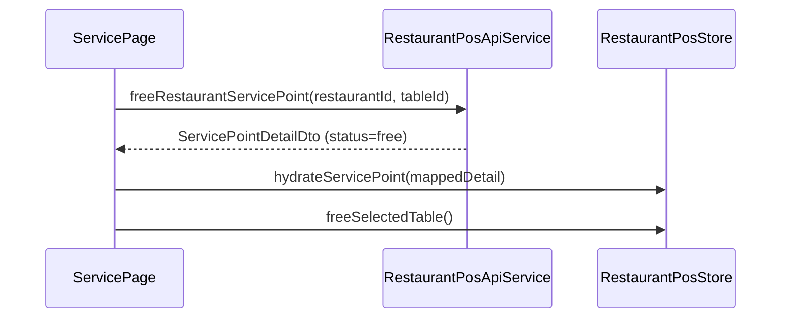

## Agenda operativa de reservas

La pantalla `RestaurantPosReservationsPage` actua como agenda diaria de sala. En `v0.0.2` no abre
servicio automaticamente ni usa un calendario mensual; su responsabilidad es leer reservas del dia,
filtrarlas y ejecutar transiciones operativas simples.

Estructura relevante:

```txt
features/restaurant-pos/
  api/
    restaurant-pos-api.models.ts
    restaurant-pos-api.service.ts
  pages/restaurant-pos-reservations-page/
    restaurant-pos-reservations-page.ts
    restaurant-pos-reservations-page.html
    restaurant-pos-reservations-page.css
    restaurant-pos-reservations-page.spec.ts
```

### Responsabilidades de la page

- Cargar reservas del restaurante activo con `RestaurantPosApiService`, pasando la fecha seleccionada.
- Mostrar spinner durante la carga y alerta de error con botón de reintento si la carga falla.
- Filtrar por fecha, estado, servicio y busqueda de cliente o telefono.
- Derivar una agenda visual por servicios con `serviceGroups` computed.
- Calcular resumen superior: reservas, pax, sin mesa y reservas vencidas.
- Mostrar acciones rapidas por reserva con spinner de accion y error local.
- Interceptar acciones destructivas (`cancel`, `no_show`) para pedir confirmacion antes de ejecutarlas.

### Contrato de API usado por frontend

`RestaurantPosApiService` centraliza la lectura y las acciones rapidas:

| Metodo | Verbo | Ruta |
|---|---|---|
| `getRestaurantReservations(restaurantId, date?)` | GET | `/restaurants/:id/reservations[?date=YYYY-MM-DD]` |
| `createRestaurantReservation` | POST | `/restaurants/:id/reservations` |
| `confirmRestaurantReservation` | PATCH | `/restaurants/:id/reservations/:reservationId/confirm` |
| `seatRestaurantReservation` | PATCH | `/restaurants/:id/reservations/:reservationId/seat` |
| `markRestaurantReservationNoShow` | PATCH | `/restaurants/:id/reservations/:reservationId/no-show` |
| `cancelRestaurantReservation` | PATCH | `/restaurants/:id/reservations/:reservationId/cancel` |

El DTO de reserva mantiene `tableIds` por compatibilidad y anade `tables[]` enriquecido para
renderizar etiquetas de mesa sin composicion extra en la page.

Tipos DTO de reserva en `restaurant-pos-api.models.ts`:

```ts
type RestaurantReservationTableDto = {
  id: string;
  tableNumber: number;
  name: string | null;
};

type RestaurantReservationDto = {
  id: string;
  customerId: string | null;
  customerNameSnapshot: string;
  customerPhoneSnapshot: string | null;
  partySize: number;
  reservationAt: string;   // ISO-8601
  durationMinutes: number;
  status: 'pending' | 'confirmed' | 'seated' | 'cancelled' | 'no_show';
  notes: string | null;
  tableIds: string[];
  tables: RestaurantReservationTableDto[];
};

type CreateRestaurantReservationRequest = {
  customerNameSnapshot: string;
  customerPhoneSnapshot: string | null;
  partySize: number;
  reservationAt: string;   // ISO-8601, debe ser futuro
  durationMinutes: number; // >= 15, default 90
  notes: string | null;
  tableIds: string[];
};
```

### Estado derivado de agenda

La page mantiene el estado de pantalla con `signal()` y deriva la agenda con `computed()`:

- `selectedDate` — fecha activa; cambiarla relanza la carga contra el backend con `?date=`
- `loading` — activo mientras la peticion de reservas esta en vuelo
- `loadError` — activo si la carga falla; habilita el boton de reintento
- `searchQuery`, `statusFilter`, `serviceFilter` — filtros locales aplicados sobre la agenda cargada
- `actionState` — mapa de `{ loading, error }` por `reservationId` para acciones en vuelo
- `pendingAction` — reserva y accion pendiente de confirmacion destructiva; `null` si no hay dialogo abierto
- `dayReservations`, `summary`, `lunchReservations`, `dinnerReservations` — derivados de las reservas
- `serviceGroups` — computed que agrupa `lunchReservations` y `dinnerReservations` en un array iterable para evitar markup duplicado en el template

La transformacion convierte cada `RestaurantReservationDto` en un item de agenda con:

- `serviceBucket`: `lunch` o `dinner`
- `tableLabel`: mesas enriquecidas o `Sin mesa asignada`
- `isUpcoming`
- `isOverdue`
- `isUnassigned`
- `availableActions`

### Robustez y UX de la agenda

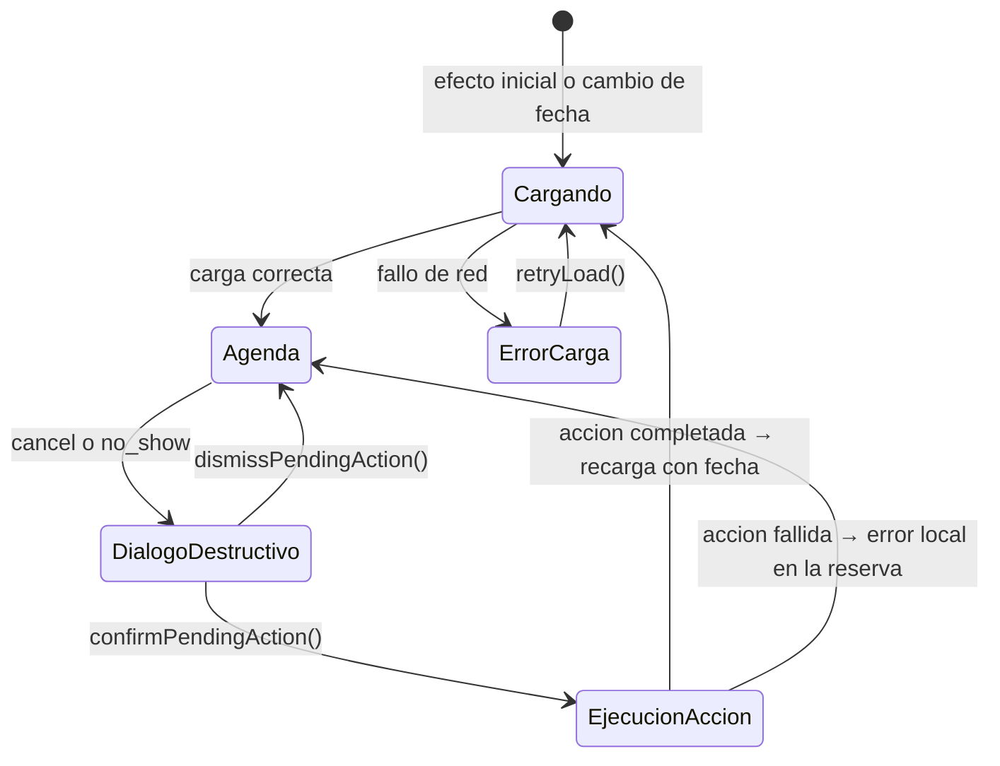

- La carga inicial y los reintentos usan `takeUntilDestroyed` para cancelar la suscripcion si el componente se destruye.
- El estado `loading` muestra un `<app-spinner>` centrado; `loadError` muestra un `<app-alert variant="danger">` con boton de reintento.
- Las acciones `cancel` y `no_show` abren un `<app-dialog>` de confirmacion antes de llamar a la API. `confirm` y `seat` se ejecutan directamente.
- Mientras una accion esta en vuelo, el boton de esa reserva queda deshabilitado y muestra un `<app-spinner size="sm" decorative>` interior.

### Reglas UX de v0.0.2

- `pending` muestra `Confirmar` y `Cancelar`.
- `confirmed` muestra `Sentar`, `No-show` y `Cancelar`.
- `seated`, `cancelled` y `no_show` no exponen nuevas acciones.
- `seat` solo cambia el estado a `seated`; no abre pedido ni vincula una mesa activa.
- Las reservas vencidas son las del dia cuya hora ya paso y siguen en `pending` o `confirmed`.
- Las reservas futuras del dia se marcan como proximas.

Esta frontera deja preparado `v0.0.3` para anadir una accion separada de abrir servicio desde una
reserva ya sentada sin mezclar la agenda con la operativa de pedido.

### Alta manual de reservas en v0.0.3

La misma page permite crear una reserva manual desde `Nueva reserva`. El formulario mantiene estado
local con signals y, al guardar, llama a `createRestaurantReservation(...)` en el API service.

El selector de mesas reutiliza `getRestaurantFloors()` para evitar una API adicional solo de
tablas. La conversión de `selectedDate + time` se hace en hora local con `new Date(year, month,
day, hour, minute).toISOString()` para no desplazar la reserva por forzar un sufijo `Z` manual.

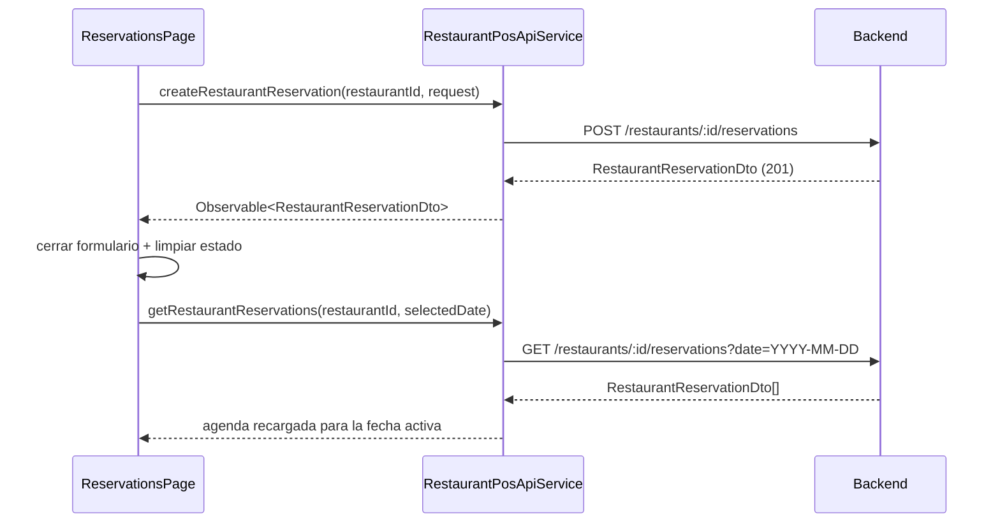

Tras una creación correcta:

- se cierra el formulario
- se limpia el estado local
- se recarga la agenda diaria

## Estado del POS: tres stores especializados

El estado del punto de venta está dividido en tres stores con responsabilidades distintas.
`RestaurantPosStore` actúa como coordinador/fachada y es el único punto de inyección para
los componentes y páginas existentes.

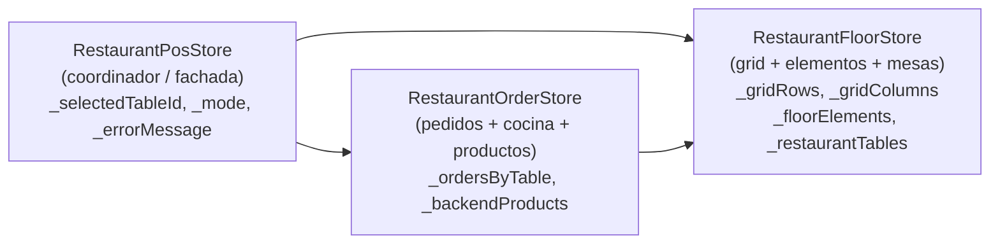

### `RestaurantFloorStore`

Archivo: `state/restaurant-floor.store.ts` (~250 líneas)

Propietario de la geometría del restaurante:

| Signal | Tipo | Descripción |
|---|---|---|
| `_gridRows`, `_gridColumns` | `number` | Dimensiones del grid de plano |
| `_activeFloorId`, `_activeFloorName` | `string \| null` | Sala activa |
| `_floorElements` | `FloorElement[]` | Elementos del plano (mesas, bar, cocina) |
| `_restaurantTables` | `RestaurantTable[]` | Mesas con capacidad y estado |

Los métodos que pueden fallar (p. ej. `removeRow`, `setGridSize`, `addFloorElement`) devuelven
`boolean` en lugar de escribir en un signal de error. `RestaurantPosStore` traduce el `false`
a un mensaje de error visible.

`deleteFloorElement` devuelve `string | null` (el `tableId` eliminado) para que el coordinador
pueda limpiar el pedido y la selección asociados.

### `RestaurantOrderStore`

Archivo: `state/restaurant-order.store.ts` (~630 líneas)

Propietario de pedidos y lógica de cocina. Inyecta `RestaurantFloorStore` para actualizar
el estado de la mesa (`updateTable`) cuando cambia un pedido:

| Signal | Tipo | Descripción |
|---|---|---|
| `_ordersByTable` | `OrdersByTable` | Pedidos activos por `tableId` |
| `_backendProducts` | `Product[] \| null` | Productos del backend (sobreescribe el mock si se hidrata) |

Los métodos de mutación de pedido reciben `tableId` explícito en lugar de leer `_selectedTableId`
internamente. Esto desacopla la lógica de pedido de la selección activa.

Computeds de cocina y preparación (`kitchenTickets`, `kitchenBoardColumns`,
`preparationBoardColumns`, `servedPreparationCards`) viven aquí porque requieren tanto
`_ordersByTable` como `restaurantTables()` del store de suelo.

### `RestaurantPosStore` (coordinador)

Archivo: `state/restaurant-pos.store.ts` (~435 líneas)

Propietario de la selección y el estado de UI transversal:

| Signal | Tipo | Descripción |
|---|---|---|
| `_selectedTableId` | `string \| null` | Mesa seleccionada actualmente |
| `_mode` | `PosMode` | `operation` o `design` |
| `_errorMessage` | `string \| null` | Clave i18n del último error |

Expone todos los signals de suelo y pedido como delegados directos (`readonly gridRows = this.floor.gridRows`). Los métodos «selected*» resuelven el `tableId` activo y delegan al order store pasándolo explícitamente.

### Flujo de datos

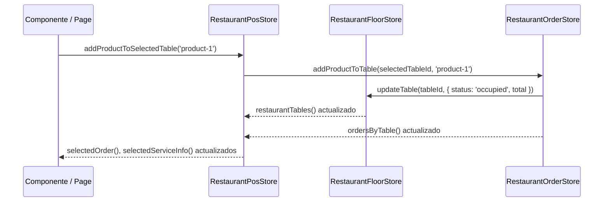

### Regla de frontera

- Los componentes y páginas inyectan **solo** `RestaurantPosStore`; no inyectan los stores internos.
- Los specs de `RestaurantPosStore` pueden acceder a `TestBed.inject(RestaurantOrderStore)` o
  `TestBed.inject(RestaurantFloorStore)` para manipular estado privado cuando el API público no
  lo expone directamente (p. ej. vaciar `_ordersByTable` para probar el caso «sin pedido»).

## Restaurante activo y selección multi-restaurante

`RestaurantContextStore` gestiona la lista de restaurantes accesibles y cuál está activo:

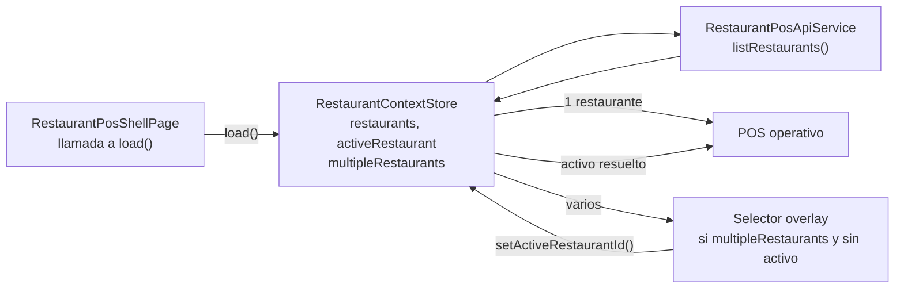

### Auto-selección

`load()` hace auto-selección (`_activeRestaurantId` ← `restaurants[0].id`) si la API devuelve
exactamente un restaurante. Si devuelve más de uno, `activeRestaurant` es `null` hasta que el
usuario elija, y la shell muestra el overlay selector.

### Signals públicos de `RestaurantContextStore`

| Signal / computed | Tipo | Descripción |
|---|---|---|
| `restaurants` | `RestaurantSummaryDto[]` | Lista cargada desde la API |
| `activeRestaurant` | `RestaurantSummaryDto \| null` | Restaurante activo o null |
| `multipleRestaurants` | `boolean` | `true` si hay más de uno |
| `isLoading` | `boolean` | Carga en vuelo |
| `loadError` | `string \| null` | Clave i18n de error |
| `hasNoRestaurants` | `boolean` | Sin restaurantes y sin carga ni error |

`setActiveRestaurantId(id)` es el único setter público; lo llama el overlay selector.

### Responsabilidad de la shell

`RestaurantPosShellPage` es la única responsable de llamar a `load()` en su constructor.
`OrderSyncService` ya no lo llama para evitar doble carga. El polling de `OrderSyncService`
se activa automáticamente en cuanto `activeRestaurant` deja de ser `null`.

`MenuApiService` lee `activeRestaurant()?.id` directamente desde el store; lanza en runtime
si no hay restaurante activo.

### Invalidación en tiempo real (`RealtimeService`)

`OrderSyncService` no solo pollea cada 30s (`ORDER_SYNC_POLL_INTERVAL_MS`): también fusiona
(`merge`) ese timer con `RealtimeService.invalidated$`, filtrado por `restaurantId` del
restaurante activo y con `debounceTime(300)` para agrupar ráfagas de eventos. `RealtimeService`
es un servicio opuesto en `core/realtime/` (fuera de `restaurant-pos/`) porque no depende de
ningún estado del POS — solo conecta un socket (vía la interfaz `RealtimeTransport`, no
`socket.io-client` directamente) cuando hay sesión autenticada y restaurante activo, y reenvía
los eventos `order:invalidated` que recibe.

El polling sigue siendo la fuente de verdad: si el flag de backend `REALTIME_ENABLED` está en
`false`, o el socket nunca llega a conectar, `invalidated$` simplemente nunca emite y el
comportamiento es idéntico al polling puro — no hay ninguna ruta de código que dependa de que el
socket exista. Ver `backend/docs/realtime.md` para el flujo completo del lado servidor.

---

## Scopes de sesión en `IdentitySessionStore`

El store de sesión persiste el campo `scopes` que devuelve el backend en login y refresh:

```ts
type SessionScopes = {
  organizations: string[];
  restaurants: string[];
};

type IdentitySessionSnapshot = {
  userId: string | null;
  roles: string[];
  permissions: PermissionName[];
  accessToken: string | null;
  scopes: SessionScopes;
};
```

`setAuthResponse(response)` lo extrae de `AuthResponseDto.scopes` con fallback a arrays vacíos
para mantener compatibilidad con tokens emitidos antes de añadir el campo.

El guard de ruta `restaurantScopeGuard` usa `IdentitySessionStore.scopes()` para decidir si el
usuario puede acceder al restaurante activo en el frontend (comprobación local, sin llamada HTTP):

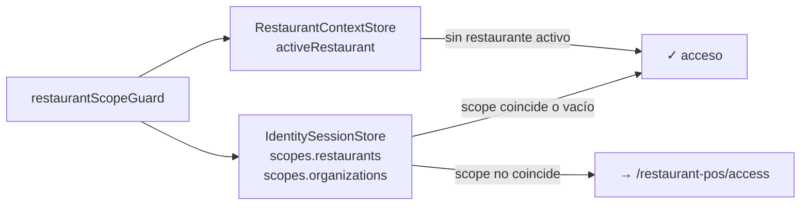

Regla: si `scopes.restaurants` está vacío el guard pasa sin restricción (usuario sin scope
específico de restaurante, p.ej. admin global). Si hay scopes y el restaurante activo no está
en ellos, redirige a `/access`.

---

## Escritura de pedidos: `OrderWriteService`

`OrderWriteService` es el puente entre la UI y la API del backend para añadir productos a un pedido.
Implementa un despacho en tres ramas según si el producto existe en el catálogo y si tiene ID de backend:

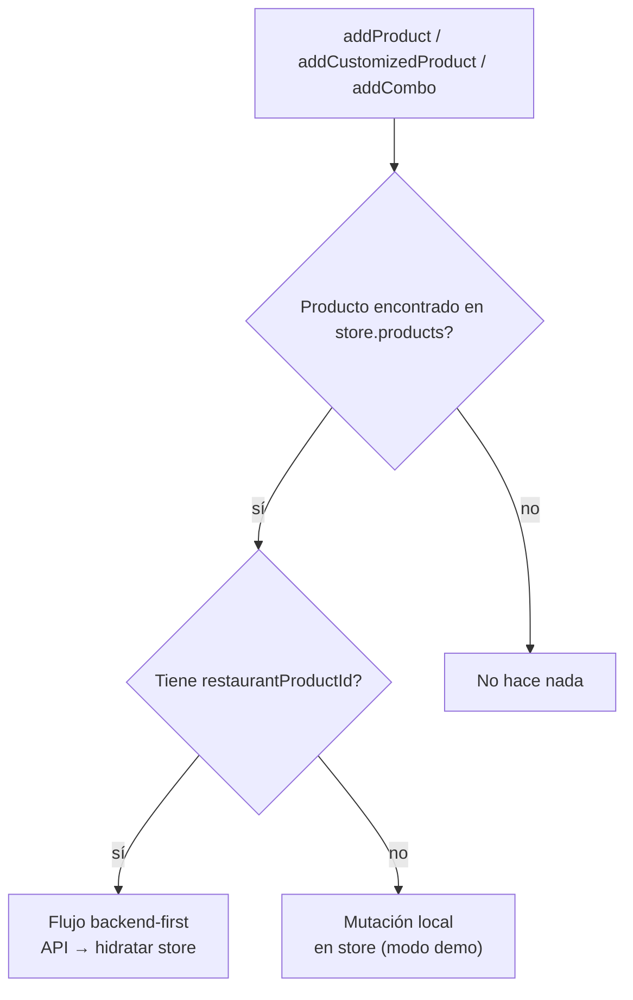

**Flujo backend-first** (producto real con ID de backend):

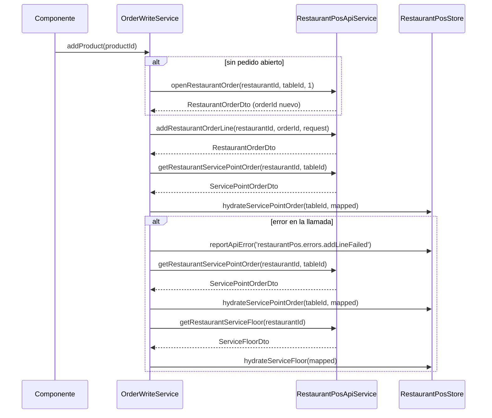

**Modo demo** (producto sin `restaurantProductId`, catálogo desde `MenuMockService`):
la mutación se aplica solo en el store sin llamada al backend. El estado visual es inmediato
pero no persiste en base de datos.

### Métodos públicos

| Método | Descripción |
|---|---|
| `addProduct(productId)` | Producto simple, sin modificadores |
| `addCustomizedProduct(productId, modifierOptionIds, kitchenNote)` | Producto con modificadores y nota de cocina |
| `addCombo(comboProductId, slotSelections)` | Combo con selecciones de slot |

### Reglas de frontera

- Si el producto no se encuentra en `store.products()`, no hace nada (ID desconocido).
- Si el producto está en el store pero no tiene `restaurantProductId` (modo demo / catálogo mock),
  aplica la mutación local directamente sin llamar a la API.
- Con `restaurantProductId` presente, el store solo se actualiza cuando llega la respuesta del
  servidor; no hay actualización optimista previa.
- Cuando ya existe pedido abierto en el store (`selectedOrder().id`), llama directamente a
  `addRestaurantOrderLine`. Si no, primero abre el pedido con `openRestaurantOrder`.
- Si no hay restaurante activo o mesa seleccionada, no hace nada (guarda interna en `syncOrderLine`).
- En caso de error recarga el pedido del punto de servicio Y la planta desde el backend para
  restaurar un estado visual consistente con el servidor.
- `OrderWriteService` es un provider a nivel de módulo o shell; no es `providedIn: 'root'`.

## Documentación

Usa esta carpeta para arquitectura frontend, estrategia de testing y notas técnicas del producto.
Usa `frontend/src/app/shared/ui/docs/` para documentación MDX de Storybook sobre el sistema UI.

## Observabilidad frontend

La capa de cliente para observabilidad vive en:

```txt
src/app/core/observability/
```

Responsabilidades:

- capturar errores globales
- capturar errores HTTP de API
- registrar navegacion principal
- registrar cambios online/offline
- enviar eventos ligeros saneados a `POST /api/v1/observability/client-events`

El dashboard operativo para `developer` vive en:

```txt
src/app/features/developer/pages/developer-logs-page/
```

La pantalla `/developer/logs` consume:

- resumen de KPIs
- timeline
- breakdown
- listado paginado de eventos

Filtros expuestos en UI:

- rango fecha/hora
- presets rapidos `1h`, `6h`, `24h`, `3d`, `7d`
- nivel
- categoria
- ruta — `<select>` con grupos de rutas curados a mano (`KNOWN_LOG_PATH_GROUPS`, `api/developer-logs.models.ts`); sincronizar si se añaden endpoints nuevos en el backend
- restaurante — picker `app-combobox` cargado una vez desde `GET /restaurants`
- usuario actor — picker `app-combobox` cargado desde `/developer/logs/actor-options` (derivado de eventos de auditoria `auth.*`, no de `GET /users`)
- tipo de entidad
- id de entidad — picker `app-combobox` que se recarga desde `/developer/logs/entity-options` al cambiar tipo de entidad o restaurante
- resultado
- texto libre

Los tres pickers usan `app-combobox` (`shared/ui/combobox/`) en vez de un modal a medida: mismo
resultado para el usuario (escribir para filtrar, texto de ayuda vía `hint`) con mucho menos codigo
nuevo. `entityId` y `actorUserId` no reusan endpoints de `identity` (`GET /users` requiere rol
`admin` desde que se cerro el bootstrap sin guard, ver `backend/docs/architecture.md`); en su lugar
derivan las opciones del propio rastro de auditoria en `app_logs`, lo que ademas hereda
automaticamente el aislamiento de cuentas demo.

Para detalles de backend, contrato de auditoria y retencion, ver
[backend/docs/observability.md](../../backend/docs/observability.md).

## Readiness en login

La pantalla de acceso tambien consulta `GET /api/v1/health/readiness` para detectar cuando una base gratuita sigue despertando.

Comportamiento:

- hace una comprobacion inicial al cargar `/login`
- si recibe `warming_up`, mantiene polling corto hasta que el backend responda `ready`
- muestra un banner de estado dentro de la tarjeta de acceso
- si recibe `down`, mantiene un aviso mas severo sin tocar el flujo de autenticacion

La intencion es operativa: reducir confusion cuando el primer acceso tarda por cold start, sin meter esta logica dentro del servicio de login.

## Readiness compartido en frontend

La logica de sondeo de readiness no vive ya en cada page por separado. Se centraliza en:

```txt
src/app/features/identity/api/platform-readiness.service.ts
```

Responsabilidades:

- consultar `GET /api/v1/health/readiness`
- aplicar polling corto (`5s`)
- degradar a `warming_up` si la comprobacion falla
- permitir dos modos:
  - `stopWhenReady: true` para pantallas como `login`
  - observacion continua para pantallas tecnicas como `developer`

Esto evita duplicar temporizadores y deja una unica frontera para cambiar la politica de sondeo mas adelante.

## Estado de plataforma en developer

La pantalla `DeveloperPage` reutiliza `PlatformReadinessService` para mostrar un estado compacto de plataforma antes de los recursos tecnicos.

Comportamiento:

- muestra `ready`, `warming_up` o `down`
- enseña la duracion de la ultima comprobacion
- mantiene observacion continua aunque la base ya este `ready`
- ofrece una accion directa a `/developer/logs`

La idea es que `login` resuelva incertidumbre para el acceso, mientras `developer` mantenga contexto operativo y enlace rapido con los logs.

## Mapa de tablas en developer

La ruta tecnica `/developer/tables` vive en:

```txt
src/app/features/developer/pages/developer-tables-page/
```

Su objetivo es complementar `/developer/logs` con una lectura rápida de entidades, campos base y
relaciones visibles entre dominios.

La documentación específica y el diagrama Mermaid asociado viven en:

- [frontend/docs/developer-tables.md](C:/Users/Thor_/Documents/Proyecto/frontend/docs/developer-tables.md)
