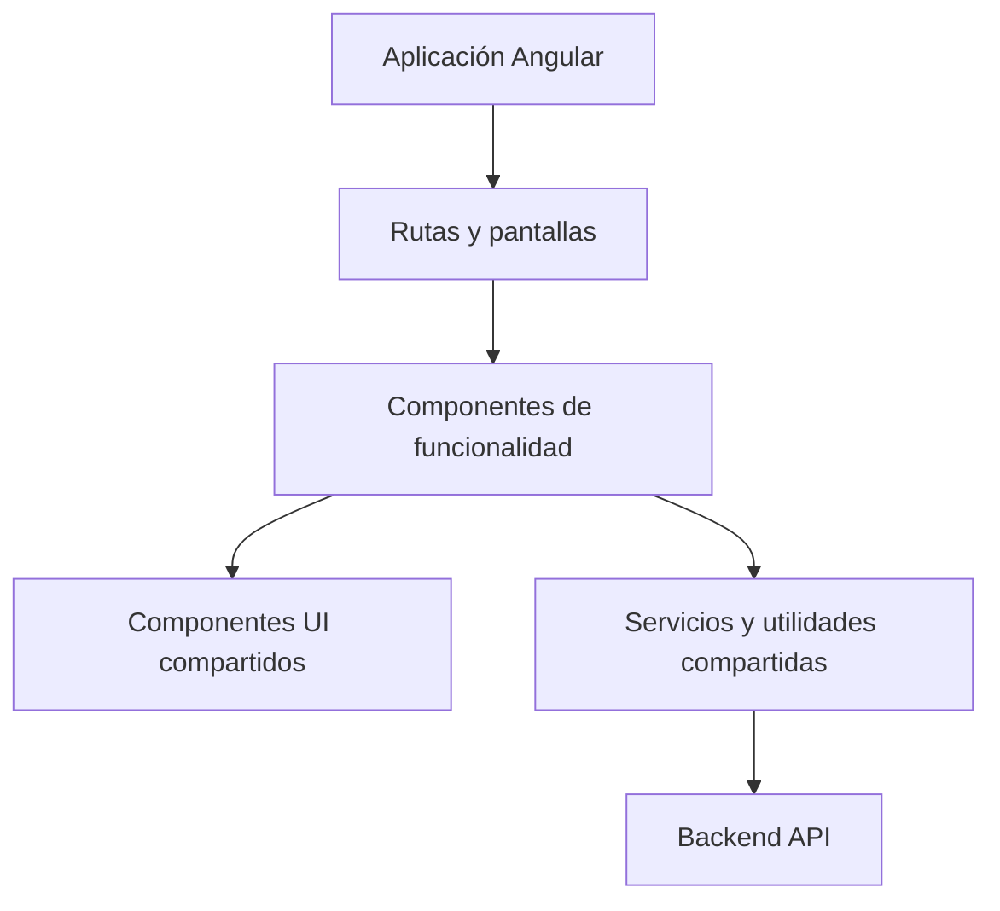
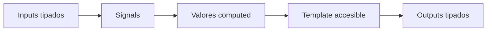
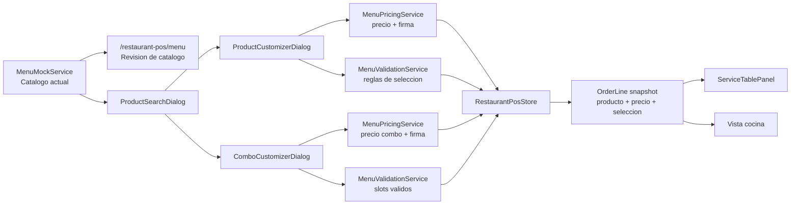
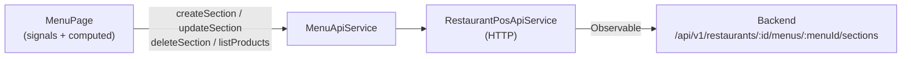
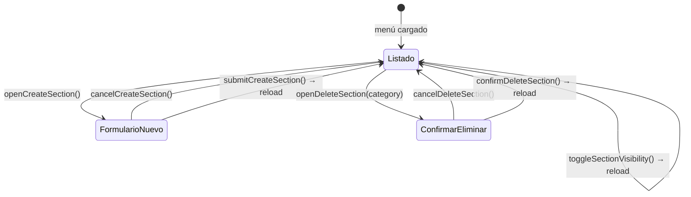
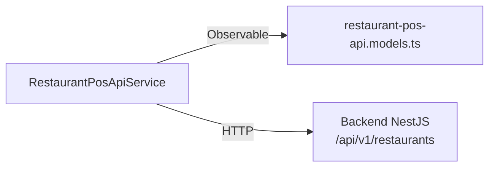
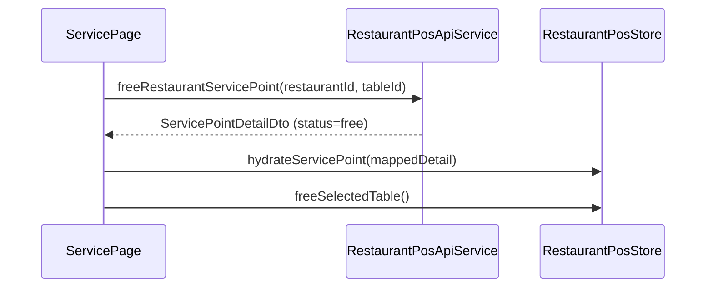

# Arquitectura Frontend

Este documento describe la estructura frontend preferida para la aplicación Angular.

## Objetivos

- Mantener las funcionalidades fáciles de probar y modificar.
- Preferir APIs modernas de Angular y estado compatible con signals.
- Mantener componentes UI compartidos consistentes, accesibles y documentados.
- Usar textos amables, formales y directos en la interfaz.

## Estructura General



## Dirección De Componentes

Prefiere componentes standalone con APIs públicas tipadas:

- Inputs con `input()`.
- Outputs con `output()`.
- Estado local con `signal()`.
- Estado derivado con `computed()`.
- Efectos secundarios con `effect()` solo cuando sean necesarios.



## Shared UI

Los componentes reutilizables viven en `frontend/src/app/shared/ui/<component>/` y mantienen juntos
implementación, tests e historias de Storybook.

Usa nombres comunes para variantes y tamaños cuando sea posible:

- Variants: `primary`, `secondary`, `neutral`, `danger`, `violet`.
- Sizes: `sm`, `md`, `lg`.

## Features Y Modelos De Dominio

Cada feature debe mantener sus contratos cerca del código que los consume. Cuando un modelo empiece
a mezclar varios conceptos, divídelo por dominio y conserva un barrel para no hacer incómodos los
imports.

Ejemplo recomendado:

```txt
features/<feature>/models/
  floor-plan.models.ts
  order.models.ts
  payment.models.ts
  product.models.ts
  service.models.ts
  table.models.ts
  <feature>.models.ts
```

El fichero `<feature>.models.ts` puede reexportar los modelos especializados:

```ts
export * from './order.models';
export * from './product.models';
export * from './service.models';
```

Esto permite imports estables desde la feature y evita que un único fichero de modelos se convierta
en un cajón de tipos sin frontera clara.

Como regla práctica:

- Los tipos de plano, mesa, pedido, producto y pago deben vivir en ficheros distintos si cambian por
  motivos diferentes.
- Los modelos de servicio pueden componer tipos de otros dominios, pero no deberían duplicarlos.
- Las pages y stores pueden importar desde el barrel de la feature cuando la comodidad compense.
- Los componentes muy acotados pueden importar el modelo concreto si mejora la legibilidad.

## Estado De Feature

Mantén el estado de pantalla y los filtros de flujo en pages o stores. Los componentes de feature
deben recibir estado por `input()` y comunicar acciones por `output()` siempre que sea razonable.

En diálogos y paneles, evita esconder estado de negocio dentro del componente. Por ejemplo, una
búsqueda de productos puede renderizar el `query`, la vista activa, la categoría y los favoritos que
recibe, pero la page o el store deberían decidir qué productos se muestran y cómo se persisten esos
favoritos.

## Módulo Menu V1

El catálogo del POS vive en `frontend/src/app/features/menu/` y queda separado del snapshot de
pedido. El menú define categorías, productos, disponibilidad y modificadores actuales; cada
`OrderLine` guarda una copia de lo elegido en el momento de añadir el producto: nombre, precio base,
modificadores seleccionados, nota de cocina, precio unitario, subtotal y `configurationSignature`.

Estructura actual:

```txt
features/menu/
  components/combo-customizer-dialog/
  components/product-customizer-dialog/
  models/
    combo.model.ts
    menu-category.model.ts
    modifier-group.model.ts
    modifier-option.model.ts
    product-customization.model.ts
    product.model.ts
    selected-modifier.model.ts
    menu.models.ts
  pages/menu-page/
  services/
    menu-mock.service.ts
    menu-pricing.service.ts
    menu-validation.service.ts
```

Reglas de frontera:

- `MenuMockService` expone el catálogo mock para POS y la vista `/restaurant-pos/menu`.
- `MenuPricingService` resuelve grupos, construye modificadores seleccionados, calcula precios y
  crea `configurationSignature`.
- `MenuValidationService` valida disponibilidad, opciones válidas, grupos requeridos, selección
  única, máximos y slots de combo.
- `RestaurantPosStore` crea y conserva el snapshot de `OrderLine`; las pantallas no recalculan el
  precio de una línea ya creada.
- `ComboCustomizerDialog` configura slots de combo con selección por defecto, suplementos y rechazo
  de productos no disponibles.
- Las líneas de combo guardan `selectedComboSlots` como snapshot: slot, producto elegido, curso,
  política de preparación y suplemento aplicado.



El flujo operativo queda así:

1. La persona abre búsqueda de producto o revisa el catálogo en `Menú`.
2. Un producto simple se añade directo con `addProductToSelectedTable(productId)`.
3. Un producto con modificadores abre `ProductCustomizerDialog`.
4. Un combo abre `ComboCustomizerDialog`, carga selecciones por defecto y permite cambiar productos
   disponibles por slot.
5. Confirmar un producto usa `addCustomizedProductToSelectedTable(productId, selectedModifierOptionIds, kitchenNote?)`.
6. Confirmar un combo usa `addConfiguredComboToSelectedTable(comboProductId, slotSelections)`.
7. La store mergea líneas con la misma `configurationSignature`; distintas notas, modificadores o
   selecciones de combo
   generan líneas separadas.
8. Servicio y cocina leen el snapshot de `OrderLine`, mostrando extras, `SIN ...`, nota de cocina o
   slots de combo sin depender de cambios posteriores del catálogo.

## Administración de Menú (CRUD de secciones)

La pestaña **Categorías** de `MenuPage` conecta con el backend para crear, editar, eliminar y reordenar secciones del menú activo.

### Servicio de API

`MenuApiService` (`features/menu/services/menu-api.service.ts`) actúa como capa de traducción entre el backend y el modelo de frontend:



Métodos expuestos por `MenuApiService`:

| Método | Descripción |
|---|---|
| `getMenu()` | Lee el menú activo e incluye `menuId` en `MenuData` |
| `createSection(menuId, name, isVisible)` | Crea sección nueva; devuelve `MenuSectionAdminDto` |
| `updateSection(menuId, sectionId, data)` | Actualiza `name` o `isVisible` |
| `deleteSection(menuId, sectionId)` | Elimina sección |
| `listProducts(menuId)` | Lista productos del restaurante para asignar |
| `addSectionItem(menuId, sectionId, data)` | Añade ítem a sección |
| `removeSectionItem(menuId, sectionId, itemId)` | Elimina ítem de sección |

### Estado de página

`MenuPage` mantiene el estado CRUD de categorías con signals propios; no hay store externo:



Signals y computeds relevantes:

- `menuId` — computed desde `menuResource`, necesario para todas las llamadas de admin
- `createSectionOpen` — controla la visibilidad del formulario inline
- `newSectionName` — valor del campo de texto del formulario
- `sectionToDelete` — sección seleccionada para confirmar su eliminación
- `deleteSectionOpen` — controla la visibilidad del diálogo de confirmación

### Flujo de recarga

Todas las mutaciones (crear, actualizar, eliminar) llaman a `menuResource.reload()` en el `complete` de la suscripción. Esto garantiza que la lista refleja el estado del backend sin gestión manual de caché.

### Reglas de frontera

- `MenuApiService` no transforma datos de dominio; mapea las respuestas DTO directamente.
- `MenuPage` no delega el estado de formulario ni el diálogo de confirmación a componentes hijo; los gestiona con signals propios al ser estado efímero de pantalla.
- El `menuId` se obtiene del recurso del menú (no hardcodeado) para soportar múltiples menús por restaurante en el futuro.

## API de Pedidos Persistentes

El servicio HTTP de pedidos vive en:

```txt
features/restaurant-pos/api/
  restaurant-pos-api.models.ts   # tipos DTO para pedidos, líneas y pagos
  restaurant-pos-api.service.ts  # métodos HTTP sobre RestaurantPosApiService
  restaurant-pos-api.service.spec.ts
```

`RestaurantPosApiService` centraliza todas las llamadas al backend. Los métodos de pedidos
persistentes siguen el contrato de `/api/v1/restaurants/:id/orders`:

| Método | Verbo | Ruta |
|---|---|---|
| `openRestaurantOrder` | POST | `/restaurants/:id/service-points/:tableId/orders` |
| `getRestaurantOrder` | GET | `/restaurants/:id/orders/:orderId` |
| `addRestaurantOrderLine` | POST | `/restaurants/:id/orders/:orderId/lines` |
| `updateRestaurantOrderLine` | PATCH | `/restaurants/:id/orders/:orderId/lines/:lineId` |
| `deleteRestaurantOrderLine` | DELETE | `/restaurants/:id/orders/:orderId/lines/:lineId` |
| `cancelRestaurantOrderLine` | POST | `/restaurants/:id/orders/:orderId/lines/:lineId/cancel` |
| `registerRestaurantOrderPayment` | POST | `/restaurants/:id/orders/:orderId/payments` |
| `updateRestaurantOrderLineStatus` | PATCH | `/restaurants/:id/orders/:orderId/lines/:lineId/status` |
| `freeRestaurantServicePoint` | POST | `/restaurants/:id/service-points/:tableId/free` |

Todos devuelven `Observable<RestaurantOrderDto>` (o `Observable<void>` para delete). El tipo
`RestaurantOrderDto` incluye el pedido con sus totales, las líneas con estado de ciclo de vida y
los pagos registrados:



### Tipos DTO de pedido

`restaurant-pos-api.models.ts` exporta los tipos primitivos de estado alineados con el backend:

- `OrderStatusDto` — `open | pending_payment | paid | cancelled`
- `OrderLineStatusDto` — `pending | preparing | ready | served | cancelled`
- `OrderPaymentMethodDto` — `cash | card | bizum | other`
- `RestaurantOrderDto` — pedido completo con `order`, `lines[]` y `payments[]`
- Tipos de request: `OpenRestaurantOrderRequest`, `AddRestaurantOrderLineRequest`,
  `UpdateRestaurantOrderLineRequest`, `CancelRestaurantOrderLineRequest`,
  `RegisterRestaurantOrderPaymentRequest`

### Reglas de frontera

- `RestaurantPosApiService` no transforma ni deriva datos; mapea parámetros a URLs y devuelve el
  DTO del backend directamente.
- El store o la page que consuma estos métodos es responsable de mantener el estado de pedido
  activo y de reemplazarlo con la respuesta de cada mutación.
- No duplicar los tipos `OrderLineStatusDto` / `OrderStatusDto` en modelos de dominio frontend;
  importar desde `restaurant-pos-api.models.ts`.

## Persistencia de escritura en las páginas POS

### Identificador de pedido en el store

`TableOrder` incluye un campo opcional `id?: string` que almacena el ID de pedido del backend.
`mapServicePointOrder` lo populea desde `serviceOrder.order.id` al hidratar el store. Esto permite
que las páginas consulten el orderId sin llamadas adicionales al backend:

```ts
const orderId = this.store.ordersByTable()[tableId]?.id;
```

### Líneas API vs. líneas locales

Las líneas añadidas manualmente antes de que exista un pedido persistente usan IDs con prefijo
`line:` (generados en el store). Las líneas provenientes del backend tienen UUIDs sin prefijo.

`RestaurantPosServicePage` usa el helper privado `resolveApiLine` para distinguirlas:

```ts
private resolveApiLine(lineIdOrProductId: string): { line; orderId; restaurantId } | null {
  // devuelve null si no hay restaurante activo, el pedido no tiene ID backend,
  // la línea no existe, o el ID de línea empieza por 'line:'
}
```

Solo se llama al backend para líneas con ID de backend real. Las operaciones sobre líneas locales
solo mutan el store.

### Board de cocina

`RestaurantPosKitchenPage.movePreparationLine` llama a `updateRestaurantOrderLineStatus` tras cada
movimiento exitoso en el board. El `statusMap` convierte el `targetColumnId` a estado de backend:

```ts
{ in_kitchen: 'preparing', ready: 'ready', served: 'served' }
```

Si la llamada al backend falla, la mutación local en el store ya ocurrió; el estado visual puede
quedar adelantado respecto al backend hasta el siguiente polling.

### Liberación de mesa

`RestaurantPosServicePage.freeTable` llama a `freeRestaurantServicePoint` antes de limpiar el
estado local. Primero hidrata el store con la respuesta del backend y luego ejecuta
`store.freeSelectedTable()` para garantizar que el estado local siempre refleja lo confirmado por
el servidor.



## Documentación

Usa esta carpeta para arquitectura frontend, estrategia de testing y notas técnicas del producto.
Usa `frontend/src/app/shared/ui/docs/` para documentación MDX de Storybook sobre el sistema UI.
