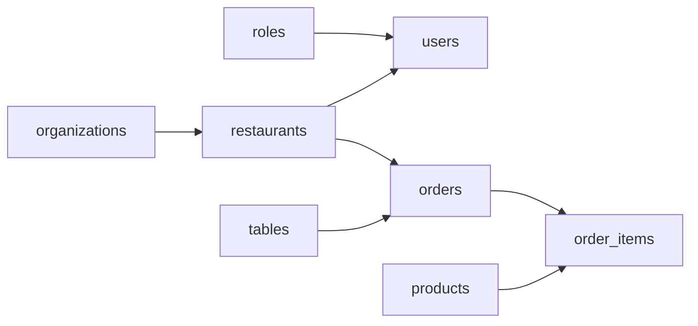

# Developer Tables

La ruta `/developer/tables` ofrece una vista rápida del esquema funcional que usa el frontend para
orientarse en dominios técnicos sin entrar todavía en introspección automática desde Prisma o desde
backend.

## Objetivo

- dar una lectura rápida de entidades clave
- mostrar relaciones principales entre dominios
- servir como base para evolucionar de mock local a fuente de verdad real

## Ruta y pantalla

La implementación actual vive en:

```txt
frontend/src/app/features/developer/pages/developer-tables-page/
```

La ruta registrada es:

```txt
/developer/tables
```

## Relación entre entidades



## Qué muestra la página

La pantalla se divide en tres capas:

1. Un mapa visual breve de entidades y relaciones visibles.
2. Un inventario de tablas con feature, dominio, número de campos y número de relaciones.
3. Un panel de detalle con campos, tipo, nullable, referencia y descripción.

Esto permite una lectura progresiva: primero estructura, luego inventario y finalmente detalle.

## Filtros disponibles

La pantalla permite filtrar por:

- texto libre sobre tabla, campo o relación
- feature funcional
- dominio técnico

La `feature` ayuda a navegar el sistema desde una perspectiva más cercana al producto o al frontend,
mientras que el `dominio` sigue siendo útil para agrupaciones más técnicas.

## Fuente de datos actual

La versión actual consume un snapshot generado desde `backend/prisma/schema.prisma` y guardado en:

```txt
frontend/src/app/features/developer/schema/developer-schema.generated.ts
```

El snapshot se regenera con:

```bash
pnpm developer:schema
```

Ventajas:

- evita leer Prisma en runtime desde el navegador
- mantiene el frontend desacoplado del backend durante la renderización
- deja una fuente de datos versionable y fácil de testear

Limitación:

- cuando cambia `schema.prisma`, hay que regenerar el snapshot manualmente

## Siguientes evoluciones recomendadas

### Opción 1: endpoint técnico de solo lectura

Publicar un endpoint backend protegido para devolver tablas, campos y relaciones.

Cuándo conviene:

- si queremos que `/developer/tables` refleje siempre el estado actual
- si interesa reutilizar el contrato desde otras herramientas internas

### Opción 2: enriquecer el snapshot generado

Mantener el flujo actual pero añadir más metadatos durante la generación: índices, enums, relaciones
inversas o agrupaciones por bounded context.

Cuándo conviene:

- si queremos seguir sin dependencias runtime
- si nos basta con sincronizar el esquema en cada cambio relevante

## Regla de mantenimiento

Si cambia `backend/prisma/schema.prisma`:

- ejecutar `pnpm developer:schema` desde `frontend/`
- revisar la pantalla `/developer/tables`
- actualizar este documento y el diagrama Mermaid si cambia la lectura conceptual del dominio
