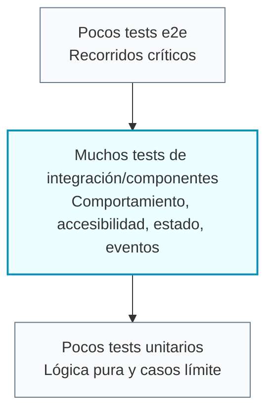

# Testing Frontend

El frontend sigue TDD y una estrategia de tests en forma de diamante. El objetivo es proteger el
comportamiento sin bloquear demasiado la implementación.

## BDD En La Documentación

Usa BDD para documentar comportamiento funcional, criterios de aceptación y flujos importantes antes
de convertirlos en tests.

```gherkin
Feature: Completar una tarea

Scenario: Completar una tarea pendiente
  Given la persona usuaria tiene una tarea pendiente
  When marca la tarea como completada
  Then la tarea aparece como completada
  And se muestra el mensaje "La tarea se ha completado correctamente."
```

BDD ayuda a acordar qué debe ocurrir. TDD ayuda a implementarlo con un test que falle primero.

## Ciclo TDD


Empieza con un test que falle por el motivo esperado. Si el test pasa antes de que exista la
funcionalidad, todavía no está probando el comportamiento.

## Test Diamond



## Tests Preferidos

- Usa Testing Library para tests de componentes e integración.
- Busca elementos por rol accesible, label, placeholder, texto visible o estado orientado a usuario.
- Prueba eventos emitidos, estados deshabilitados, validación, atributos ARIA y clases importantes.
- Reserva tests unitarios estrechos para funciones puras, reducers, formatters y lógica con bordes claros.
- Usa Playwright para flujos críticos que dependan de rutas, navegador o páginas reales.

## Comandos

Ejecuta desde `frontend/`:

```txt
pnpm test -- --watch=false
pnpm test:e2e
pnpm build
pnpm build-storybook
```

Ejecuta tests enfocados durante TDD y amplía la verificación antes de cerrar cambios compartidos o
de mayor riesgo.
