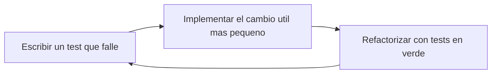

# Testing Frontend

El frontend sigue TDD y una estrategia de tests en forma de diamante. El objetivo es proteger el
comportamiento sin bloquear demasiado la implementacion.

## BDD En La Documentacion

Usa BDD para documentar comportamiento funcional, criterios de aceptacion y flujos importantes antes
de convertirlos en tests.

```gherkin
Feature: Completar una tarea

Scenario: Completar una tarea pendiente
  Given la persona usuaria tiene una tarea pendiente
  When marca la tarea como completada
  Then la tarea aparece como completada
  And se muestra el mensaje "La tarea se ha completado correctamente."
```

BDD ayuda a acordar que debe ocurrir. TDD ayuda a implementarlo con un test que falle primero.

## Ciclo TDD



Empieza con un test que falle por el motivo esperado. Si el test pasa antes de que exista la
funcionalidad, todavia no esta probando el comportamiento.

## Test Diamond


## Tests Preferidos

- Usa Testing Library para tests de componentes e integracion.
- Busca elementos por rol accesible, label, placeholder, texto visible o estado orientado a usuario.
- Prueba eventos emitidos, estados deshabilitados, validacion, atributos ARIA y clases importantes.
- Reserva tests unitarios estrechos para funciones puras, reducers, formatters y logica con bordes claros.
- Usa Playwright para flujos criticos que dependan de rutas, navegador o paginas reales.

## UI De Feature

Para cambios de UI dentro de una feature, empieza con el test mas cercano al comportamiento y amplia
solo cuando el estado real viva fuera del componente.

Patron recomendado:

- Component spec para comprobar render accesible, labels, roles, eventos emitidos y estados ARIA.
- Page spec cuando el componente recibe datos ya filtrados o cuando la page coordina signals, store,
  busqueda, favoritos, categorias o seleccion.
- Store spec cuando cambia una regla de negocio o un calculo compartido.
- Build final cuando cambien templates, imports standalone, clases Tailwind nuevas o barrels de
  modelos.

Ejemplo: un dialogo de busqueda puede tener un spec que valide `radio`, `combobox`, `aria-pressed`,
estrella favorita y eventos emitidos. La page debe cubrir que favoritos, busqueda y categoria filtran
los productos reales.

## Actions Object En Specs

Cuando un `page.spec.ts` repite varias veces las mismas interacciones de Testing Library, usa un
`actions object` pequeno dentro del propio spec para reducir ruido sin esconder el comportamiento.

Patron recomendado:

- Manten las aserciones en el test.
- Extrae solo acciones repetidas: abrir un modal, seleccionar una celda, rellenar un formulario o
  enviar una accion frecuente.
- Prefiere nombres orientados a la persona usuaria, por ejemplo `openAddElementDialog()`,
  `choosePosition()` o `submitEditElement()`.
- Deja el `actions object` en el mismo fichero mientras solo lo use ese spec.
- Muevelo a un fichero dedicado solo cuando varias specs compartan las mismas acciones o cuando el
  helper crezca lo suficiente como para merecer reutilizacion real.

Evita usar este patron si el helper empieza a ocultar demasiada logica o si convierte el test en
una capa opaca tipo framework. La idea es hacer el spec mas legible, no alejarlo de Testing Library.

Ejemplo simplificado:

```ts
const createPageActions = () => ({
  openAddElementDialog: () => {
    fireEvent.click(screen.getByRole('button', { name: 'Anadir elemento' }));
  },
  choosePosition: (column: number, row: number) => {
    fireEvent.click(screen.getByRole('button', { name: `Colocar en columna ${column} fila ${row}` }));
  },
});
```

## Modulo Menu V1

El modulo `features/menu/` combina logica pura, integracion con la store del POS y UI de
personalizacion. La cobertura debe proteger la frontera entre catalogo mutable y snapshot de pedido.

Tests puros recomendados:

- `MenuPricingService`: precio base, extras simples y multiples, modificadores `remove` sin coste,
  construccion de `selectedModifiers`, total de combos con suplementos y firmas iguales o distintas
  por modificadores, nota o seleccion de slots.
- `MenuValidationService`: producto no disponible, opcion invalida, grupos requeridos, seleccion
  unica, maximos por grupo, slots requeridos de combo, productos permitidos y disponibilidad.
- Mocks de menu: mantener categorias, disponibilidad y grupos realistas para hamburguesas, bebidas,
  cafe y combos sin depender de backend.

Tests de integracion con POS:

- `RestaurantPosStore` debe cubrir producto simple, producto personalizado, merge por
  `configurationSignature`, separacion por nota o modificadores distintos, rechazo de
  personalizacion invalida y totales con modificadores.
- Los combos deben cubrir configuracion por slots, suplementos, rechazo de selecciones invalidas,
  snapshot `selectedComboSlots`, firma estable y merge de lineas equivalentes.
- Las operaciones de servicio y cocina se prueban por `line.id` para soportar varias lineas del
  mismo producto con configuraciones distintas.
- Las notas se verifican como `kitchenNote` en el snapshot, manteniendo compatibilidad con el campo
  antiguo cuando exista.

Tests UI principales:

- `ProductCustomizerDialog` renderiza grupos, permite seleccionar opciones, recalcula el precio en
  vivo, captura nota de cocina y emite la confirmacion.
- `ComboCustomizerDialog` renderiza slots, marca la seleccion activa, bloquea productos no
  disponibles, recalcula suplementos y emite la configuracion confirmada.
- `ProductSearchDialog` muestra precio, categoria, disponibilidad y badge de producto
  personalizable, combo o plato combinado segun corresponda.
- `ServiceTablePanel` muestra extras, `SIN ...`, nota de cocina y productos elegidos en combos bajo
  cada linea.
- La vista de cocina muestra modificadores, combos y notas sin crear una nueva pantalla de cocina.
- La navegacion del shell incluye `Menu` apuntando a `/restaurant-pos/menu`.

## Decisiones UX En Tests

No pruebes todas las clases visuales. Si conviene proteger clases cuando representan una decision UX
concreta y facil de romper:

- `focus-visible` para evitar anillos de foco despues de clicks de raton.
- Alturas fijas o scroll interno cuando un modal debe mantener tamano estable.
- Estados ARIA como `aria-pressed`, `aria-expanded`, `aria-selected` y `aria-checked`.
- Labels accesibles de botones icon-only, buscadores, selects y controles segmentados.

Si el test solo repite Tailwind sin explicar comportamiento, prefiere buscar una senal mas cercana a
la persona usuaria: rol, nombre accesible, texto visible, estado ARIA o evento emitido.

## Comandos

Ejecuta desde `frontend/`:

```txt
pnpm test -- --watch=false
pnpm test:e2e
pnpm build
pnpm build-storybook
```

Ejecuta tests enfocados durante TDD y amplia la verificacion antes de cerrar cambios compartidos o
de mayor riesgo.

## Reservas operativas v0.0.2

La agenda de reservas combina lectura enriquecida, filtros de pantalla y acciones PATCH por
reserva. Conviene cubrir la frontera en tres niveles:

- `restaurant-pos-api.service.spec.ts` para verificar las rutas REST de `confirm`, `seat`,
  `no-show` y `cancel`.
- `restaurant-pos-reservations-page.spec.ts` para proteger render, filtros, busqueda, acciones por
  estado, refresh tras mutacion y error visual por reserva.
- Tests backend del caso de uso y del repositorio demo para validar transiciones permitidas y
  rechazadas.

Escenarios recomendados en frontend:

- Render de agenda diaria agrupada por `Comidas` y `Cenas`.
- Resumen superior con total de reservas y pax.
- Reserva sin mesa con badge visible.
- Apertura del formulario `Nueva reserva`.
- Conversión correcta de fecha local + hora al `reservationAt` enviado al backend.
- Filtro por estado y servicio.
- Busqueda por nombre o telefono.
- Acciones visibles segun `pending` o `confirmed`.
- Creación correcta y recarga posterior de la agenda.
- Recarga de la agenda tras una accion exitosa.
- Mensaje de error cuando falla una accion PATCH.
- Mensaje de error cuando falla la creacion.

Al escribir estos tests, evita queries demasiado genericas porque algunos textos se repiten entre
filtros y tarjetas, por ejemplo `Comidas`, `Cenas` o `Confirmada`. Prefiere `getByRole` con
`heading`, `region` o `within(...)` para apuntar a la seccion correcta y mantener los specs
estables cuando la UI gane mas filtros o badges.
