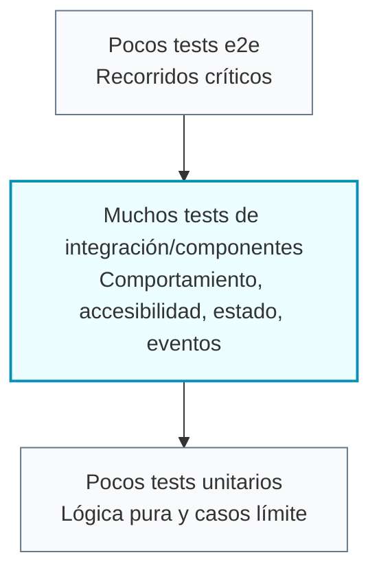

# Testing Frontend

El frontend sigue TDD y una estrategia de tests en forma de diamante. El objetivo es proteger el
comportamiento sin bloquear demasiado la implementación.

## BDD En La Documentación

Usa BDD para documentar comportamiento funcional, criterios de aceptación y flujos importantes antes
de convertirlos en tests.

```gherkin
Feature: Completar una tarea

Scenario: Completar una tarea pendiente
  Given la persona usuaria tiene una tarea pendiente
  When marca la tarea como completada
  Then la tarea aparece como completada
  And se muestra el mensaje "La tarea se ha completado correctamente."
```

BDD ayuda a acordar qué debe ocurrir. TDD ayuda a implementarlo con un test que falle primero.

## Ciclo TDD


Empieza con un test que falle por el motivo esperado. Si el test pasa antes de que exista la
funcionalidad, todavía no está probando el comportamiento.

## Test Diamond



## Tests Preferidos

- Usa Testing Library para tests de componentes e integración.
- Busca elementos por rol accesible, label, placeholder, texto visible o estado orientado a usuario.
- Prueba eventos emitidos, estados deshabilitados, validación, atributos ARIA y clases importantes.
- Reserva tests unitarios estrechos para funciones puras, reducers, formatters y lógica con bordes claros.
- Usa Playwright para flujos críticos que dependan de rutas, navegador o páginas reales.

## UI De Feature

Para cambios de UI dentro de una feature, empieza con el test más cercano al comportamiento y amplía
solo cuando el estado real viva fuera del componente.

Patrón recomendado:

- Component spec para comprobar render accesible, labels, roles, eventos emitidos y estados ARIA.
- Page spec cuando el componente recibe datos ya filtrados o cuando la page coordina signals, store,
  búsqueda, favoritos, categorías o selección.
- Store spec cuando cambia una regla de negocio o un cálculo compartido.
- Build final cuando cambien templates, imports standalone, clases Tailwind nuevas o barrels de
  modelos.

Ejemplo: un diálogo de búsqueda puede tener un spec que valide `radio`, `combobox`, `aria-pressed`,
estrella favorita y eventos emitidos. La page debe cubrir que favoritos, búsqueda y categoría filtran
los productos reales.

## Módulo Menu V1

El módulo `features/menu/` combina lógica pura, integración con la store del POS y UI de
personalización. La cobertura debe proteger la frontera entre catálogo mutable y snapshot de pedido.

Tests puros recomendados:

- `MenuPricingService`: precio base, extras simples y múltiples, modificadores `remove` sin coste,
  construcción de `selectedModifiers` y firmas iguales o distintas por modificadores y nota.
- `MenuValidationService`: producto no disponible, opción inválida, grupos requeridos, selección
  única y máximos por grupo.
- Mocks de menú: mantener categorías, disponibilidad y grupos realistas para hamburguesas, bebidas
  y café sin depender de backend.

Tests de integración con POS:

- `RestaurantPosStore` debe cubrir producto simple, producto personalizado, merge por
  `configurationSignature`, separación por nota o modificadores distintos, rechazo de
  personalización inválida y totales con modificadores.
- Las operaciones de servicio y cocina se prueban por `line.id` para soportar varias líneas del
  mismo producto con configuraciones distintas.
- Las notas se verifican como `kitchenNote` en el snapshot, manteniendo compatibilidad con el campo
  antiguo cuando exista.

Tests UI principales:

- `ProductCustomizerDialog` renderiza grupos, permite seleccionar opciones, recalcula el precio en
  vivo, captura nota de cocina y emite la confirmación.
- `ProductSearchDialog` muestra precio, categoría, disponibilidad y badge de producto
  personalizable.
- `ServiceTablePanel` muestra extras, `SIN ...` y nota de cocina bajo cada línea.
- La vista de cocina muestra modificadores y notas sin crear una nueva pantalla de cocina.
- La navegación del shell incluye `Menú` apuntando a `/restaurant-pos/menu`.

## Decisiones UX En Tests

No pruebes todas las clases visuales. Sí conviene proteger clases cuando representan una decisión UX
concreta y fácil de romper:

- `focus-visible` para evitar anillos de foco después de clicks de ratón.
- Alturas fijas o scroll interno cuando un modal debe mantener tamaño estable.
- Estados ARIA como `aria-pressed`, `aria-expanded`, `aria-selected` y `aria-checked`.
- Labels accesibles de botones icon-only, buscadores, selects y controles segmentados.

Si el test solo repite Tailwind sin explicar comportamiento, prefiere buscar una señal más cercana a
la persona usuaria: rol, nombre accesible, texto visible, estado ARIA o evento emitido.

## Comandos

Ejecuta desde `frontend/`:

```txt
pnpm test -- --watch=false
pnpm test:e2e
pnpm build
pnpm build-storybook
```

Ejecuta tests enfocados durante TDD y amplía la verificación antes de cerrar cambios compartidos o
de mayor riesgo.
